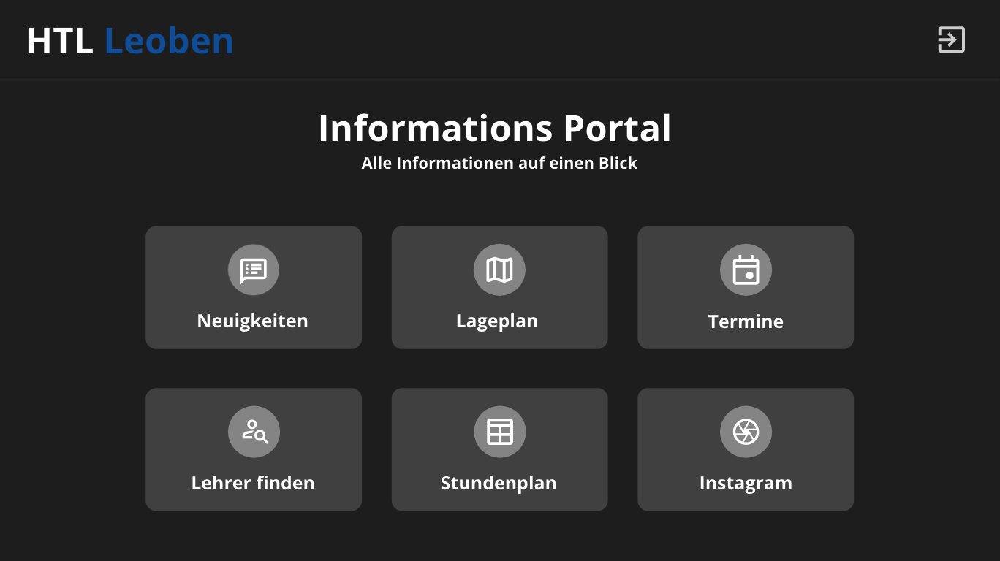
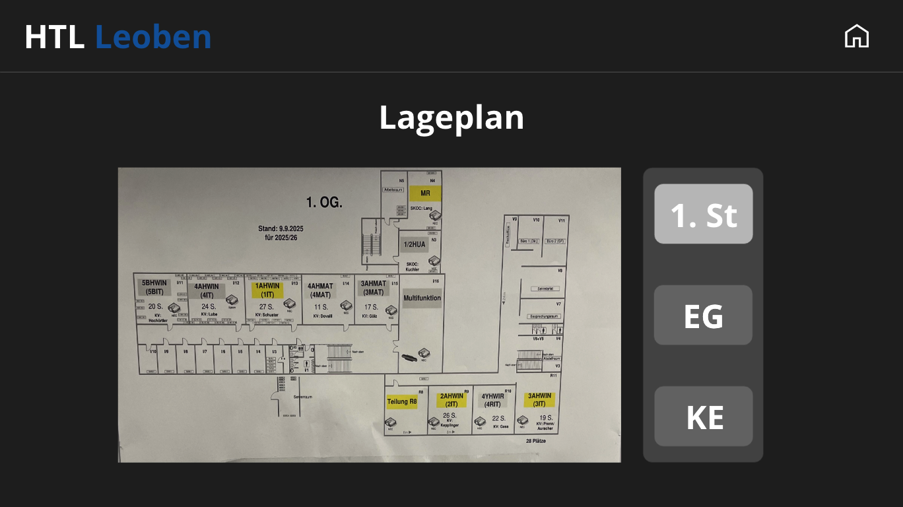
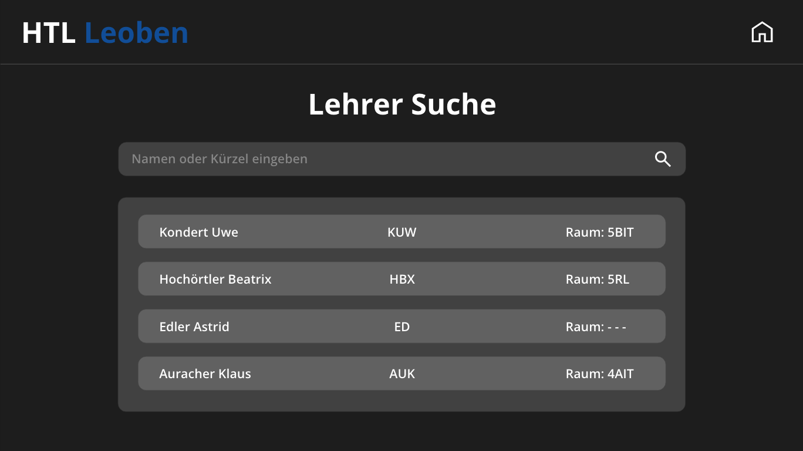
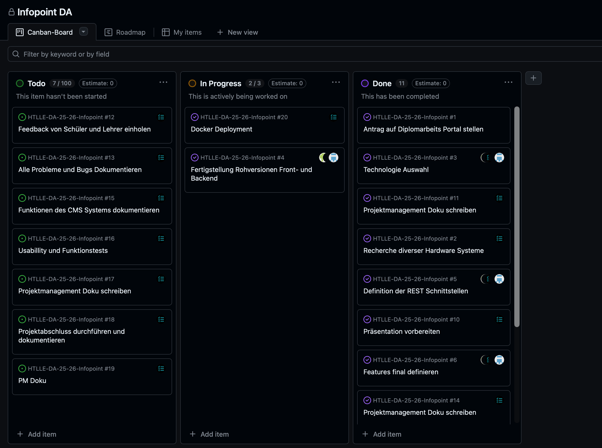
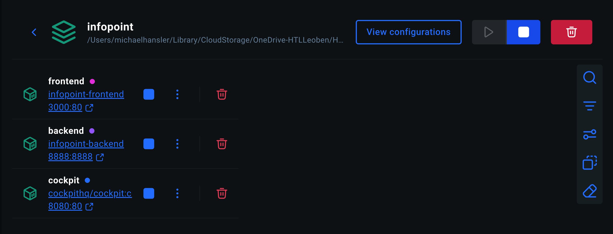
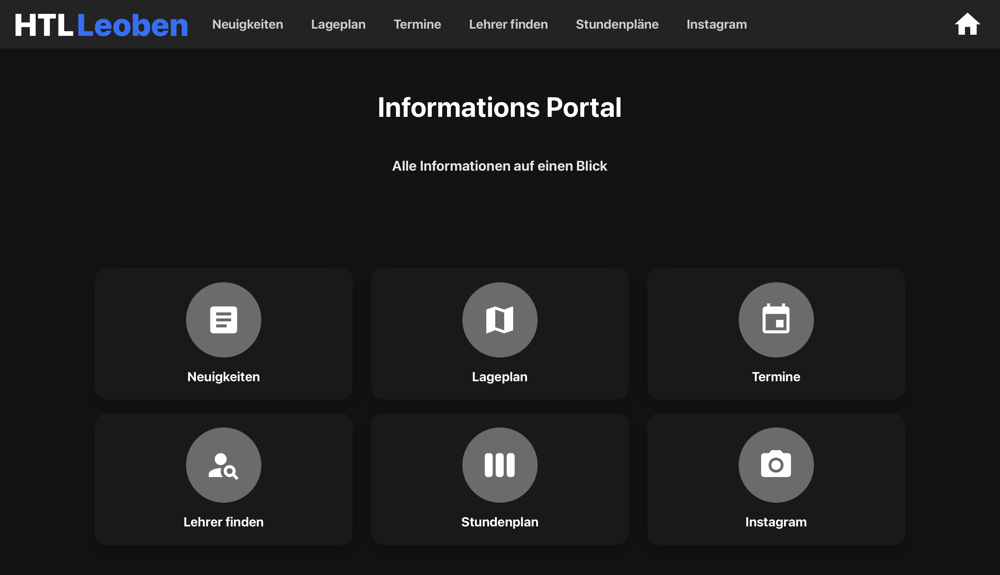

# Teilaufgabe Schüler Michael Hänsler
\textauthor{Michael Hänsler}

## Ausgangslage

### Teilaufgabenbereich

Der vorliegende Teilbereich umfasst die Hardwareauswahl, das Design, die Konzeption sowie das Projektmanagement. Im Rahmen der Hardwareauswahl erfolgte eine systematische Recherche geeigneter Komponenten zur Erstellung einer Kostenübersicht. Für die Designphase wurden mithilfe des Tools Adobe XD funktionale Mockups erstellt, um die anschließende Implementierungsarbeit zu erleichtern. Aus diesen Mockups entwickelte sich das finale Design. Auf Projektmanagementebene fiel die Entscheidung zugunsten von GitHub Projects, um eine effiziente Koordination der Arbeitsabläufe zu gewährleisten. Die folgenden Abschnitte erläutern diese Bereiche detailliert.

## Theorie

### Grundlagen digitaler Informationssysteme

#### Definition und Aufgaben von Infopoint-Systemen

Ein Infopoint-System bezeichnet eine digitale Lösung zur effizienten und benutzerfreundlichen Bereitstellung von Informationen. Derartige Systeme finden sich häufig in öffentlichen Einrichtungen wie Schulen, Universitäten, Bibliotheken oder Museen und dienen dazu, Besucherinnen und Besuchern sowie Nutzerinnen und Nutzern den Zugang zu relevanten Informationen zu erleichtern. Infopoint-Systeme können unterschiedliche Ausprägungen annehmen, darunter interaktive Kioske, digitale Anzeigetafeln oder mobile Anwendungen. Sie werden in der Regel maßgeschneidert konzipiert, um die spezifischen Anwendungsfälle der jeweiligen Einrichtungen optimal abzudecken. Ein prominentes Beispiel für ein Infopoint-System stellt das Self-Service-Bestellsystem von Fast-Food-Ketten dar. Hier können Kundinnen und Kunden ihre Bestellungen eigenständig aufgeben, ohne persönliche Interaktion mit dem Personal, was die Effizienz steigert und Wartezeiten reduziert. (vgl. [@Infopoints])

Die konkreten Aufgaben eines Infopoint-Systems lassen sich in mehrere Kategorien einteilen. Im Bereich **Orientierung und Navigation** fungieren derartige Informationssysteme als Orientierungshilfe, indem sie interaktive Karten, Wegbeschreibungen und Standortinformationen einzelner Räume bereitstellen. Dies erweist sich insbesondere in großen Gebäudekomplexen oder auf weitläufigen Campusgeländen als vorteilhaft. Entsprechende Anwendungen finden sich beispielsweise in Einkaufszentren oder Flughäfen. (vgl. [@Infopoints])

Eine weitere zentrale Funktion ist die **Anzeige aktueller Informationen**. Infopoint-Systeme ermöglichen die Darstellung von Veranstaltungshinweisen, Ankündigungen, Wetterberichten oder Verkehrsinformationen. Dies gewährleistet, dass Nutzerinnen und Nutzer stets über relevante Neuigkeiten informiert sind. Auf Campusgeländen von Hochschulen und Schulen findet sich dieser Anwendungsfall häufig, wobei Informationen über Informationstage, aktuelle Veranstaltungen oder Projekte angezeigt werden. (vgl. [@Infopoints])

Im Bereich **Service und Self-Service** bieten zahlreiche Infopoint-Systeme Funktionen wie den Ticketerwerb, Reservierungen oder das Ausfüllen von Formularen an. Dies erleichtert den Nutzerinnen und Nutzern den Zugang zu Dienstleistungen, reduziert den Bedarf an persönlicher Interaktion, minimiert Wartezeiten und steigert somit die Effizienz. Ein Beispiel hierfür sind die Kiosk-Systeme in Fast-Food-Ketten, bei denen der Bestell- und Bezahlvorgang erheblich vereinfacht wird.

Nicht zuletzt spielt die **Barrierefreiheit** eine wichtige Rolle. Moderne Infopoint-Systeme werden so gestaltet, dass sie den Bedürfnissen von Menschen mit Behinderungen gerecht werden. Dies kann durch die Integration von Funktionen wie Sprachausgabe, Bildschirmvergrößerung oder taktilen Eingabemöglichkeiten erreicht werden. (vgl. [@Lee_Park_Park_Kim_2023])

#### Einsatzgebiete und Nutzen in Bildungseinrichtungen

Die genannten Aufgabenbereiche weisen eine hohe Relevanz für Bildungseinrichtungen auf. Der Aspekt Orientierung und Navigation erweist sich als besonders bedeutsam. Insbesondere an Tagen der offenen Tür, an denen zahlreiche Besucherinnen und Besucher das Schulgebäude frequentieren, ist eine effektive Informationsvermittlung unverzichtbar. Die Orientierung in unbekannten Gebäuden kann ohne entsprechende Hilfsmittel zeitaufwendig sein und dazu führen, dass relevante Bereiche nicht aufgefunden werden. Benutzerfreundliche Anlaufstellen wie Infopoints ermöglichen es Besucherinnen und Besuchern, gewünschte Informationen effizient abzurufen. (vgl. [@Infopoints])

Der Aspekt „Anzeige aktueller Informationen" ist für Bildungseinrichtungen ebenfalls von erheblicher Bedeutung. Schulen und Universitäten verfügen häufig über eine Vielzahl von Veranstaltungen, Kursen und Ankündigungen, die den Schülerinnen und Schülern sowie Studierenden kommuniziert werden müssen. Infopoint-Systeme können als zentrale Informationsquelle fungieren und gewährleisten, dass alle Beteiligten stets über relevante Neuigkeiten informiert sind. Dies fördert die Kommunikation innerhalb der Bildungseinrichtung. Darüber hinaus wird die Nachhaltigkeit gefördert, da papierbasierte Aushänge an Pinnwänden reduziert werden können. (vgl. [@Infopoints])

#### Anforderungen an moderne digitale Informationslösungen

Moderne digitale Informationslösungen müssen eine Reihe von Anforderungen erfüllen, um effektiv und benutzerfreundlich zu sein. An erster Stelle steht die **Benutzerfreundlichkeit**: Die Systeme sollten intuitiv und einfach zu bedienen sein, damit Nutzerinnen und Nutzer aller Altersgruppen und technischen Fähigkeiten problemlos darauf zugreifen können. Eine klare Navigation, verständliche Symbole und eine logische Struktur sind hierfür entscheidend. (vgl. [@Lee_Park_Park_Kim_2023])

Eng damit verbunden ist die **Zugänglichkeit**. Digitale Informationslösungen sollten barrierefrei gestaltet sein, um Menschen mit unterschiedlichen Fähigkeiten gerecht zu werden. Dies umfasst Funktionen wie Bildschirmleser-Kompatibilität, Tastaturnavigation und Anpassungsmöglichkeiten für Sehbehinderte. (vgl. [@Lee_Park_Park_Kim_2023])

Die **Aktualität** der bereitgestellten Informationen ist ebenfalls von zentraler Bedeutung. Die Inhalte müssen stets aktuell und relevant sein, was eine einfache Möglichkeit zur Aktualisierung erfordert – sei es durch automatisierte Prozesse oder manuelle Eingriffe. (vgl. [@Lee_Park_Park_Kim_2023])

Hinsichtlich der **Skalierbarkeit** sollten die Lösungen in der Lage sein, mit dem Wachstum der Nutzerbasis und den sich ändernden Anforderungen der Bildungseinrichtung mitzuwachsen. Dies kann die Integration neuer Funktionen oder die Erweiterung der Infrastruktur umfassen. Schließlich sollten moderne Informationssysteme eine nahtlose **Integration** in bestehende IT-Infrastrukturen und Softwarelösungen ermöglichen, um einen reibungslosen Informationsfluss zu gewährleisten. (vgl. [@Lee_Park_Park_Kim_2023])

### Hardware-Grundlagen für Informationssysteme

#### Wichtige Hardwarekomponenten eines Infopoints

Die technische Struktur eines Infopoint-Systems ist grundlegend überschaubar und besteht im Wesentlichen aus drei Hauptkomponenten.

Der **Computer** bildet die zentrale Recheneinheit eines Infopoints und ist für die Verarbeitung und Visualisierung der Inhalte verantwortlich. Auf diesem läuft das Betriebssystem. Die Leistungsfähigkeit des Computers bestimmt, welche Komplexität die dargestellten Inhalte aufweisen können – ein Beispiel für komplexere Inhalte wäre ein dreidimensionaler Raumplan eines Gebäudes. (vgl. [@Infopoints-Hardware])

Das **Display** stellt die wichtigste Komponente des Infopoints dar, da es die Schnittstelle zwischen System und Endbenutzer bildet. Hierbei existieren zwei Optionen: Die erste Option besteht in der Verwendung eines einfachen Bildschirms zur Darstellung statischer Inhalte. Die zweite Option umfasst den Einsatz eines Touchscreens, wodurch der Infopoint interaktiv wird und eine Vielzahl weiterer Funktionsmöglichkeiten für die Benutzerinteraktion eröffnet. (vgl. [@Infopoints-Hardware])

Das **Gehäuse** bildet den ersten visuellen Eindruck des Infopoints. Es vereint die Komponenten und gewährleistet ein ansprechendes Erscheinungsbild. Das Gehäuse kann so gestaltet werden, dass es sich in die vorhandene Inneneinrichtung einfügt, sofern eine entsprechende Anfertigung erfolgt. Darüber hinaus ist das Gehäuse maßgeblich für den Einsatzzweck: Bei einer Außeninstallation muss es beispielsweise die Komponenten vor Witterungseinflüssen schützen. (vgl. [@Infopoints-Hardware])

#### Kriterien für die Hardwareauswahl

Bei der Auswahl der Hardware für ein Infopoint-System sind mehrere Kriterien zu berücksichtigen, um sicherzustellen, dass das System den Anforderungen der Bildungseinrichtung entspricht.

An erster Stelle steht die **Leistung**: Die Hardware muss ausreichend leistungsfähig sein, um die geplanten Anwendungen und Inhalte reibungslos auszuführen. Dies umfasst die Prozessorleistung, den Arbeitsspeicher und die Grafikkapazitäten. Da Infopoint-Systeme häufig rund um die Uhr in Betrieb sind, ist zudem die **Zuverlässigkeit** von besonderer Bedeutung – die Hardware muss robust sein, um Ausfallzeiten zu minimieren.

Aus wirtschaftlicher Perspektive spielen **Energieeffizienz** und **Kosten** eine entscheidende Rolle. Energieeffiziente Hardware trägt dazu bei, die Betriebskosten zu senken und die Umweltbelastung zu reduzieren. Das Budget der Bildungseinrichtung erfordert dabei ein ausgewogenes Verhältnis zwischen Leistung, Qualität und Anschaffungskosten.

Für die technische Integration ist die **Konnektivität** relevant: Die Hardware sollte über ausreichende Anschlussmöglichkeiten verfügen, um eine einfache Einbindung in das bestehende Netzwerk und die IT-Infrastruktur zu gewährleisten. Ebenso muss die **Kompatibilität** mit der geplanten Software und den Betriebssystemen gegeben sein.

Mit Blick auf den langfristigen Betrieb sind **Wartungsfreundlichkeit** und **Zukunftssicherheit** zu beachten. Die Hardware sollte leicht zu warten und zu reparieren sein, um langfristige Betriebskosten zu minimieren. Zudem ist es ratsam, Hardware zu wählen, die zukünftige Erweiterungen und Upgrades ermöglicht.

#### Energieverbrauch, Zuverlässigkeit und Wartbarkeit

Bei der Auswahl der Hardware für ein Infopoint-System sind Energieverbrauch, Zuverlässigkeit und Wartbarkeit entscheidende Faktoren, welche sich langfristig auf die Effizienz und die Betriebskosten des Systems auswirken. Eine Vernachlässigung dieser Aspekte kann zu unerwartet hohen Kosten und Ausfallzeiten führen, was sich negativ auf die Nutzungsintensität des Geräts auswirkt. Systeme mit unzureichender Funktionalität werden erfahrungsgemäß von Endnutzern kaum verwendet und stellen für die Institution lediglich eine Kostenstelle dar.

Ein niedriger **Energieverbrauch** ist wichtig, um die Betriebskosten zu minimieren und die Umweltbelastung zu reduzieren. Energieeffiziente Komponenten wie stromsparende Computer und Displays sollten bevorzugt werden. Dies ist besonders relevant für Infopoint-Systeme, die rund um die Uhr in Betrieb sind. Die Verwendung von Energiesparmodi und automatischen Abschaltfunktionen kann ebenfalls dazu beitragen, den Energieverbrauch zu senken.

Hinsichtlich der **Zuverlässigkeit** muss die Hardware robust und langlebig sein, um Ausfallzeiten zu minimieren. Komponenten mit hoher Zuverlässigkeit, wie beispielsweise SSDs mit industriellem Qualitätsstandard anstelle von herkömmlichen Festplatten, tragen dazu bei, die Lebensdauer des Systems zu verlängern und den Wartungsaufwand zu reduzieren.

Die **Wartbarkeit** erfordert, dass die Hardware so ausgewählt wird, dass sie leicht zu warten und zu reparieren ist. Modular aufgebaute Systeme ermöglichen einen einfachen Austausch defekter Komponenten. Zudem sollte die Verfügbarkeit von Ersatzteilen und Support berücksichtigt werden. Außerdem ist es für künftige Erweiterungen von Vorteil, wenn die Hardware leicht aufgerüstet bzw. umgebaut werden kann.

#### Kostenfaktoren bei Hardwareprojekten

Bei Hardwareprojekten spielen verschiedene Kostenfaktoren eine entscheidende Rolle, die sorgfältig berücksichtigt werden müssen, um das Budget einzuhalten und die Wirtschaftlichkeit des Projekts zu gewährleisten.

Die **Anschaffungskosten** umfassen die Kosten für den Kauf der Hardwarekomponenten wie Computer, Displays, Gehäuse und Zubehör. Es ist wichtig, qualitativ hochwertige Komponenten zu wählen, die den Anforderungen des Projekts entsprechen, ohne das Budget zu überschreiten. Hinzu kommen **Installationskosten**, die durch die Installation und Einrichtung der Hardware entstehen. Dazu gehören Arbeitskosten für Techniker, die die Komponenten zusammenbauen, konfigurieren und testen.

Während der Lebensdauer des Systems fallen **Betriebskosten** an, darunter Stromverbrauch, Wartung und Reparaturen. Energieeffiziente Hardware kann dazu beitragen, diese Kosten zu minimieren. Zusätzlich ist eine regelmäßige Wartung erforderlich, um die Zuverlässigkeit und Leistung der Hardware zu gewährleisten. Dies umfasst Kosten für Inspektionen, Software-Updates und den Austausch von Verschleißteilen.

Falls das Personal für die Bedienung oder Wartung der Hardware geschult werden muss, sollten auch **Schulungskosten** berücksichtigt werden. Idealerweise ist das System jedoch so benutzerfreundlich konzipiert und dokumentiert, dass der Schulungsaufwand minimal bleibt.

### Grundlagen des UI/UX-Designs

#### Bedeutung von nutzerzentriertem Design

Nutzerzentriertes Design (User-Centered Design, UCD) ist ein Ansatz im Designprozess, welcher den Fokus auf die Bedürfnisse, Erwartungen und Einschränkungen des Endbenutzers legt. Dieser Ansatz ist besonders wichtig bei der Entwicklung von Informationssystemen wie Infopoints, da diese direkt von einer Vielzahl von Nutzern verwendet und verstanden werden müssen. (vgl. [@User-Centered-Design])

Durch die Berücksichtigung der Nutzerbedürfnisse wird eine **verbesserte Benutzererfahrung** sichergestellt. Das System wird intuitiv und einfach zu bedienen, was zu einer positiven Benutzererfahrung führt und die Akzeptanz sowie die Nutzungsintensität positiv beeinflusst. Konkret bedeutet dies, dass Benutzerinnen und Benutzer auf den ersten Blick erfassen können, wie sie zu den gewünschten Informationen gelangen. (vgl. [@User-Centered-Design] & [@UI-UX])

Ein nutzerzentriertes Design ermöglicht zudem eine **erhöhte Effizienz**. Benutzerinnen und Benutzer können ihre Aufgaben schneller erledigen, was besonders in Bildungseinrichtungen relevant ist, wo zeitliche Ressourcen begrenzt sind. Wichtige Funktionen und Informationen sollten mit möglichst wenigen Interaktionsschritten erreichbar sein, um eine aufwendige Navigation durch komplexe Menüstrukturen zu vermeiden. (vgl. [@User-Centered-Design] & [@UI-UX])

Wenn das Design auf die Fähigkeiten und Erwartungen der Nutzer abgestimmt ist, wird die **Fehlerquote** bei der Bedienung minimiert, was zu einer reibungsloseren Nutzung führt. Darüber hinaus sind Nutzerinnen und Nutzer, die ein System als benutzerfreundlich empfinden, eher zufrieden und bereit, es regelmäßig zu verwenden. Diese **höhere Zufriedenheit** trägt zur langfristigen Nutzung und zum Erfolg des Infopoint-Systems bei. (vgl. [@User-Centered-Design])

#### Grundprinzipien (Usability, Accessibility, Informationsarchitektur)

Die Gestaltung von Infopoint-Systemen basiert auf drei wesentlichen Grundprinzipien. **Usability** (Benutzerfreundlichkeit) bezieht sich darauf, wie einfach und effizient ein Benutzer ein System nutzen kann, um seine Ziele zu erreichen. Ein benutzerfreundliches Design sollte klar strukturierte Navigation, verständliche Symbole und eine logische Anordnung der Inhalte bieten. Es sollte auch durchgängig gleich gestaltet und aufgebaut sein, damit Benutzer schnell lernen können, wie sie das System bedienen. (vgl. [@UI-UX])

**Accessibility** (Barrierefreiheit) stellt sicher, dass das System für alle Benutzer zugänglich ist, einschließlich Menschen mit Behinderungen. Dies umfasst die Integration von Funktionen wie Bildschirmleser-Kompatibilität, Tastaturnavigation und Anpassungsmöglichkeiten für Sehbehinderte. Ein barrierefreies Design gewährleistet, dass niemand aufgrund von physischen oder kognitiven Einschränkungen ausgeschlossen wird. (vgl. [@UI-UX])

Die **Informationsarchitektur** bezieht sich auf die Organisation und Strukturierung der Inhalte innerhalb des Systems. Eine gut durchdachte Informationsarchitektur erleichtert es den Benutzern, die benötigten Informationen schnell zu finden. Dies umfasst die Kategorisierung von Inhalten, die Erstellung von Navigationsstrukturen und die Verwendung von Suchfunktionen. (vgl. [@UI-UX])

#### Wireframes, Mockups und Prototypen

Im Designprozess kommen verschiedene Darstellungsformen zum Einsatz, die aufeinander aufbauen. **Wireframes** sind einfache, schematische Darstellungen der Benutzeroberfläche eines Systems. Sie konzentrieren sich auf die grundlegende Struktur und Anordnung der Elemente, ohne sich auf Designaspekte wie Farben oder Grafiken zu konzentrieren. Wireframes dienen dazu, die Funktionalität und Navigation des Systems zu planen und zu testen. (vgl. [@UI-UX])

Auf Wireframes aufbauend entstehen **Mockups** als detailliertere visuelle Darstellungen der Benutzeroberfläche, die das endgültige Design und Layout des Systems zeigen. Sie enthalten Farben, Grafiken und typografische Elemente, um einen realistischen Eindruck davon zu vermitteln, wie das fertige System aussehen wird. Mockups helfen dabei, Designentscheidungen zu treffen und Feedback von Stakeholdern einzuholen. (vgl. [@UI-UX])

**Prototypen** schließlich sind interaktive Modelle des Systems, die es den Benutzerinnen und Benutzern ermöglichen, durch die Benutzeroberfläche zu navigieren und Funktionen zu testen. Prototypen können von einfachen klickbaren Wireframes bis hin zu voll funktionsfähigen Modellen reichen. Sie stellen ein wertvolles Instrument dar, um die Benutzererfahrung zu testen und Verbesserungen vorzunehmen, bevor das System final entwickelt wird.  (vgl. [@UI-UX])

#### Einführung in Adobe XD und seine Einsatzmöglichkeiten

Adobe XD ist ein leistungsstarkes Design- und Prototyping-Tool, das speziell für die Erstellung von Benutzeroberflächen entwickelt wurde. Dies umfasst die Gestaltung von Webseiten, mobilen Applikationen und anderen digitalen Produkten. Das Tool bietet eine umfangreiche Funktionspalette, die es Designerinnen und Designern ermöglicht, Wireframes, Mockups und interaktive Prototypen effizient zu erstellen. (vgl. [@Adobe-XD])

Im Bereich **Design von Benutzeroberflächen** bietet Adobe XD eine intuitive Benutzeroberfläche und eine Vielzahl von Designwerkzeugen, mit denen ansprechende und funktionale Benutzeroberflächen erstellt werden können. Es unterstützt Vektor- und Rastergrafiken, was eine hohe Flexibilität bei der Gestaltung ermöglicht. Zusätzlich gibt es vorgefertigte UI-Kits und Designvorlagen, die den Designprozess beschleunigen können. Durch die Anbindung an die Adobe Creative Cloud können Designer problemlos auf andere Adobe-Tools wie Photoshop und Illustrator zugreifen, um Grafiken zu erstellen und zu bearbeiten. (vgl. [@Adobe-XD])

Die **Erstellung von Wireframes und Mockups** wird durch die Drag-and-Drop-Funktionalität erleichtert, die das Platzieren und Anordnen von Elementen auf der Leinwand vereinfacht. Im Bereich **Prototyping** ermöglicht Adobe XD die Erstellung interaktiver Prototypen, bei denen Übergänge, Animationen und Interaktionen hinzugefügt werden können, um ein realistisches Nutzungserlebnis zu simulieren. (vgl. [@Adobe-XD])

Für die **Kollaboration** unterstützt Adobe XD die Zusammenarbeit im Team, indem Arbeiten in Echtzeit geteilt und Feedback von anderen Teammitgliedern oder Stakeholdern eingeholt werden kann. Dies fördert eine effiziente Kommunikation und erleichtert den Designprozess erheblich. (vgl. [@Adobe-XD])

### Projektmanagement-Grundlagen

#### Projektlebenszyklus in Softwareprojekten

Der Projektlebenszyklus in Softwareprojekten umfasst mehrere Phasen, die den gesamten Prozess von der Initiierung bis zum Abschluss des Projekts strukturieren. Diese Phasen helfen dabei, das Projekt systematisch zu planen, durchzuführen und zu überwachen.

In der **Initiierungsphase** wird das Projekt definiert und die Machbarkeit bewertet. Es werden die Ziele, Anforderungen und der Umfang des Projekts festgelegt, Stakeholder identifiziert und erste Ressourcen geplant. Darauf folgt die **Planungsphase**, in der detaillierte Pläne für die Durchführung erstellt werden. Dies umfasst die Erstellung eines Projektplans, die Zuweisung von Ressourcen, die Festlegung von Zeitplänen und die Identifizierung von Risiken.

Während der **Ausführungsphase** werden die geplanten Aktivitäten umgesetzt. Das Entwicklungsteam arbeitet an der Erstellung der Software, während das Projektmanagement den Fortschritt überwacht und sicherstellt, dass die Ziele erreicht werden. Die Phase der **Überwachung und Kontrolle** läuft parallel zur Ausführung und umfasst die kontinuierliche Überwachung des Projektfortschritts. Es werden Leistungsindikatoren verfolgt, Abweichungen vom Plan identifiziert und gegebenenfalls Korrekturmaßnahmen ergriffen.

In der **Abschlussphase** wird das Projekt formal beendet. Die Software wird ausgeliefert, Dokumentationen erstellt und eine Nachbesprechung durchgeführt, um Erfahrungen zu sammeln und Verbesserungen für zukünftige Projekte zu identifizieren. 

#### Agile Methoden (Kanban, Scrum) im Überblick

Im Bereich des agilen Projektmanagements haben sich zwei Methoden besonders etabliert. **Kanban** ist eine agile Methode, die sich auf die Visualisierung des Arbeitsflusses konzentriert. Es verwendet ein Kanban-Board, um Aufgaben in verschiedenen Phasen des Workflows darzustellen, beispielsweise „To Do", „In Progress" und „Done". Teams ziehen Aufgaben durch den Workflow basierend auf ihrer Kapazität, was zu einer kontinuierlichen Verbesserung und Anpassung führt. Kanban fördert Transparenz und Flexibilität, da es keine festen Iterationen gibt und Prioritäten jederzeit angepasst werden können.

**Scrum** hingegen basiert auf festen Iterationen, sogenannten Sprints. Ein Sprint dauert in der Regel zwei bis vier Wochen, in denen ein funktionsfähiges Produktinkrement erstellt wird. Scrum umfasst spezifische Rollen wie den Product Owner, Scrum Master und das Entwicklungsteam. Es beinhaltet regelmäßige Meetings wie Daily Stand-ups, Sprint Planning, Sprint Review und Retrospektiven, um den Fortschritt zu überwachen und kontinuierliche Verbesserungen zu fördern. Scrum legt großen Wert auf Zusammenarbeit, Selbstorganisation und Anpassungsfähigkeit.

#### Aufgaben- und Zeitplanung

Effektive Aufgaben- und Zeitplanung ist entscheidend für den Erfolg von Softwareprojekten. **Aufgabenmanagement-Tools** wie Jira, Trello oder GitHub Projects ermöglichen es Teams, Aufgaben zu erstellen, zuzuweisen und den Fortschritt zu verfolgen. Diese Tools bieten Funktionen wie Kanban-Boards, To-Do-Listen und Kalenderansichten, um die Organisation zu erleichtern.

Für die **Zeitplanung** hilft die Verwendung von Gantt-Diagrammen oder Zeitplänen dabei, den Projektzeitrahmen zu visualisieren und wichtige Meilensteine zu identifizieren. Dies ermöglicht es dem Team, den Fortschritt zu überwachen und sicherzustellen, dass das Projekt im Zeitplan bleibt.

Die **Priorisierung** von Aufgaben basierend auf ihrer Wichtigkeit und Dringlichkeit hilft dem Team, sich auf die wichtigsten Aktivitäten zu konzentrieren. Methoden wie die MoSCoW-Methode (Must have, Should have, Could have, Won't have) können dabei unterstützen.

#### Verwendung digitaler Tools für Projektorganisation

Die Projektorganisation profitiert von verschiedenen digitalen Werkzeugen. **Kommunikationstools** wie Slack, Microsoft Teams oder Zoom erleichtern die Kommunikation und Zusammenarbeit im Team, insbesondere bei verteilten Teams. Für die Dokumentation ermöglichen Plattformen wie Confluence, Notion oder Google Docs die zentrale Speicherung und gemeinsame Bearbeitung von Projektdokumentationen.

Im Bereich der **Versionskontrolle** helfen Systeme wie Git und Plattformen wie GitHub oder GitLab dabei, den Code zu verwalten, Änderungen nachzuverfolgen und die Zusammenarbeit im Entwicklungsteam zu erleichtern.

#### Risiken und Qualitätsmanagement

Das **Risikomanagement** umfasst die Identifizierung, Bewertung und Steuerung von Risiken und ist entscheidend, um potenzielle Probleme frühzeitig zu erkennen und zu mitigieren. Dies beinhaltet die Erstellung eines Risikoregisters und die Entwicklung von Strategien zur Risikobewältigung.

Das **Qualitätsmanagement** zielt auf die Sicherstellung der Softwarequalität durch kontinuierliche Tests, Code-Reviews und die Einhaltung von Standards ab. Dies ist wichtig, um ein zuverlässiges und benutzerfreundliches Produkt zu liefern. Qualitätsmanagementprozesse sollten in den gesamten Projektlebenszyklus integriert werden.

### Grundlagen zu Deployment & Containerisierung

#### Herausforderungen beim Deployment auf verschiedener Hardware

Das Deployment von Software auf unterschiedlicher Hardware kann eine Vielzahl von Herausforderungen mit sich bringen. Unterschiedliche Hardwarekonfigurationen, Betriebssysteme und Abhängigkeiten können zu Inkompatibilitäten führen, die den reibungslosen Betrieb der Software beeinträchtigen.

Eine wesentliche Herausforderung stellen **inkompatible Betriebssysteme** dar. Verschiedene Hardwareplattformen können unterschiedliche Betriebssysteme verwenden, was zu Problemen bei der Ausführung der Software führen kann. Beispielsweise kann eine Anwendung, die für Windows entwickelt wurde, nicht ohne Weiteres auf einem Linux-basierten System laufen.

Hinzu kommt die Problematik unterschiedlicher **Abhängigkeiten und Bibliotheken**. Unterschiedliche Hardware kann unterschiedliche Versionen von Abhängigkeiten und Bibliotheken erfordern, was zu Konflikten führen kann, wenn die Software auf einer Plattform läuft, die nicht die erforderlichen Versionen unterstützt.

**Leistungsunterschiede** zwischen verschiedenen Hardwarekonfigurationen können die Ausführungsgeschwindigkeit und das Verhalten der Software beeinflussen. Eine Anwendung, die auf leistungsstarker Hardware gut funktioniert, kann auf schwächerer Hardware langsam oder instabil sein. Auch unterschiedliche **Netzwerkkonfigurationen** und Sicherheitsrichtlinien können den Zugriff auf Ressourcen und Dienste beeinträchtigen, die für die Software erforderlich sind.

Schließlich kann die **Wartung und Aktualisierung** auf verschiedenen Hardwareplattformen komplex sein, insbesondere wenn unterschiedliche Versionen der Software auf verschiedenen Systemen laufen. 

[@Docker-Benefits]

#### Einführung in Virtualisierung und Containerisierung

Zur Lösung der genannten Deployment-Herausforderungen haben sich zwei Technologien etabliert. **Virtualisierung** ist eine Technologie, die es ermöglicht, mehrere virtuelle Maschinen (VMs) auf einer physischen Hardware zu betreiben. Jede VM kann ein eigenes Betriebssystem und Anwendungen ausführen, was die Isolation und Flexibilität erhöht. Virtualisierung wird häufig verwendet, um Serverressourcen effizienter zu nutzen und verschiedene Umgebungen für Entwicklung, Test und Produktion bereitzustellen.

**Containerisierung** stellt eine leichtgewichtigere Alternative zur Virtualisierung dar, bei der Anwendungen und ihre Abhängigkeiten in isolierten Containern verpackt werden. Container teilen sich den Kernel des Host-Betriebssystems, was zu einer geringeren Ressourcennutzung und schnelleren Startzeiten führt. Containerisierung ermöglicht es Entwicklern, Anwendungen konsistent über verschiedene Umgebungen hinweg bereitzustellen, unabhängig von der zugrunde liegenden Hardware.

#### Docker – Funktionsweise und Vorteile

Docker ist eine weit verbreitete Plattform für die Containerisierung von Anwendungen. Es ermöglicht Entwicklern, Anwendungen und ihre Abhängigkeiten in sogenannten Docker-Containern zu verpacken, die auf jedem System mit Docker-Unterstützung ausgeführt werden können.

Die Funktionsweise von Docker basiert auf dem Konzept der **Containerisierung**: Docker verwendet Container, um Anwendungen und ihre Abhängigkeiten zu isolieren. Jeder Container enthält alles, was die Anwendung benötigt, um ausgeführt zu werden, einschließlich Bibliotheken, Konfigurationsdateien und Laufzeitumgebungen. Die Grundlage dafür bilden **Docker Images** – schreibgeschützte Vorlagen, die die Anwendungsumgebung definieren. Sie können aus einem Dockerfile erstellt werden, das die Schritte zur Erstellung des Images beschreibt. Images können in Registries wie Docker Hub gespeichert und geteilt werden. Die **Docker Engine** ist die Laufzeitumgebung, die Container erstellt und verwaltet sowie das Starten, Stoppen und Überwachen von Containern auf dem Host-System ermöglicht.

Die Vorteile von Docker sind vielfältig. Die **Portabilität** ermöglicht es, Docker-Container auf verschiedenen Systemen und Plattformen auszuführen, ohne dass Änderungen an der Anwendung erforderlich sind, was das Deployment und die Skalierung von Anwendungen erleichtert. Die **Konsistenz** wird dadurch gewährleistet, dass Container alle Abhängigkeiten enthalten, sodass die Anwendung in verschiedenen Umgebungen gleich funktioniert. Dies vereinfacht Entwicklungs- und Testprozesse. Schließlich zeichnen sich Docker-Container durch **Ressourceneffizienz** aus – sie sind leichtgewichtig und benötigen weniger Ressourcen als virtuelle Maschinen, was zu einer besseren Ausnutzung der Hardware führt.

#### Images, Container, Volumes & Multi-Container-Setups

Für das Verständnis von Docker sind vier zentrale Konzepte relevant. **Images** sind die Blaupausen für Container und enthalten das Dateisystem und die Konfiguration, die zum Ausführen einer Anwendung erforderlich sind. Images können versioniert und in Registries gespeichert werden, um sie einfach zu verteilen.

**Container** sind laufende Instanzen von Docker-Images. Sie sind isoliert und enthalten alle notwendigen Komponenten, um die Anwendung auszuführen. Container können gestartet, gestoppt und gelöscht werden, ohne das Host-System zu beeinträchtigen.

**Volumes** sind persistente Speicherbereiche, die von Docker-Containern verwendet werden können, um Daten zu speichern, die über die Lebensdauer eines Containers hinaus erhalten bleiben sollen. Sie ermöglichen es Containern, Daten zu teilen und zu sichern.

In komplexen Anwendungen können durch **Multi-Container-Setups** mehrere Container zusammenarbeiten, um verschiedene Dienste bereitzustellen. Tools wie Docker Compose ermöglichen die Definition und Verwaltung von Multi-Container-Anwendungen, indem sie die Konfiguration in einer einzigen Datei zusammenfassen.

#### Bedeutung für plattformunabhängige Systeme

Die Verwendung von Containerisierungstechnologien wie Docker ist entscheidend für die Entwicklung plattformunabhängiger Systeme. Durch die Verpackung von Anwendungen und ihren Abhängigkeiten in Containern wird sichergestellt, dass sie konsistent auf verschiedenen Hardwareplattformen und Betriebssystemen ausgeführt werden können.

Dies ermöglicht ein **einfaches Deployment**: Container können problemlos auf verschiedenen Umgebungen bereitgestellt werden, sei es auf lokalen Maschinen, in Rechenzentren oder in der Cloud. Dies erleichtert den Übergang von der Entwicklung zur Produktion. Darüber hinaus können plattformunabhängige Systeme leicht skaliert werden, indem Container auf mehreren Hosts verteilt werden. Diese **Skalierbarkeit** ermöglicht eine flexible Anpassung an wechselnde Anforderungen und Lasten.

## Praktische Arbeit

### Konzeption des Infopoint-Systems

#### Anforderungen an das System

Die Anforderungen an das Infopoint-System wurden überwiegend in Zusammenarbeit mit dem Auftraggeber definiert. Ein zentrales Anliegen stellte dabei die Lehrersuchfunktion dar, welche es den Schülerinnen und Schülern ermöglichen soll, zeitnah Informationen über den Aufenthaltsort ihrer Lehrkräfte zu erhalten. Darüber hinaus sollte das System eine benutzerfreundliche Oberfläche bieten, die eine intuitive Orientierung ermöglicht und den Abruf der gewünschten Informationen mit minimalem Aufwand gewährleistet.

#### Zielgruppe und Nutzungsszenarien

Die primäre Zielgruppe des Infopoint-Systems sind die Schülerinnen und Schüler der Schule, die das System nutzen, um Informationen über Lehrkräfte, Stundenpläne und schulische Veranstaltungen abzurufen. Ein weiteres Nutzungsszenario umfasst die Orientierung innerhalb des Schulgebäudes, insbesondere für neue Schülerinnen und Schüler sowie Besucherinnen und Besucher.

#### Technische Rahmenbedingungen

Die technischen Rahmenbedingungen für das Infopoint-System umfassen die Auswahl geeigneter Hardwarekomponenten, die den Anforderungen der Schule entsprechen. Dazu gehören ein leistungsfähiger Computer, ein benutzerfreundliches Display (idealerweise ein Touchscreen) und ein robustes Gehäuse, das den Einsatz im Schulumfeld ermöglicht. Zudem muss das System später in das bestehende Netzwerk der Schule integriert werden, um eine einfache Aktualisierung der Inhalte zu gewährleisten.

#### Gesamtarchitektur des Projekts

Die Gesamtarchitektur des Infopoint-Systems besteht aus mehreren Komponenten, die nahtlos zusammenarbeiten, um eine optimale Benutzererfahrung zu gewährleisten. Das System umfasst ein Frontend, das die Benutzeroberfläche darstellt, ein Backend, das die Geschäftslogik und Datenverarbeitung übernimmt, sowie ein Content-Management-System (CMS), das die Verwaltung und Aktualisierung der Inhalte ermöglicht. Die Kommunikation zwischen diesen Komponenten erfolgt über definierte Schnittstellen, um eine modulare und skalierbare Architektur zu gewährleisten. Ausgeliefert wird das System in einer containerisierten Umgebung mittels Docker, um eine einfache Bereitstellung auf diversen Systemen zu ermöglichen.

### Hardwareauswahl und Kostenanalyse

#### Evaluierte Hardwarevarianten (ToDo)

| Komponente        | Option A               | Option B               | Option C               |
|-------------------|------------------------|------------------------|------------------------|
| Computer          | Mini-PC (Intel NUC)    | All-in-One PC          | Raspberry Pi 4         |
| Display           | 24" Touchscreen        | 27" Monitor            | 32" Touchscreen        |
| Gehäuse           | Standardgehäuse        | Wetterfestes Gehäuse   | Designgehäuse          |
| Leistung          | Hoch                   | Mittel                 | Niedrig                |
| Kosten            | Hoch                   | Mittel                 | Niedrig                |
| Energieverbrauch  | Mittel                 | Hoch                   | Sehr niedrig           |

:Hardwarevergleich

#### Entscheidungsprozess und Bewertungskriterien

Bei der Auswahl der Hardware für das Infopoint-System wurden verschiedene Kriterien berücksichtigt, um sicherzustellen, dass die ausgewählten Komponenten den Anforderungen der Schule entsprechen. Zu den wichtigsten Bewertungskriterien gehörten Leistung, Zuverlässigkeit, Energieverbrauch, Kosten und Wartbarkeit. Die finale Entscheidung obliegt jedoch dem Auftraggeber.

#### Final ausgewählte Hardware

Leider konnte aufgrund von fehlendem Budget des Auftraggebers keine Auswahl und Beschaffung der Hardware erfolgen. Das Projektteam hat jedoch eine Empfehlung für die optimale Hardwarekonfiguration ausgesprochen, die den Anforderungen des Infopoint-Systems gerecht wird.

### Design und Erstellung der Mockups

#### Vorgehen beim Designprozess

Der Designprozess für das Infopoint-System begann mit der Erstellung von Wireframes, um die grundlegende Struktur und Anordnung der Benutzeroberfläche zu planen. Anschließend wurden detaillierte Mockups erstellt, die das endgültige Design und Layout des Systems visualisieren. Dabei wurde besonderes Augenmerk auf Benutzerfreundlichkeit und Barrierefreiheit gelegt, um sicherzustellen, dass das System für alle Nutzergruppen zugänglich ist.

#### Erstellung der Wireframes in Adobe XD

Wireframes wurden in Adobe XD erstellt, um die grundlegende Struktur und Navigation des Infopoint-Systems zu planen. Dabei wurden verschiedene Layout-Optionen getestet, um die beste Anordnung der Elemente zu finden. Die Wireframes dienten als Grundlage für die spätere Entwicklung der detaillierten Mockups.

#### Entwicklung des finalen UI-Designs

Das finale UI-Design wurde auf Basis der Wireframes entwickelt, wobei Adobe XD verwendet wurde, um ein ansprechendes und funktionales Design zu erstellen. Es wurden Farben, Typografie und Grafiken ausgewählt, die zur Identität der Schule passen und eine positive Benutzererfahrung fördern.

#### Vorteile der Mockups für die Entwicklung

Die Erstellung von Mockups ermöglichte es dem Projektteam, insbesondere dem Frontend-Entwickler, das Design des Infopoint-Systems frühzeitig zu visualisieren und Feedback vom Auftraggeber einzuholen. Dies unterstützte die Identifikation potenzieller Probleme und ermöglichte Anpassungen vor Beginn der eigentlichen Entwicklung. Mockups dienten zudem als Referenz für Entwicklerinnen und Entwickler, um die Übereinstimmung des endgültigen Produkts mit den Design- und Funktionsvorgaben sicherzustellen.

#### Beispiele und Screenshots

{width=100%}

{width=100%}

{width=100%}

### Projektmanagement in der Umsetzung

#### Strukturierung der Aufgaben in GitHub Projects

Im Rahmen des Projekts wurde eine Kombination aus Kanban und Scrum angewandt, die häufig als Scrumban bezeichnet wird. Dieses Hybridmodell kombiniert feste Sprints mit der Organisation der Aufgaben in einem Kanban-Board. Zu diesem Zweck wurde ein GitHub Project mit einem Kanban-Board und einer Roadmap erstellt, in dem die Aufgaben für die Entwicklung des Infopoint-Systems organisiert werden. Das Board wurde in die Spalten „To Do", „In Progress" und „Done" unterteilt, um den Status der Aufgaben übersichtlich darzustellen. Jede Aufgabe bzw. jedes Issue wurde mit einer präzisen Beschreibung, Priorität, Zuweisung und einem definierten Fälligkeitsdatum versehen, um die Koordination im Team zu optimieren. Zusätzlich wurden die Aufgaben an Meilensteine geknüpft, um einen besseren Überblick über den Gesamtstatus des Projekts zu gewährleisten. Die Roadmap bot darüber hinaus eine strukturierte Übersicht zur Planung und Zeiteinschätzung.

{width=100%}

#### Arbeitsabläufe und Verteilung im Team

Durch die im Vorhinein festgelegten Projektrollen war jedem Teammitglied der jeweilige Verantwortungsbereich bekannt. Ergänzend erfolgte über GitHub Projects eine verbindliche Zuordnung einzelner Aufgaben zu den jeweiligen Teammitgliedern. Darüber hinaus fanden regelmäßige Meetings sowie informelle Abstimmungen zwischen den Teammitgliedern statt, um den Fortschritt zu evaluieren, Herausforderungen zu identifizieren und die weiteren Schritte zu planen. Die Arbeitsabläufe wurden flexibel gestaltet und in Sprints strukturiert, um eine iterative Entwicklung zu ermöglichen. Dies gewährleistete eine zeitnahe Reaktion auf Feedback sowie die Durchführung erforderlicher Anpassungen zur Entwicklung einer optimalen Lösung für das Infopoint-System.

#### Dokumentation des Fortschritts

Die Dokumentation des Projektfortschritts erfolgte primär über GitHub, wo sämtliche Aufgaben, Issues und Meilensteine erfasst und nachverfolgt wurden. Über die Roadmap und das Kanban-Board war jederzeit eine Einsicht in den aktuellen Projektstand möglich, was die Einhaltung des Zeitplans sicherstellte. Zusätzlich wurden wesentliche Entscheidungen, identifizierte Herausforderungen und entwickelte Lösungsansätze in regelmäßigen Meetings dokumentiert, um eine transparente Kommunikation innerhalb des Teams zu gewährleisten.

#### Reflexion über die Effektivität der Methode

Die Kombination aus Kanban und Scrum (Scrumban) erwies sich als effektive Methode für die Projektorganisation. Die festen Sprints ermöglichten die Definition klarer Ziele und die Messung des Fortschritts, während die Flexibilität des Kanban-Boards eine zeitnahe Reaktion auf Veränderungen und Feedback erlaubte. Die strukturierte Aufgabenorganisation und die regelmäßige Kommunikation im Team förderten eine effiziente Zusammenarbeit und stellten sicher, dass alle Teammitglieder über einen einheitlichen Informationsstand verfügten. Diese methodische Herangehensweise trug maßgeblich zur erfolgreichen Projektumsetzung bei.

### Deployment mittels Docker

#### Aufbau der Docker-Umgebung

Die Docker-Umgebung für das Infopoint-System wurde so konzipiert, dass die verschiedenen Komponenten des Systems – Frontend, Backend und CMS – in separaten Containern isoliert betrieben werden. Jeder Container enthält die notwendigen Abhängigkeiten und Konfigurationen zur Ausführung der jeweiligen Komponente. Die Kommunikation zwischen den Containern erfolgt über definierte REST-API-Schnittstellen, um eine modulare und skalierbare Architektur zu gewährleisten. Zur Vereinfachung der Verwaltung und Bereitstellung der Multi-Container-Anwendung wurden die Container über ein Docker-Compose-File orchestriert. Das Docker-Compose-File definiert die Dienste, Netzwerke und Volumes, die für den Betrieb des Infopoint-Systems erforderlich sind, und ermöglicht es, das gesamte System mit einem einzigen Befehl zu starten.

#### Containerisierung des Frontends, Backends und CMS (ToDo Docker einzelne Files verlinken)

Jede Komponente des Infopoint-Systems wurde in einem dedizierten Docker-Container containerisiert. Das Frontend wurde mittels eines Webserver-Containers bereitgestellt, der die Benutzeroberfläche hostet. Das Backend wird in einem separaten Container ausgeführt, welcher die Geschäftslogik und Datenverarbeitung übernimmt. Das CMS wurde ebenfalls in einem eigenständigen Container betrieben, wobei dieses nicht über ein eigenes Programm, sondern über ein vorgefertigtes Docker-Image läuft. Dieses Image enthält die notwendige Software zum Betrieb des CMS und ermöglicht eine unkomplizierte Verwaltung und Aktualisierung der Inhalte des Infopoint-Systems. Die Kommunikation zwischen den Containern erfolgt, wie bereits dargelegt, über definierte REST-API-Schnittstellen, um eine modulare und skalierbare Architektur zu realisieren.

#### Multi-Container-Komposition

Die Multi-Container-Komposition wurde mit Docker Compose realisiert, um die Verwaltung und Bereitstellung der verschiedenen Container zu erleichtern. Das Docker-Compose-File definiert die Dienste für Frontend, Backend und CMS sowie die Netzwerke und Volumes, die für den Betrieb des Infopoint-Systems erforderlich sind. Durch die Verwendung von Docker Compose können sämtliche Container mit einem einzigen Befehl gestartet, gestoppt und verwaltet werden, was den Deployment-Prozess auch für Anwender ohne tiefgreifende technische Kenntnisse erheblich vereinfacht. 

Das Docker-Compose File sieht wie folgt aus:

~~~~~~~~~~~~~~~~~~~~~~~~~~~~~~~~~~~~~~~~~~~~~~~{caption="Docker-Compose" .yaml}
services:
  # Cockpit CMS
  cockpit:
    image: cockpithq/cockpit:core-latest
    container_name: infopoint-cockpit
    restart: unless-stopped
    ports:
      - "8080:80"
    volumes:
      # Lokaler Storage-Ordner mit der Vorkonfiguration
      - ./resources/cockpit-data:/var/www/html/storage
    environment:
      - COCKPIT_SESSION_NAME=cockpit
    networks:
      - infopoint-network

  # Backend
  backend:
    build:
      context: ./backend
      dockerfile: Dockerfile
    container_name: infopoint-backend
    restart: unless-stopped
    ports:
      - "8888:8888"
    environment:
      - SPRING_PROFILES_ACTIVE=docker
      - COCKPIT_URL=http://cockpit:80
      - COCKPIT_API_KEY=API-4411907c14a99505c286559eef0f81979256f987
    depends_on:
      - cockpit
    networks:
      - infopoint-network

  # Frontend
  frontend:
    build:
      context: ./frontend
      dockerfile: Dockerfile
    container_name: infopoint-frontend
    restart: unless-stopped
    ports:
      - "3000:80"
    depends_on:
      - backend
    networks:
      - infopoint-network

networks:
  infopoint-network:
    driver: bridge
~~~~~~~~~~~~~~~~~~~~~~~~~~~~~~~~~~~~~~~~~~~~~~~

Nach dem erstmaligen Starten des Systems werden dem Endanwender in Docker Desktop lediglich die drei Container für Frontend, Backend und CMS angezeigt, welche gemeinsam im Infopoint-Container zusammengefasst sind und per Mausklick gestartet bzw. gestoppt werden können. Im finalen Betriebsszenario wird das System so konfiguriert, dass es automatisch beim Systemstart initialisiert wird, um eine kontinuierliche Verfügbarkeit zu gewährleisten. 

{width=100%}

#### Herausforderungen beim Deployment auf unterschiedlicher Hardware

Im Rahmen der praktischen Umsetzung des Infopoint-Systems zeigte sich, dass das Deployment auf unterschiedlicher Hardware mit mehreren technischen Herausforderungen verbunden ist. Während die Software grundsätzlich plattformunabhängig entwickelt wurde, ergeben sich in der Praxis hardwareabhängige Unterschiede, die berücksichtigt werden müssen.

Eine zentrale Herausforderung besteht in der variierenden Leistungsfähigkeit der eingesetzten Hardware. Unterschiede bei Prozessorarchitektur, etwa zwischen x86- und ARM-basierten Systemen, sowie beim verfügbaren Arbeitsspeicher oder der Grafikeinheit wirken sich unmittelbar auf die Ladezeiten der Weboberfläche, die Reaktionszeit des Touchscreens sowie die Container-Startzeiten aus. Insbesondere bei leistungsschwächerer Hardware kann es zu spürbaren Verzögerungen kommen, wenn mehrere Dienste wie Backend, Frontend und Datenbank gleichzeitig ausgeführt werden.

Eng damit verbunden ist die Problematik der Betriebssystem- und Treiberkompatibilität. Nicht jede Hardware unterstützt alle Betriebssysteme oder Treiber gleichermaßen, was beim Deployment zu Schwierigkeiten bei der Touchscreen-Treibererkennung, der korrekten Bildschirmauflösung und Skalierung, der GPU-Beschleunigung im Browser sowie bei Energieverwaltungsfunktionen führen kann. Insbesondere bei All-in-One-Systemen oder spezialisierten Industrie-PCs sind häufig herstellerspezifische Treiber erforderlich, die vorab umfassend getestet werden müssen.

Das System ist zudem auf Netzwerkzugriff angewiesen, etwa für Updates oder API Zugriffe. Unterschiede zwischen kabelgebundenen und drahtlosen Netzwerkverbindungen reichen aus, um die funktionalität der Software stark zu beeinträchtigen.

Ein weiterer praktischer Aspekt betraf die Einrichtung des Kiosk-Modus, der einen automatischen Systemstart, den automatischen Containerstart, den Browser im Vollbildmodus sowie die Deaktivierung von Benutzerinteraktionen außerhalb der Anwendung umfasst. Die konkrete Umsetzung dieser Funktionalitäten variiert je nach verwendeter Linux-Distribution, Desktop-Environment und Window-Manager erheblich, wodurch zusätzlicher Konfigurationsaufwand entsteht.

Da das System für den Dauerbetrieb konzipiert ist, mussten schließlich auch Aspekte der Energieverwaltung berücksichtigt werden. Dies umfasst die Konfiguration eines automatischen Neustarts bei Stromausfall sowie die Deaktivierung von Standby und Energiespar-Modi. 

### Ergebnis und Funktionsweise des Systems

#### Vorstellung des fertigen Infopoints

Das fertige Infopoint-System präsentiert sich als benutzerfreundliche und funktionale Lösung, die den Schülerinnen und Schülern der Schule einen unkomplizierten Zugang zu Informationen über Lehrkräfte, Stundenpläne und schulische Veranstaltungen ermöglicht. Die Benutzeroberfläche wurde intuitiv gestaltet, um eine schnelle Orientierung zu gewährleisten, und bietet verschiedene Funktionen, die den Anforderungen der unterschiedlichen Nutzergruppen gerecht werden.

Das System ist derzeit auf einem Schul-PC implementiert, auf dem Ubuntu Desktop als Betriebssystem installiert ist. Ubuntu wurde so konfiguriert, dass beim Systemstart automatisch eine Überprüfung des GitHub-Repositorys erfolgt. Sofern Änderungen im Repository vorliegen, wird dieses auf dem lokalen System aktualisiert und die Docker-Container werden neu gebaut. Im Anschluss startet das System automatisch im Kiosk-Modus, wodurch der Browser im Vollbildmodus geöffnet wird und die Benutzeroberfläche des Infopoints anzeigt.

Für die Verwaltung und Aktualisierung der Inhalte ist es erforderlich, den Kiosk-Modus zu verlassen und das CMS-System über den Browser aufzurufen. Dort werden die vorgefertigten Collections angezeigt, in denen Daten ergänzt, geändert oder gelöscht werden können. Die Bedienung des CMS wurde bewusst einfach gehalten, um auch Personen ohne tiefgreifende technische Kenntnisse die Pflege der Inhalte zu ermöglichen.

#### Bedienablauf und Nutzererfahrung

Die Nutzererfahrung des Infopoint-Systems wurde darauf ausgerichtet, eine schnelle und intuitive Navigation zu ermöglichen. Bei Inaktivität zeigt das System zunächst einen Standby-Bildschirm an, der durch Berührung des Touchscreens verlassen werden kann. Anschließend wird der Homescreen angezeigt, der verschiedene Optionen wie die Lehrersuchfunktion, den Lageplan des Schulgebäudes sowie Informationen zu aktuellen Veranstaltungen bietet. Durch die Verwendung klar erkennbarer Icons und einer logischen Anordnung der Navigationselemente können die Nutzer die gewünschten Informationen mit wenigen Interaktionsschritten abrufen. Die Reaktionszeiten der Benutzeroberfläche wurden optimiert, um ein flüssiges Nutzungserlebnis zu gewährleisten.

{width=50%}

{width=50%}

### Fazit und Ausblick

#### Rückblick auf die Projektarbeit

Die Entwicklung des Infopoint-Systems stellte ein umfassendes Projekt dar, das verschiedene Disziplinen der Informatik vereinte. Von der initialen Konzeptionsphase über die Hardwarerecherche und das UI-Design bis hin zur technischen Implementierung und dem containerisierten Deployment wurden sämtliche Phasen des Softwareentwicklungsprozesses durchlaufen.

Die Zusammenarbeit im Team erwies sich als produktiv und effizient. Die frühzeitige Festlegung von Verantwortungsbereichen und die konsequente Nutzung von GitHub Projects als Projektmanagement-Tool ermöglichten eine strukturierte Arbeitsweise. Die Anwendung der Scrumban-Methodik unterstützte dabei sowohl die langfristige Planung als auch die flexible Reaktion auf kurzfristige Anforderungsänderungen.

Technisch konnte das gesetzte Ziel erreicht werden: Es wurde ein funktionsfähiges Informationssystem entwickelt, das die definierten Anforderungen erfüllt. Die Entscheidung für eine containerisierte Architektur mittels Docker erwies sich als vorteilhaft, da sie eine hohe Portabilität und einfache Wartbarkeit des Systems gewährleistet. Die Verwendung moderner Webtechnologien für das Frontend ermöglicht zudem eine flexible Anpassung und Erweiterung der Benutzeroberfläche.

Herausfordernd gestalteten sich insbesondere die Integration verschiedener Systemkomponenten sowie die Konfiguration des Kiosk-Modus für den Dauerbetrieb. Diese Aspekte erforderten umfangreiche Recherchen und Tests, führten jedoch zu einem tiefgreifenden Verständnis der eingesetzten Technologien.

#### Potenzial für zukünftige Erweiterungen

Das entwickelte Infopoint-System bietet zahlreiche Ansatzpunkte für zukünftige Erweiterungen, die den Funktionsumfang und die Integration in die schulische IT-Infrastruktur verbessern können.

Eine naheliegende Erweiterung stellt die vollständige Integration in das Schulnetzwerk dar. Durch die Anbindung an bestehende Authentifizierungssysteme könnten personalisierte Informationen bereitgestellt werden, etwa individuelle Stundenpläne für angemeldete Schülerinnen und Schüler. Zudem würde eine Netzwerkintegration die zentrale Verwaltung und Überwachung des Systems durch die IT-Administration der Schule ermöglichen.

Eine weitere Erweiterungsmöglichkeit besteht in der Integration des Infopoints in die Schulhomepage. Hierbei könnten ausgewählte Funktionen des Infopoints auch über die Webpräsenz der Schule zugänglich gemacht werden, sodass Schülerinnen und Schüler sowie Erziehungsberechtigte relevante Informationen auch von externen Geräten abrufen können. Dies würde den Nutzen des Systems über den physischen Standort hinaus erweitern.

Schließlich bietet sich die Integration des CMS-Systems des Infopoints mit dem Content-Management-System der Schulhomepage an. Eine solche Verknüpfung würde die Datenpflege erheblich vereinfachen, da Inhalte nur einmal eingepflegt werden müssten und automatisch auf beiden Plattformen verfügbar wären. Dies würde nicht nur den administrativen Aufwand reduzieren, sondern auch die Konsistenz der bereitgestellten Informationen sicherstellen.

Darüber hinaus wäre die Implementierung weiterer Funktionen denkbar, etwa einen Barierrefreien Zugang über eine Sprachausgabe, oder die Erweiterung um mehrsprachige Unterstützung für internationale Schülerinnen und Schüler.

#### Persönliche Reflexion

Die Arbeit am Infopoint-Projekt stellte eine wertvolle Erfahrung dar, die sowohl fachliche als auch persönliche Lerneffekte mit sich brachte. Als Verantwortlicher für Hardwareauswahl, Design, Konzeption und Projektmanagement war es erforderlich, verschiedene Kompetenzbereiche zu koordinieren und zu einem  Gesamtkonzept zusammenzuführen.

Die Erstellung der Mockups in Adobe XD ermöglichte einen tiefen Einblick in die Prinzipien des UI/UX-Designs. Die Entwicklung des Designs, von ersten Wireframes bis zum finalen Interface, verdeutlichte die Bedeutung eines nutzerzentrierten Ansatzes. Besonders lehrreich war dabei die Erkenntnis, dass vermeintlich intuitive Designentscheidungen einer kritischen Überprüfung und kontinuierlichen Verfeinerung bedürfen.

Die Übernahme des Projektmanagements bot die Möglichkeit, theoretisches Wissen über agile Methoden in der Praxis anzuwenden. Die Einrichtung und Pflege des GitHub-Projekts sowie die Organisation der Teamarbeit erforderten organisatorische Fähigkeiten und eine klare Kommunikation. Die Erfahrung zeigte, dass eine strukturierte Herangehensweise und transparente Dokumentation wesentlich zum Projekterfolg beitragen.

Rückblickend lässt sich feststellen, dass das Projekt die Komplexität realer Softwareentwicklungsprojekte widerspiegelte. Die Notwendigkeit, technische Entscheidungen unter Berücksichtigung von Budgetrestriktionen zu treffen, externe Abhängigkeiten zu koordinieren und auf unvorhergesehene Herausforderungen zu reagieren, vermittelte praxisnahe Einblicke in den Berufsalltag der Softwareentwicklung. Diese Erfahrungen werden bei zukünftigen Projekten von unmittelbarem Nutzen sein.
