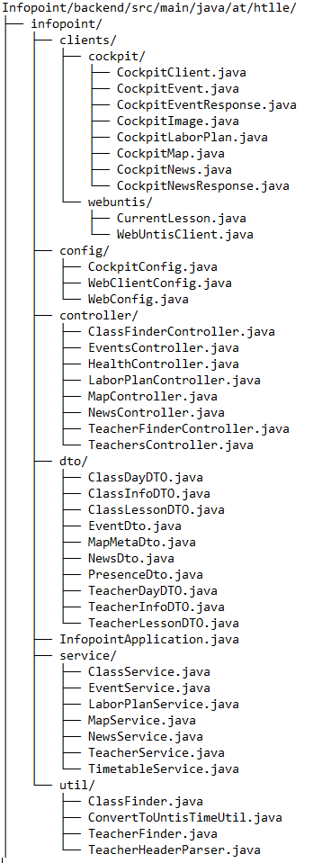

# Teilaufgabe Schüler Moser Simon
\textauthor{Moser Simon}

## Aufgabenstellung und Verantwortungsbereich
Im Rahmen dieser Diplomarbeit war ich für den Entwurf, Umsetzung, Implementierung und Dokumentation
des Backends sowie des Content-Management-Systems (CMS) zuständig. Der Schwerpunkt meiner Arbeit
lag auf der serverseitigen Verarbeitung von Daten, der Bereitstellung von Schnittstellen für das
Frontend sowie der Verwaltung und Speicherung von Inhalten im CMS.
Das Backend ist das Herzstück des Infopoints. Seine Aufgaben sind es Daten zu verarbeiten und korrekt
an das Frontend zu liefern. Zusätzlich wurde ein CMS namens Cockpit angebunden um das Verwalten von 
Inhalten und Daten so benutzerfreundlich wie möglich zu gestalten ohne dabei immer in der Quellcode eingreifen zu müssen.

## Zielsetzung des Backend-Systems

Ziel des Backend-Systems ist es, die zentrale technische Grundlage für das Infopoint-System bereitzustellen. Das Backend übernimmt dabei die Verarbeitung von Anfragen, die Verwaltung der Inhalte sowie die Kommunikation zwischen dem CMS und dem Frontend. Es sorgt dafür, dass alle relevanten Daten strukturiert gespeichert, verarbeitet und zuverlässig an die Benutzeroberfläche ausgeliefert werden.

Ein weiteres Ziel ist die Trennung von Darstellung und Logik. Während das Frontend ausschließlich für die Anzeige der Informationen zuständig ist, konzentriert sich das Backend auf die Geschäftslogik und Datenverarbeitung. Dadurch wird das Gesamtsystem übersichtlicher, leichter wartbar und einfacher erweiterbar.

Zusätzlich wurde das Backend so umgesetzt, dass Inhalte flexibel über das CMS verwaltet werden können, ohne dass Änderungen am Quellcode notwendig sind. Das System ist darauf ausgelegt, stabil zu laufen, fehlerhafte Eingaben abzufangen und klare Rückmeldungen an das Frontend zu liefern. Insgesamt stellt das Backend sicher, dass das Infopoint-System zuverlässig, erweiterbar und für den späteren Einsatz im schulischen Umfeld geeignet ist.

### Anforderungen an digitale Informationssysteme

Digitale Informationssysteme müssen eine Reihe von Anforderungen erfüllen, um im praktischen Einsatz zuverlässig und benutzerfreundlich zu funktionieren. Eine der wichtigsten Anforderungen ist die **Zuverlässigkeit** des Systems. Die bereitgestellten Informationen müssen jederzeit korrekt und aktuell sein, da fehlerhafte oder veraltete Inhalte zu Verwirrung bei den Nutzern führen können. Besonders bei Infopoint-Systemen in öffentlichen oder schulischen Einrichtungen ist ein stabiler Dauerbetrieb essenziell.

Ein weiterer zentraler Punkt ist die **Benutzerfreundlichkeit**. Informationen sollen schnell und intuitiv auffindbar sein, ohne dass dafür technische Vorkenntnisse notwendig sind. Die Struktur der Inhalte sowie deren Darstellung müssen klar und verständlich gestaltet sein. Das Backend spielt hierbei eine entscheidende Rolle, da es die Daten strukturiert bereitstellt und konsistent an das Frontend übermittelt.

Darüber hinaus müssen digitale Informationssysteme **flexibel und wartbar** sein. Inhalte ändern sich regelmäßig, weshalb das System so aufgebaut sein sollte, dass Anpassungen ohne großen technischen Aufwand möglich sind. Durch den Einsatz eines Content-Management-Systems können Inhalte gepflegt werden, ohne direkt in den Programmcode eingreifen zu müssen. Dies erhöht die Effizienz und reduziert potenzielle Fehlerquellen.

Auch die **Sicherheit** stellt eine wichtige Anforderung dar. Das System muss vor unberechtigtem Zugriff geschützt sein und fehlerhafte oder ungültige Eingaben korrekt behandeln. Insbesondere das Backend ist dafür verantwortlich, Anfragen zu überprüfen und nur zulässige Daten zu verarbeiten.

Zusätzlich sollte ein digitales Informationssystem **erweiterbar und skalierbar** sein. Neue Funktionen oder Inhalte sollten ohne grundlegende Änderungen an der bestehenden Architektur integriert werden können. Eine klare Trennung zwischen Frontend, Backend und Datenhaltung trägt wesentlich dazu bei, diese Anforderungen zu erfüllen und ein langfristig nutzbares System bereitzustellen.

## Theorie

### Überblick und Zielsetzung des Theorie-Teils
Der Theorie-Teil dient dazu, den fachlichen und technischen Kontext bereitzustellen, der für das Verständnis des anschließenden praktischen Abschnitts notwendig ist.
Er definiert zentrale Begriffe, erläutert die verwendeten Technologien und liefert die Grundlage für die Designentscheidungen im Projekt.
Die Zielsetzung besteht darin, dem Leser einen guten Überblick über Backend-Systeme im Allgemeinen und die spezifischen Komponenten des Infopoint-Projektes im Besonderen zu vermitteln.
Der Abschnitt soll ausreichend theoretisches Wissen bereitstellen, um auch ohne tiefe Vorkenntnisse die Architektur und Implementierung des Backends nachvollziehen zu können.
Abschließend wird verdeutlicht, wie die einzelnen Konzepte im späteren Praxis-Teil konkret angewendet werden.
Diese Verknüpfung erleichtert dem Leser die Orientierung und stärkt das Verständnis für die gewählten Technologien und Strukturen.

### Begriffe und grundlegende Konzepte
Bevor auf konkrete Frameworks und Werkzeuge eingegangen wird, ist es sinnvoll, einige generelle Fachbegriffe zu klären. Diese dienen als gemeinsamer Referenzrahmen und verhindern Missverständnisse bei späteren Diskussionen über Architektur oder Code.
Zu diesen grundlegenden Konzepten gehören insbesondere die Client-Server-Architektur, HTTP als Kommunikationsprotokoll sowie die Prinzipien von REST. Darüber hinaus werden allgemeine Aspekte der Datenrepräsentation angesprochen, etwa das JSON-Format und Serialisierungstechniken.
Die Kenntnis dieser Begriffe erleichtert nicht nur das Verständnis des Infopoint-Backends, sondern ist allgemein für die Entwicklung moderner Webanwendungen von Bedeutung.
Die Auswahl und Definition dieser Begriffe folgt der gängigen Literatur aus der Softwarearchitektur und den Webstandards (z. B. RFC 7231 für HTTP). Eine präzise Terminologie bildet die Basis für wiederholbare Kommunikation zwischen Entwicklern und ist ein wichtiges Merkmal wissenschaftlicher Texte.
Zudem wird im Verlauf der Arbeit kontinuierlich auf diese Grundbegriffe zurückgegriffen; sie dienen als Anker für tiefergehende Erklärungen und helfen, Komplexität schrittweise aufzubauen.

#### Client-Server-Architektur
Das Modell der Client-Server-Architektur trennt die Systeme in zwei Rollen: den Client, der Dienste anfordert, und den Server, der sie bereitstellt.
Diese Trennung erlaubt eine modulare Entwicklung und eine klare Verantwortungszuweisung. Clients können unterschiedliche Technologien verwenden, solange sie das vereinbarte Protokoll beherrschen.
Im Kontext des Infopoint-Projektes fungiert das Frontend als Client, das HTTP-Anfragen an das Spring-Boot-Backend sendet.
Das Backend bearbeitet diese Anfragen, führt Geschäftslogik aus und greift bei Bedarf auf externe Systeme wie ein CMS zu. Die Architekturschicht zwischen beiden ist durch eine klar definierte API charakterisiert.
Ein Vorteil der Client-Server-Struktur ist die Skalierbarkeit: Server können unabhängig von den Clients vervielfältigt oder ausgetauscht werden, während die Clients unverändert bleiben.
Dies unterstützt spätere Erweiterungen und einen stabilen Betrieb.
Historisch gesehen geht die Client-Server-Architektur auf frühe Netzwerkanwendungen zurück und bildet die Grundlage für moderne Webarchitekturen. Sie erlaubt auch den Einsatz von Zwischenschichten wie Proxies oder Load-Balancers, die zusätzliche Funktionen wie Caching, Sicherheitsfilter oder Verkehrsverteilung übernehmen können.
Neben dem klassischen Modell existieren Varianten wie Peer-to-Peer oder Serverless, doch für die vorliegende Anwendung bleibt das traditionelle Client-Server-Paradigma aufgrund seiner Vorhersagbarkeit und Unterstützung durch etablierte Technologien die sinnvollste Wahl.

#### HTTP, URIs und Statuscodes
HTTP (Hypertext Transfer Protocol) bildet die Grundlage der Kommunikation zwischen Client und Server im Web. Es definiert Methoden wie GET, POST, PUT und DELETE zur Manipulation von Ressourcen und verwendet URIs (Uniform Resource Identifiers) zur eindeutigen Adressierung dieser Ressourcen.
Statuscodes liefern dem Client unmittelbares Feedback über den Erfolg oder Misserfolg einer Anfrage. Codes im Bereich 2xx signalisieren Erfolg, 4xx weisen auf Clientfehler hin und 5xx zeigen an, dass auf Serverseite ein Problem aufgetreten ist. Eine konsistente Nutzung dieser Codes ist essenziell für eine verständliche und zuverlässig integrierbare API.
HTTP ist zustandslos, wird jedoch häufig durch Mechanismen wie Cookies oder Tokens erweitert, um Sitzungsinformationen zu übertragen. Moderne Implementierungen nutzen zudem persistenten Verbindungen (Keep-Alive) und Komprimierung, um Latenzzeiten zu reduzieren.
In der praktischen Umsetzung des Backends werden Statuscodes unter anderem durch Exception-Handler in Spring Boot gesteuert, die Fehlerinformationen in JSON-Strukturen kapseln und so eine gleichmäßige Schnittstelle für das Frontend gewährleisten. Zusätzlich werden Header wie `Content-Type` und `Cache-Control` verwendet, um das Verhalten von Clients zu steuern und eine korrekte Interpretation der Daten sicherzustellen.

#### REST-Architekturprinzipien
Representational State Transfer (REST) beschreibt ein Set an Designprinzipien für verteilte Systeme. REST orientiert sich an Ressourcen, die durch URIs identifiziert und durch Repräsentationen (z. B. JSON) ausgetauscht werden. Zustandslosigkeit bedeutet, dass jede HTTP-Anfrage alle nötigen Informationen enthält, um verarbeitet zu werden; der Server speichert keinen Sitzungszustand.
Weitere REST-Charakteristika sind eine einheitliche Schnittstelle, Schichtbarkeit und Cachebarkeit. Gemeinsam verbessern sie die Modularität und erleichtern die Entwicklung skalierbarer Systems. In Spring Boot lassen sich diese Prinzipien durch die Verwendung von `@RestController` und passenden HTTP-Methoden direkt abbilden.
Ein erweitertes REST-Prinzip ist HATEOAS (Hypermedia as the Engine of Application State), bei dem Antworten Links enthalten, die den Client durch die verfügbaren Aktionen führen. Zwar wurde HATEOAS im Infopoint-Backend nicht vollständig implementiert, so wird es dennoch in der Theorie als Möglichkeit zur Reduzierung der Kopplung zwischen Client und Server erwähnt.
Im Infopoint-Backend dient REST als architektonisches Leitbild für alle API-Endpunkte. Die Ressourcen wie `events` oder `news` werden konsistent benannt und über versionierte Pfade zur Verfügung gestellt, sodass das Frontend unabhängig von internen Implementierungen arbeiten kann. Die Einhaltung von REST-Prinzipien erleichtert außerdem die Nutzung generischer HTTP-Clients und Testing-Werkzeuge.

#### Datenformate: JSON und Serialisierung
JSON (JavaScript Object Notation) ist das dominierende Format für den Datenaustausch in Web-APIs. Es ist leichtgewichtig, menschenlesbar und wird von praktisch allen Programmiersprachen unterstützt. Serialisierung bezeichnet den Prozess, ein Objekt in eine byte- oder textbasierte Repräsentation zu überführen; Deserialisierung kehrt diesen Vorgang um.
In Java-Anwendungen übernimmt die Bibliothek Jackson diesen Vorgang automatisch, sobald HTTP-Nachrichten über `@RestController` verarbeitet werden. Die richtige Konfiguration von Serialisierungsregeln (z. B. Formatierung von Datumstypen oder Ignorieren von Nullwerten) ist wichtig, um Kompatibilität zwischen Backend und Frontend sicherzustellen.
Ein weiterer Aspekt ist die Versionierung der Datenformate. Änderungen an DTOs müssen so gestaltet werden, dass ältere Clients weiterhin funktionstüchtig bleiben; Erweiterbare Strukturen und opt-in-Felder sind übliche Strategien.

### Aufgaben und Verantwortlichkeiten von Backend-Systemen

Ein Backend übernimmt vielfältige Aufgaben: Verwaltung von persistenten Daten, Ausführung geschäftlicher Regeln, Authentifizierung und Autorisierung, Validierung von Eingaben sowie die Orchestrierung von Drittservices. Darüber hinaus setzt es Nicht-Funktionale Anforderungen um, beispielsweise Sicherheit, Performance und Skalierbarkeit.
Ein weiteres zentrales Thema ist die Behandlung von Nebenläufigkeit und Transaktionen. Da mehrere Clients gleichzeitig auf geteilte Ressourcen zugreifen, muss das System Mechanismen zur Synchronisation und zum Rollback bereitstellen. In Java-basierten Backends erfolgt dies häufig über deklarative Transaktionsverwaltung (z. B. `@Transactional`), die atomare Operationen in Datenbanken gewährleistet.
Im Infopoint-Projekt ist das Backend das Bindeglied zwischen dem Cockpit CMS und dem Infopoint-Frontend. Es übernimmt die Aufgabe, Inhalte zu laden, zu filtern und in geeigneter Form bereitzustellen. Dabei sorgt es für Konsistenz, wie beispielsweise einheitliche Datumsformate und vollständige Einträge.
Zudem isoliert das Backend das Frontend von technischen Details externer Systeme. Durch klar definierte Schnittstellen wird vermieden, dass Änderungen am CMS direkt Auswirkungen auf die Benutzeroberfläche haben. Diese Abstraktion erleichtert die Wartung und ermöglicht unabhängigere Weiterentwicklungen.
Schließlich fungiert das Backend oft als Kontrollpunkt für Logging, Monitoring und Auditierung. Jede wichtige Aktion wird protokolliert, wodurch sich Betriebszustände analysieren und Fehlerquellen eingrenzen lassen.

### Frameworks und Laufzeitumgebungen
Frameworks bieten wiederkehrende Bausteine und abstrahieren allgemeine Aufgaben. Sie verkürzen die Entwicklungszeit, indem sie beispielsweise den Lebenszyklus von Komponenten, Konfiguration oder Zugriff auf Bibliotheken standardisieren. Laufzeitumgebungen stellen die Ausführungsplattform zur Verfügung, oft einschließlich eingebetteter Webserver und Managementschnittstellen.
Die Wahl eines Frameworks beeinflusst nicht nur die Code-Architektur, sondern auch die erforderlichen Skills im Team sowie die verfügbare Dokumentation und Community-Unterstützung. In Java-Projekten sind neben Spring Boot auch Jakarta EE (ehemals Java EE) oder Micronaut gängig; Spring Boot wurde im Infopoint-Projekt aufgrund seiner ausgereiften Integrationen und der aktiven Community gewählt.
Laufzeitumgebungen wie der eingesetzte Tomcat-Servlet-Container oder eingebettete Alternativen vereinfachen Deployments, da sie zusammen mit dem Anwendungscode ausgeliefert werden können und keine externen Installationen erfordern.

### Spring Boot — Konzepte und Kernkomponenten
Spring Boot ist ein Framework, das auf dem Spring-Ökosystem aufbaut und die schnelle Erstellung produktionsfähiger Anwendungen ermöglicht. Es bietet vordefinierte Konfigurationen, sogenannte "Starters", und einen eingebetteten Server, sodass Anwendungen als selbstständige JARs ausgeführt werden können.
Die Autokonfiguration übernimmt dabei die Auswahl und Einrichtung zahlreicher Komponenten basierend auf den entdeckten Bibliotheken und Einstellungen. Dies reduziert den Konfigurationsaufwand erheblich und erlaubt es Entwicklern, sich auf die Geschäftslogik zu konzentrieren.
Kernkomponenten sind unter anderem der ApplicationContext für Bean-Management, das Web-Framework Spring MVC für REST-Endpunkte und die Unterstützung vielfältiger Datenzugriffstechnologien (JPA, JDBC, MongoDB, etc.).
Spring Boot ist zudem gut für den Aufbau von Microservices geeignet, da es modular einsetzbar ist und leichtgewichtige Anwendungen unterstützt. In verteilten Umgebungen ist die Fähigkeit, Anwendungen schnell zu starten und mit minimaler Konfiguration zu betreiben, ein großer Vorteil.
Die umfangreiche Ökosphäre um Spring Boot, inklusive Spring Cloud, bietet zahlreiche zusätzliche Module für Konfigurationsmanagement, Service Discovery und Resilienz. Obwohl im Infopoint-Projekt keine vollständige Microservice-Architektur zum Einsatz kommt, erleichtert das Framework künftig mögliche Erweiterungen in diese Richtung.

#### Dependency Injection und Inversion of Control

Dependency Injection (DI) ist ein Entwurfsmuster, bei dem Komponenten ihre Abhängigkeiten nicht selbst erstellen, sondern vom Framework bereitgestellt bekommen. Diese Umkehrung der Kontrolle (Inversion of Control, IoC) ermöglicht lose Kopplung und erleichtert das Testen, da Mock-Objekte einfach injiziert werden können.
Spring realisiert DI durch Annotationen wie `@Autowired` oder durch Konstruktorinjektion, wobei letztere als best practice gilt. Der ApplicationContext verwaltet den Lebenszyklus der Beans und injiziert sie zur Laufzeit.
Durch DI können Komponenten in verschiedenen Kontexten wiederverwendet werden, da sie nicht auf feste Implementierungen angewiesen sind. Dies fördert die Modularität und steigert die Flexibilität bei Änderungen.

#### Autokonfiguration, Starters und Typische Annotationen

Autokonfiguration ist ein Feature von Spring Boot, das basierend auf der Klassenpfad-Analyse automatisch Konfigurations-Benutzer bereitstellt. Starters sind Sammlungen von Abhängigkeiten, die typische Funktionalitäten bündeln, z. B. `spring-boot-starter-web` für Webanwendungen.
Typische Annotationen umfassen `@SpringBootApplication` am Haupteinstiegspunkt, `@RestController` für Web-Controller, `@Service` für Geschäftslogik und `@Repository` für Datenzugriff. Diese Annotationen sind mehr als schmückend; sie werden vom Framework gelesen und bewirken spezifisches Verhalten.
Die Kombination aus Autokonfiguration und Starters erlaubt es, neue Projekte mit wenig Boilerplate-Code zu starten und dennoch bei Bedarf tiefgehende Konfigurationen vorzunehmen.

### Erstellung von REST-APIs mit Spring Boot

Die Bereitstellung von REST-APIs ist eine der Standardanwendungen von Spring Boot. Eine API definiert Endpunkte, über die Clients Ressourcen abrufen oder manipulieren können. Die Konvention von URI-Strukturen und HTTP-Methoden wird dabei eingehalten.
Spring Boot stellt dafür das MVC-Modul zur Verfügung, mit dem Handler-Methoden einfach definiert werden. Response Bodies werden automatisch in JSON konvertiert, und Request Bodies können validiert werden, bevor sie in die Geschäftslogik gelangen.
Neben der Implementierung der Endpunkte beinhaltet die API-Erstellung auch Aspekte wie Sicherheit, Dokumentation und Versionierung, die im Rahmen von Spring Boot ebenfalls unterstützt werden.

#### Controller, Routing und HTTP-Methoden

Controller sind Java-Klassen, die mit `@RestController` gekennzeichnet werden. Methoden in diesen Klassen werden über Mapping-Annotationen wie `@GetMapping` oder `@PostMapping` einem URI-Pfad und einer HTTP-Methode zugeordnet.
Routing kann dynamische Pfadvariablen (`@PathVariable`), Abfragen (`@RequestParam`) oder Header verarbeiten. Die Struktur sollte intuitiv und konsistent sein, um die Entwicklung des Frontends zu erleichtern.
Die Verwendung der richtigen HTTP-Methode ist nicht nur semantisch wichtig, sondern beeinflusst auch Caching-Verhalten und Sicherheit. Beispielsweise sollten GET-Anfragen idempotent sein, während POST für nicht-idempotente Operationen genutzt wird.

#### DTOs, Mapping und Validation

DTOs (Data Transfer Objects) trennen die interne Domänenlogik von der externen Schnittstelle. Sie verhindern, dass interne Entitäten oder sensible Felder nach außen durchgereicht werden. DTOs erleichtern zudem die Anpassung der API bei Änderungen an internen Modellen.
Mapping zwischen Domänenobjekten und DTOs kann manuell erfolgen oder mit Bibliotheken wie MapStruct automatisiert werden. Validation wird in der Regel mithilfe von Bean Validation (JSR 380) und Annotationen wie `@NotNull`, `@Size` oder `@Pattern` umgesetzt.
Durch validierte DTOs gelangen nur korrekte Daten in die Geschäftslogik. Fehler werden früh erkannt und in verständlichen Antworten an den Client zurückgegeben.

#### Fehlerbehandlung und Exception Handling

Eine konsistente Fehlerbehandlung ist für eine robuste API unverzichtbar. In Spring lässt sich dies über `@ControllerAdvice` und `@ExceptionHandler` realisieren, um bestimmte Exceptions in strukturierte HTTP-Antworten zu transformieren.
Dabei werden intern geworfene Ausnahmen wie `IllegalArgumentException` oder eigene Domain-spezifische Exceptions abgefangen und entsprechende Statuscodes (z. B. 400 Bad Request, 404 Not Found) zurückgegeben.
Schließlich sollte die Fehlerantwort ausreichend Informationen für das Frontend oder den API-Consumer bereithalten, ohne intern zu detailliert zu werden. Log-Ausgaben ergänzen die Rückmeldungen auf Serverseite.

### Grundlangen von Maven

Maven ist ein weit verbreitetes Build- und Projektmanagement-Tool für Java. Es verwaltet Abhängigkeiten, führt den Build-Prozess durch und unterstützt Plug-ins für zusätzliche Aufgaben wie Testing oder Dokumentation. Grundlage ist die deklarative `pom.xml`.
Maven ermöglicht reproduzierbare Builds durch ein einheitliches Verzeichnislayout und einen festgelegten Lifecycle mit Phasen wie `compile`, `test`, `package` und `install`. Plugins können an diese Phasen angehängt werden, um zusätzliche Schritte auszuführen.
Die Abhängigkeitsscopes (`compile`, `provided`, `test`, `runtime`) steuern, welche Bibliotheken in welchen Phasen des Build- und Laufzeitprozesses zur Verfügung stehen. Transitive Abhängigkeiten werden automatisch aufgelöst, was die Verwaltung vereinfacht, aber gelegentlich zu Konflikten führt, die dann über das Enforcer-Plugin oder Version-Management gelöst werden müssen.
Für das Infopoint-Projekt wurden unter anderem das Compiler-Plugin zur Festlegung der Java-Version und das Surefire-Plugin für die Ausführung von Unit-Tests konfiguriert. Zusätzlich sorgt das Spring Boot Maven Plugin dafür, dass beim Package-Schritt ein ausführbares JAR inklusive aller benötigten Abhängigkeiten entsteht.

#### pom.xml, Lebenszyklus und Plugins

Die `pom.xml` enthält Gruppennamen, Artifakt-IDs, Versionsangaben sowie die Liste der Abhängigkeiten. Sie definiert auch Properties und Profile, die je nach Umgebung unterschiedliche Konfigurationen erlauben.
Plugins steuern einzelne Teile des Build-Prozesses. Das Spring Boot Maven Plugin erzeugt beispielsweise ein ausführbares JAR und kann den Anwendungstart im Entwicklungskontext unterstützen.
Durch das Festlegen von Versionsnummern und die Nutzung von Repositories wird sichergestellt, dass alle Entwickler und CI-Server dieselben Abhängigkeiten verwenden.

#### WebClient

`WebClient` ist Teil von Spring WebFlux und ermöglicht asynchrone, nicht-blockierende HTTP-Anfragen. Im Vergleich zum älteren `RestTemplate` bietet es eine reaktive API und bessere Skalierbarkeit.
Die reaktive Programmierung von `WebClient` basiert auf dem Projekt Reactor und verwendet die Typen `Mono` und `Flux` zur Darstellung von Einzelergebnissen bzw. Datenströmen. Durch die deklarative Fehlerbehandlung und die Möglichkeit, Rückgriff auf Backpressure zu nehmen, lassen sich robuste Integrationen implementieren.
Im Infopoint-Backend wird `WebClient` zur Kommunikation mit externen Systemen wie dem Cockpit CMS oder WebUntis verwendet. Es erlaubt die Konfiguration von Timeouts, Fehlerbehandlung und die Anpassung der In-Memory-Größe für große Antworten.
Durch die Nutzung von `WebClient` kann das Backend auch bei hoher Last stabil bleiben, da Threads nicht blockiert werden während auf Antworten gewartet wird. Außerdem erleichtert die einheitliche Schnittstelle die Implementierung von Retry-Mechanismen, Logging und Metriken, da alle HTTP-Aufrufe über denselben Typ ablaufen.

### Content-Management-Systeme (Cockpit) — Architektur und Integration

Content-Management-Systeme trennen die Inhalte einer Anwendung von deren Darstellung und Logik. Das Cockpit CMS ermöglicht Redakteuren, Inhalte zu erstellen und zu pflegen, ohne direkt in den Quellcode eingreifen zu müssen.
Das Backend des Infopoint-Projektes integriert Cockpit über eine REST-API. Ein dedizierter `CockpitClient` kapselt die Kommunikation, sodass Änderungen am CMS minimalen Einfluss auf den Anwendungscode haben.
Wichtige Aspekte der Integration sind Authentifizierung mittels API-Schlüssel, Umgang mit paginierten Ergebnissen und Caching, um die Performance zu verbessern und Ausfallzeiten des CMS abzufangen.

### Sicherheit im Backend

Sicherheit umfasst sowohl Authentifizierung (Wer ist der Benutzer?) als auch Autorisierung (Darf er das tun?). In REST-APIs werden häufig Token-basierte Verfahren wie JWT oder OAuth2 eingesetzt.
Zusätzlich zur klassischen Authentifizierung sollte die Anwendung auch gegen gängige Angriffe wie Cross-Site Scripting (XSS), SQL-Injection oder CSRF geschützt sein. Dies wird teils durch Framework-Funktionalitäten (z. B. automatische Parameterbindung) und teils durch explizite Prüfungen realisiert.
Das Infopoint-Backend selbst stellt primär öffentliche Daten bereit; dennoch wurden Mechanismen implementiert, um administrative Endpunkte oder interne Funktionen schützen zu können. Zudem wird eingehende Datenvalidierung als wesentlicher Sicherheitsaspekt betrachtet. Die Validierung erfolgt nicht nur auf der Oberfläche, sondern auch serverseitig, um bösartige Eingaben zu unterbinden.
Zusätzliche Schutzmaßnahmen umfassen die Konfiguration von CORS-Regeln, Input-Sanitization und der Einsatz von HTTPS zur Verschlüsselung des Datenverkehrs. Geheimnisse wie API-Keys werden nicht im Quellcode gespeichert, sondern über Umgebungsvariablen oder Secret-Management-Systeme eingespielt. Regelmäßige Updates der verwendeten Bibliotheken reduzieren zudem das Risiko bekannter Sicherheitslücken.

### Konfiguration und Profile (z. B. application.properties / application.yml)

Konfigurationseigenschaften ermöglichen das Parametrisieren einer Anwendung ohne Codeänderungen. Spring Boot liest hierfür die Dateien `application.properties` oder `application.yml` ein und unterstützt Profile wie `dev`, `test` oder `prod`.
Über Profile kann z. B. die Basis-URL des CMS oder ein API-Key pro Umgebung festgelegt werden. In sensiblen Produktionsumgebungen sollten solche Werte über Umgebungsvariablen oder spezielle Secret-Manager eingespielt werden
Die Trennung von Konfiguration und Code erleichtert den Wechsel zwischen Entwicklungs- und Produktionsumgebungen und minimiert das Risiko, vertrauliche Daten irrtümlich zu veröffentlichen.

#### Containerisierung (Docker) und docker-compose

Docker ermöglicht das Verpacken der Anwendung samt aller Abhängigkeiten in einem Container. Dies garantiert, dass sie in verschiedenen Umgebungen identisch ausgeführt wird. `docker-compose` vereinfacht die lokale Entwicklung durch Orchestrierung mehrerer Services wie Backend, CMS und Datenbank.
Im Projekt enthält die Backend-Docker-Datei Anweisungen zum Bauen und Starten des Spring-Boot-JARs sowie zur Konfiguration der Netzwerkverbindungen zu anderen Containern.
Das Zusammenspiel mit `docker-compose` erlaubt das schnelle Aufsetzen einer vollständigen Testumgebung inklusive Cockpit und optionalen Datenbanken.

### API-Dokumentation und Versionierung

Eine klare API-Dokumentation ist für die Zusammenarbeit zwischen Backend- und Frontend-Teams essentiell. OpenAPI/Swagger bietet sowohl maschinenlesbare Spezifikationen als auch eine interaktive Benutzeroberfläche.
Versionierung der API, z. B. durch Pfadsegmente wie `/api/v1/`, stellt sicher, dass bestehende Clients bei Erweiterungen oder Änderungen weiter funktionieren. Langfristig können so mehrere Versionen parallel betrieben werden.
Im Infopoint-Backend wurde Swagger automatisch aus den Controller-Definitionen erzeugt und dient sowohl als Dokumentationsquelle als auch als Prüfwerkzeug während der Entwicklung.

### Grundlagen von Backend-Systemen

Das Backend, wie bereits eingangs erwähnt, bildet das "Herz" der Anwendung. Es ist verantwortlich für alle Operationen, die nicht direkt mit der Darstellung zusammenhängen. Hier werden Datenbanken angesprochen, Geschäftsregeln formuliert und externe Systeme angebunden.

Obwohl es für Endanwender nicht sichtbar ist, prägt die Qualität des Backends unmittelbar die Nutzererfahrung, da es Verfügbarkeit, Antwortzeiten und Datenkonsistenz bestimmt. Eine mangelhafte Implementierung kann zu inkonsistenten Daten, langen Wartezeiten oder Ausfällen führen, selbst wenn das Frontend perfekt gestaltet ist.

Ein gut gestaltetes Backend trennt klar zwischen Schichten (Präsentation, Logik, Daten), unterstützt durch dokumentierte Schnittstellen, um zukünftige Erweiterungen und Wartung zu erleichtern. Dieses Schichtenmodell wird in der Literatur häufig als "Layered Architecture" bezeichnet und ist Bestandteil von Architekturmuster-Katalogen (z. B. [@buschmann1996pattern]).

#### Schichten und Designmuster

Typische Schichten umfassen die Präsentationsschicht (Controller/Rest), die Geschäftslogikschicht (Services) und die Persistenzschicht (Repository/DAO). Diese klare Trennung ermöglicht es, einzelne Schichten unabhängig zu testen und auszutauschen. Zudem finden sich innerhalb dieser Schichten wiederkehrende Designmuster wie Factory, Singleton oder Strategy, die bewährte Lösungen für häufige Probleme bieten.

Besonders wichtig ist die Verwendung von Data Transfer Objects (DTOs) und Boundary-Interfaces, die die interne Domäne vom externen API-Contract abkoppeln. Dadurch bleibt das Backend resistent gegenüber Veränderungen in der Datenrepräsentation und ermöglicht parallele Entwicklungen an Front- und Backend.


Ein Backend kann entweder vertikal skalieren (mehr Ressourcen pro Instanz) oder horizontal (mehr Instanzen). Statelose Architekturen erleichtern letzteren Ansatz und eignen sich hervorragend für Cloud-Umgebungen, in denen Auto-Scaling genutzt wird. Persistente Zustände werden in externen, dafür optimierten Systemen gehalten (Datenbanken, Cache-Cluster), um die Kopplung zwischen Instanzen zu minimieren.

Hochverfügbarkeit erreicht man durch Redundanz (mehrere Instanzen über mehrere Verfügbarkeitszonen) sowie durch Monitoring und Self-Healing. Cloud-Anbieter bieten hierfür native Dienste an, doch auch on-premises können Load-Balancer und Cluster-Technologien dieses Ziel unterstützen.

Diese erweiterten Grundlagen legen ein fundiertes Verständnis dafür, weshalb der praktische Teil dieser Arbeit so strukturiert und umgesetzt wurde. Die nachfolgenden Kapitel erläutern im Detail, wie die hier beschriebenen Prinzipien konkret im Infopoint-Backend realisiert wurden und welche Entscheidungen zu treffen waren, um die beschriebenen Anforderungen zu erfüllen.


## Praktische Arbeit

### Überblick über die praktische Umsetzung
Der praktische Teil umfasst die **Konzeption, Implementierung und Dokumentation** des Backends sowie die **Konfiguration und Anbindung** des Content-Management-Systems (Cockpit CMS).  
Ziel war eine serverseitige Lösung, die **stabil**, **wartbar**, **erweiterbar** und im Alltag **einfach zu bedienen** ist. Inhalte sollen im CMS gepflegt werden können und anschließend über eine REST API standardisiert im Infopoint-Frontend angezeigt werden.

Zu Beginn wurden die Anforderungen gemeinsam mit dem Frontend abgestimmt. Dabei wurde festgelegt:
- **welche Inhalte** gebraucht werden (z. B. Events, News, Kategorien),
- **welche Felder** diese Inhalte haben (z. B. Titel, Datum, Beschreibung),
- und über **welche API-Endpunkte** das Frontend diese Daten abrufen kann.

### Systemgrenzen und Verantwortlichkeiten
Damit die Lösung übersichtlich bleibt, wurden klare Zuständigkeiten definiert:

- **Cockpit CMS:** Inhalte anlegen und pflegen (z. B. Events erstellen, News bearbeiten, Bilder hochladen)
- **Backend:** Inhalte aus dem CMS abholen, prüfen/aufbereiten und als REST API bereitstellen
- **Frontend/Infopoint:** Inhalte anzeigen und Benutzerinteraktion umsetzen

Beispiel:
- Eine Lehrperson erstellt im Cockpit CMS ein neues Event.
- Das Backend liefert dieses Event über `/api/v1/events`.
- Das Frontend zeigt es als „Nächstes Event“ am Infopoint an.

### Projektsetup und Entwicklungsumgebung
Zu Beginn der praktischen Umsetzung des Backends wurde eine strukturierte und stabile Basis geschaffen.
Das Backend wurde als eigenständiges Spring-Boot-Projekt umgesetzt und klar vom Frontend getrennt.
Diese Trennung ermöglicht eine unabhängige Weiterentwicklung beider Systeme und sorgt für eine saubere Aufgabenteilung innerhalb des Projekts.

Als Entwicklungsumgebung wurde **IntelliJ IDEA** verwendet.
IntelliJ bietet eine umfassende Unterstützung für Spring Boot und Maven und erleichtert dadurch die Entwicklung erheblich.
Funktionen wie automatische Code-Vervollständigung, integrierte Fehleranalyse, Refactoring-Werkzeuge sowie eine direkte Integration von Build- und Run-Konfigurationen ermöglichen eine effiziente und strukturierte Arbeitsweise.

Das Projekt wurde mit **Maven** verwaltet, wodurch alle Abhängigkeiten zentral in der `pom.xml` definiert sind.
IntelliJ übernimmt dabei automatisch das Laden und Verwalten der benötigten Libraries (**dependencies**) [@Maven-Docs].
Änderungen an Dependencies werden direkt erkannt und in das Projekt integriert.
Dies sorgt für eine konsistente und reproduzierbare Entwicklungsumgebung.

Ein weiterer wichtiger Bestandteil der Entwicklungsumgebung war die Nutzung eines Versionsverwaltungssystems (Git) [@Git-Docs].
Dadurch konnten Änderungen am Backend nachvollziehbar dokumentiert, Zwischenstände gesichert und bei Bedarf frühere Versionen wiederhergestellt werden.
Dies unterstützte sowohl die eigene Arbeitsweise als auch die Zusammenarbeit im Team.

Insgesamt bildete die gewählte Entwicklungsumgebung die Grundlage für eine effiziente und strukturierte Backend-Entwicklung.
Durch die Kombination aus **IntelliJ** und **Maven** konnte eine stabile, gut wartbare und reproduzierbare Projektstruktur geschaffen werden.

### Projekt- und Ordnerstruktur des Backends
Bei der Umsetzung des Backends wurde von Beginn an auf eine klare und nachvollziehbare Projektstruktur geachtet.
Eine saubere Ordnerstruktur ist besonders bei größeren Anwendungen wichtig, da sie die Wartbarkeit verbessert und neuen Entwicklern eine schnelle Orientierung im Projekt ermöglicht.

Das Backend basiert auf einem typischen Spring-Boot-Projektaufbau.
Der Quellcode befindet sich im Verzeichnis `src/main/java`, während Konfigurationsdateien wie die `application.yml` bzw. `application.properties` im Ordner `src/main/resources` abgelegt sind.

Innerhalb des Hauptpakets wurde der Code zusätzlich logisch gegliedert.
Die wichtigsten Unterpakete sind:

- `controller` – Enthält die REST-Controller, welche die HTTP-Anfragen entgegennehmen.
- `service` – Beinhaltet die Geschäftslogik der Anwendung.
- `clients` – Enthält externe Schnittstellen, z. B. den CockpitClient und WebUntisClient.
- `dto` – Definiert Data Transfer Objects zur strukturierten Datenübertragung.
- `config` – Beinhaltet Konfigurationsklassen (z. B. für WebClient oder CMS-Zugriff).
- `util` - Stellt Hilfsklassen zur leichteren Verarbeitung von Daten (z.B. TimeConverter)

Diese klare Trennung sorgt dafür, dass jede Klasse eine eindeutige Aufgabe hat und Verantwortlichkeiten nicht vermischt werden.
Änderungen an einer Schicht, beispielsweise an der API oder an der CMS-Anbindung, können dadurch durchgeführt werden, ohne andere Teile des Systems unnötig zu beeinflussen.

Die durchdachte Projektstruktur bildet somit eine wichtige Grundlage für eine stabile, erweiterbare und langfristig wartbare Backend-Architektur.

{width=100%}

### Vorgehen und erstellte Artefakte
Im Rahmen der Umsetzung sind mehrere sogenannte **Artefakte** entstanden.  
Als Artefakte bezeichnet man alle greifbaren Ergebnisse, die während eines Entwicklungsprozesses erstellt werden.
Dabei handelt es sich nicht nur um fertigen Programmcode, sondern auch um Konzepte, Entwürfe, Definitionen oder Dokumentationen, die für die Umsetzung notwendig sind.  

Artefakte helfen dabei, das System strukturiert zu planen, nachvollziehbar umzusetzen und später leichter zu warten oder zu erweitern.
Sie dienen außerdem als gemeinsame Grundlage für die Abstimmung im Team, insbesondere zwischen Backend- und Frontend-Entwicklung.

Die Umsetzung erfolgte in klaren Schritten. Dabei sind folgende Artefakte entstanden:

- **Ressourcen-Definition:** Welche Datenobjekte gibt es?  
  Beispiele: `events`, `news`, `categories`

- **API-Entwurf:** Welche Endpunkte gibt es und wie sind sie aufgebaut?  
  Beispiel:
  - `GET /api/v1/events` -> Liste aller Events
  - `GET /api/v1/events/{id}` -> Details zu einem Event

- **DTO-Konzept:** Trennung zwischen internen Objekten und dem, was die API ausgibt  
  Beispiel:
  - Intern kann ein Objekt mehr Felder haben (z. B. interne IDs oder Metadaten)
  - Nach außen liefert die API nur das, was das Frontend braucht (z. B. Titel, Datum, Text)

- **Validierung & Fehlerformat:** Einheitliche Regeln und klare Fehlermeldungen  
  Beispiel:
  - Wenn `title` fehlt -> Rückgabe `400 Bad Request` mit verständlicher Fehlermeldung

- **API-Dokumentation:** Dokumentation für das Frontend-Team (OpenAPI/Swagger)

### Planung und Systemarchitektur
Das Backend wurde so aufgebaut, dass die einzelnen Teile klar getrennt sind:

- **Controller-Schicht (API):** nimmt HTTP-Anfragen entgegen und gibt Antworten zurück  
- **Service-Schicht (Logik):** verarbeitet Daten und enthält die Geschäftslogik  
- **DTO-Schicht (Datenübertragung):** definiert, welche Daten die API liefert  
- **CMS-Anbindung:** holt Inhalte aus dem Cockpit CMS und macht sie nutzbar

Diese Trennung macht das System wartbar und erleichtert Erweiterungen,
weil Änderungen meist nur in einer Schicht notwendig sind.

### Implementierung des Backends

Die Implementierung des Backends erfolgte nach dem Prinzip der klaren Schichtentrennung. Ziel war es, eine übersichtliche und wartbare Struktur zu schaffen, bei der jede Schicht eine klar definierte Aufgabe übernimmt. Der Ablauf einer typischen Anfrage folgt dabei immer demselben Muster:

1. Eine HTTP-Anfrage erreicht den Controller.
2. Der Controller delegiert die Verarbeitung an die Service-Schicht.
3. Der Service verarbeitet die Daten und kommuniziert mit dem CMS.
4. Das Ergebnis wird als DTO zurückgegeben.
5. Der Controller liefert eine standardisierte HTTP-Antwort an das Frontend.

---

### Umsetzung der Controller-Schicht im Backend

Die Controller-Schicht bildet die Schnittstelle zwischen dem Backend und dem Frontend.
Sie ist dafür verantwortlich, eingehende HTTP-Anfragen entgegenzunehmen, diese an die entsprechende Service-Schicht weiterzuleiten und die Antwort in strukturierter Form zurückzugeben.
In Spring Boot werden Controller typischerweise mit der Annotation `@RestController` definiert.
Diese ermöglicht es, REST-Endpunkte einfach zu erstellen und JSON-Antworten automatisch zu serialisieren (vgl. [@Spring-Boot-Docs]).

Jeder Controller ist einer bestimmten Ressource zugeordnet, beispielsweise `events` oder `news`.
Über `@RequestMapping` wird ein gemeinsamer Basispfad definiert, etwa `/api/v1/events`.
Konkrete Endpunkte werden anschließend mit Annotationen wie `@GetMapping`, `@PostMapping`, `@PutMapping` oder `@DeleteMapping` umgesetzt (vgl. [@Spring-Boot-Docs]).
Dadurch wird klar festgelegt, welche HTTP-Methode welche Funktion ausführt.

Die Controller enthalten bewusst keine Geschäftslogik.
Ihre Aufgabe besteht ausschließlich darin, Anfragen zu validieren, Parameter entgegenzunehmen und diese an die Service-Schicht weiterzugeben.
Diese klare Trennung zwischen Controller und Service erhöht die Wartbarkeit des Systems und sorgt für eine übersichtliche Struktur.

### Ablauf einer Anfrage (Beispiel: Events abrufen)

Um die Funktionsweise zu verdeutlichen, wird folgend ein typischer Ablauf beschrieben:

Ein Client sendet eine Anfrage an:

- GET `/api/v1/events`

Der Controller nimmt diese Anfrage entgegen und ruft den entsprechenden Service auf.

```java
@RestController
@RequestMapping("/api/v1/events")
public class EventsController {

    private final EventService eventService; // <-- Service für Events

    public EventsController(EventService eventService) {
        this.eventService = eventService;
    }

    @GetMapping("/{limit}")
    public List<CockpitEvent> get(@PathVariable int limit) {
        return eventService.get(limit);
    }
}

```

---

### Umsetzung der Service-Schicht im Backend
Die Service-Schicht bildet das zentrale Element der Geschäftslogik im Backend.
Während die Controller-Schicht ausschließlich für die Entgegennahme und Rückgabe von HTTP-Anfragen zuständig ist, übernimmt die Service-Schicht die eigentliche Verarbeitung der Daten.
Sie koordiniert die Kommunikation mit externen Clients (z. B. CockpitClient oder WebUntisClient), wendet Geschäftsregeln an und bereitet die Daten für die Weitergabe an die Controller-Schicht auf.

Ein wesentliches Konzept innerhalb der Service-Schicht ist die Verwendung von Data Transfer Objects (DTOs).
DTOs dienen dazu, Daten strukturiert und kontrolliert zwischen den einzelnen Schichten zu übertragen, ohne interne Implementierungsdetails preiszugeben (vgl. [@DTOs-information]).
Dadurch wird sichergestellt, dass das Backend klar zwischen interner Datenstruktur und externer API-Darstellung unterscheidet.

Die Service-Schicht greift nicht direkt auf HTTP-Mechanismen zu, sondern arbeitet rein logisch.
Dadurch bleibt sie unabhängig von der konkreten API-Implementierung und kann leichter getestet oder erweitert werden.
Zudem ermöglicht diese Struktur eine saubere Trennung der Verantwortlichkeiten (Separation of Concerns), was die Wartbarkeit und Übersichtlichkeit des Systems deutlich verbessert.

### Service-Schicht (Geschäftslogik)

Die Service-Schicht übernimmt die eigentliche Verarbeitung der Daten.  
Hier wird definiert:

- Wie Daten aus dem CMS geladen werden
- Wie sie ggf. gefiltert oder sortiert werden
- Wie sie in DTOs umgewandelt werden

Ein zentraler Bestandteil der Service-Schicht ist die Kommunikation mit dem Cockpit CMS.  
Dafür wird eine eigene Client-Klasse (`CockpitClient`) verwendet. Diese Klasse kapselt die externe Kommunikation und sorgt dafür, dass HTTP-Aufrufe zum CMS nicht direkt im Service implementiert werden. Dadurch bleibt der Service übersichtlich und unabhängig von technischen Details der CMS-Anbindung.

```java
@Service
public class EventService {

	private final CockpitClient cockpitClient; // <-- Verbindung zu Cockpit

    public EventService(CockpitClient cockpitClient) {
        this.cockpitClient = cockpitClient;
    }

    public List<CockpitEvent> get(int limit) {
        return cockpitClient.getAppointments(limit); // <-- holt Events
    }
}
```

In diesem Beispiel ruft die Methode `get(int limit)` die Methode `getAppointments(limit)` des `CockpitClient` auf.
Der Service selbst enthält keine HTTP-Logik, sondern delegiert diese Aufgabe vollständig an den Client.
Dadurch bleibt die Geschäftslogik klar getrennt von der technischen Kommunikation.

---

### Umsetzung und Einsatz von DTOs (Data Transfer Objects)
Im Backend werden **DTOs (Data Transfer Objects)** eingesetzt, um Daten kontrolliert zwischen den einzelnen Schichten (Controller, Service) und nach außen zur REST API zu übertragen. 
Ein DTO ist dabei ein eigenes, meist einfaches Objekt, das nur jene Felder enthält, die das Frontend wirklich benötigt.
Dadurch wird verhindert, dass interne Strukturen oder unnötige Informationen direkt über die API sichtbar werden.
Außerdem macht diese Trennung den Code übersichtlicher und reduziert das Risiko, dass sich Änderungen an internen Klassen direkt auf die API auswirken (vgl. [@DTOs-information]).

In der praktischen Umsetzung werden DTOs vor allem in zwei Situationen verwendet: Erstens bei **Antworten** an das Frontend (Response-DTO), damit das Frontend eine klare und stabile Struktur erhält. 
Zweitens bei **Anfragen** an das Backend (Request-DTO), um Eingabedaten sauber entgegenzunehmen und direkt validieren zu können.
Die Umwandlung von internen Objekten (z. B. Cockpit-Datenmodelle) in DTOs passiert typischerweise in der Service-Schicht, da dort die Geschäftslogik liegt.
So bleibt der Controller möglichst schlank und konzentriert sich auf die HTTP-Ebene.


### Verwendung von DTOs
DTOs (Data Transfer Objects) dienen dazu, nur die Daten nach außen zu geben, die das Frontend wirklich benötigt.  
Interne Felder oder CMS-spezifische Informationen werden nicht direkt weitergegeben. [@DTOs-information]

Beispiel:
Ein Event im CMS könnte folgende Felder enthalten:
- id
- title
- description
- internalMetadata
- createdAt
- updatedAt

Die API gibt jedoch nur zurück:
- title
- description
- date

```java
public record EventDto(
        Long id,
        String title,
        Instant start,
        Instant end,
        String location,
        String type,
        String description,
        String imageUrl
) {}
```

---

### CockpitClient (CMS-Anbindung)
Der **CockpitClient** ist die zentrale Verbindung zwischen Backend und dem **Cockpit CMS**.
Seine Aufgabe ist es, Inhalte wie News, Events, Karten oder Laborpläne aus dem CMS abzurufen und dem Backend als Java-Objekte bereitzustellen. Damit bleibt die Kommunikation mit dem CMS an einer Stelle gebündelt: Controller und Services müssen keine URLs, Header oder Speziallogik für Cockpit kennen, sondern rufen nur Methoden wie `getNews(...)` oder `getAppointments(...)` auf.
Die Zugriffsdaten (CMS-URL und API-Key) werden über eine eigene Konfiguration (`CockpitConfig`) eingebunden.
Zusätzlich wurde die maximale In-Memory-Größe des WebClients erhöht, damit auch größere Medien (z. B. Bilder) verarbeitet werden können.
Bei Fehlern (z. B. falscher API-Key, CMS nicht erreichbar) fängt der Client Ausnahmen ab und gibt sichere Rückgabewerte zurück (z. B. `List.of()` oder `null`), damit das Backend stabil bleibt und das Frontend nicht durch Exceptions „abstürzt“.

**CockpitClient – Beispiel für den Abruf von News über REST** [@SLF4J-Docs]
```java
@Component
public class CockpitClient {

    private final WebClient webClient;
    private final CockpitConfig cockpitConfig;
    private static final Logger log = LoggerFactory.getLogger(CockpitClient.class);

    public CockpitClient(WebClient.Builder builder, CockpitConfig cockpitConfig) {
        this.webClient = builder
                .codecs(c -> c.defaultCodecs().maxInMemorySize(16 * 1024 * 1024))
                .build();
        this.cockpitConfig = cockpitConfig;
    }

    public List<CockpitNews> getNews(int limit) {
        try {
            return webClient.get()
                    .uri(cockpitConfig.getUrl() + "/api/content/items/news?limit=" + limit)
                    .header("api-key", cockpitConfig.getApiKey())
                    .retrieve()
                    .bodyToMono(new ParameterizedTypeReference<List<CockpitNews>>() {})
                    .block();
        } catch (WebClientResponseException e) {
            return List.of();
        }
    }
}
```

### WebUntisClient (Stundenplan Anbindung)
Der **WebUntisClient** dient dazu, externe Informationen aus **WebUntis** abzurufen und im Infopoint anzuzeigen (z. B. Tagesübersicht für Lehrer oder Klassen).
Der Client nutzt ebenfalls den **WebClient**, um HTTP-Anfragen an WebUntis zu senden.
Im Gegensatz zum **CockpitClient** arbeitet WebUntis hier mit einem GET-Request auf einen Monitor-Endpunkt, bei dem ein Request-Body mit Parametern wie `date` und `format` mitgeschickt wird.
Da Eingaben vom Frontend fehlerhaft sein können (z. B. ein ungültiges Datum), normalisiert der Client zuerst den Datumswert und verwendet bei Fehlern automatisch das aktuelle Datum als Fallback.
Zusätzlich gibt es eine Schutzlogik (`safeFetchDayOverview`): Falls WebUntis nicht erreichbar ist oder ein Fehler auftritt, wird nicht einfach eine Exception weitergeworfen, sondern ein leeres, aber gültiges JSON-Objekt zurückgegeben.
Das sorgt dafür, dass die Anzeige am Infopoint weiterhin funktioniert, auch wenn die externe Quelle kurzzeitig Probleme hat.

**WebUntisClient - Abruf der Tagesübersicht für Klassen mit Fallback** [@SLF4J-Docs]
```java
@Component
public class WebUntisClient {

    private final WebClient webClient;
    private static final Logger log = LoggerFactory.getLogger(CockpitClient.class);

    public WebUntisClient(WebClient.Builder webClient) {
        this.webClient = webClient
                .baseUrl("https://htlleoben.webuntis.com/WebUntis")
                .build();
    }

    public JsonNode getClassOverview(String date) {
        String normalizedDate = normalizeDate(date);
        try {
            return safeFetchDayOverview(normalizedDate, "Tagesübersicht Klass");
        } catch (Exception ignored) {
            return safeFetchDayOverview(normalizedDate, "Tagesübersicht Klassen");
        }
    }

    private JsonNode fetchDayOverviewByFormat(String date, String format) {
        Map<String, String> requestBody = Map.of("date", date, "format", format);
        return webClient.post()
                .uri(uriBuilder -> uriBuilder
                        .path("/monitor/dayoverview/data")
                        .queryParam("school", "htlleoben")
                        .build())
                .header("X-Requested-With", "XMLHttpRequest")
                .bodyValue(requestBody)
                .retrieve()
                .bodyToMono(JsonNode.class)
                .block();
    }
}
```

### Utility-Klassen im Backend

Neben Controllern, Services und DTOs wurden im Backend mehrere **Utility-Klassen** (kurz: *Utils*) umgesetzt.
Diese Klassen enthalten wiederverwendbare Hilfslogik, die an mehreren Stellen benötigt wird, aber **nicht direkt** in Controller oder Services gehört. 
Typische Aufgaben sind z. B. das **Auslesen und Aufbereiten von WebUntis-JSON**, das **Suchen/Filtern** von Daten oder kleine **Zeit-Konvertierungen**.
Dadurch bleibt der restliche Code übersichtlich und doppelte Logik wird vermieden.
Da WebUntis die Daten als JSON liefert, arbeiten diese Utils stark mit `JsonNode` und sicheren Zugriffen wie `node.path(...)`, damit das System auch bei fehlenden Feldern stabil bleibt (vgl. [@Jackson-Docs]).

#### ClassFinder
`ClassFinder` dient dazu, aus der WebUntis-Tagesübersicht **Klassen zu suchen** und bei Bedarf einen **Tagesplan** einer bestimmten Klasse zu erstellen.
Die Klasse geht dabei durch die `rows` im JSON, prüft den `header` (Klassenname) und ermittelt zusätzlich, ob gerade eine aktuelle Stunde läuft. Dafür wird die aktuelle Zeit in das Untis-Zeitformat (z. B. 0815) umgerechnet und mit `startTime`/`endTime` verglichen.
Außerdem werden **Events** (z. B. „Wandertag“) aus den Zellen gesammelt und bei unregelmäßigen Perioden als Anzeige-Text verwendet.

```java
public static List<ClassInfoDTO> search(JsonNode root, String query) {
    String q = query.toLowerCase();
    int now = ConvertToUntisTimeUtil.nowAsUntisTime();

    for (JsonNode row : root.path("payload").path("rows")) {
        String header = row.path("header").asText("").trim(); // Klassenname
        if (!header.toLowerCase().contains(q)) continue;

        // ... periods durchsuchen und aktuelle Stunde finden (now in start/end)
    }
    return results;
}
```

### ConvertToUntisTimeUtil
`ConvertToUntisTimeUtil` ist eine kleine Hilfsklasse, die die aktuelle Uhrzeit in das von WebUntis verwendete Zeitformat umwandelt.
WebUntis arbeitet bei Zeiten häufig mit Ganzzahlen wie `0815` für 08:15 Uhr oder `1340` für 13:40 Uhr.
Damit die aktuell laufende Unterrichtseinheit einfach ermittelt werden kann, liefert die Utility-Methode die aktuelle Zeit im Format `hour * 100 + minute`.

Als Zeitzone wird bewusst `Europe/Vienna` verwendet, um sicherzustellen, dass die Zeitberechnung unabhängig von der Server- oder Container-Konfiguration korrekt erfolgt.
Die Umsetzung basiert auf der `java.time`-API, die seit Java 8 Bestandteil der Standardbibliothek ist (vgl. [@Java-Time-Docs]).

```java
public class ConvertToUntisTimeUtil {

    private static final ZoneId SCHOOL_ZONE = ZoneId.of("Europe/Vienna");

    public static int nowAsUntisTime() {
        LocalTime now = ZonedDateTime.now(SCHOOL_ZONE).toLocalTime();
        return now.getHour() * 100 + now.getMinute();
    }
}
```

### TeacherFinder

Die Klasse `TeacherFinder` übernimmt die Suche und Verarbeitung von Lehrerdaten aus der WebUntis-Tagesübersicht.
Sie arbeitet ähnlich wie der `ClassFinder`, berücksichtigt jedoch zusätzliche Informationen wie Lehrerkürzel sowie Vor- und Nachname.
Ziel ist es, aus der von WebUntis gelieferten JSON-Struktur strukturierte DTOs zu erzeugen, die im Backend weiterverwendet oder direkt an das Frontend übergeben werden können.

Ein zentrales Element ist die Methode `firstNonBlank(...)`.
Da WebUntis je nach Situation unterschiedliche JSON-Schlüssel für Fachbezeichnungen verwendet, prüft diese Methode mehrere mögliche Felder und gibt das erste nicht-leere Ergebnis zurück.
Dadurch wird sichergestellt, dass auch bei variierender Datenstruktur ein gültiger Fachname ermittelt werden kann.

```java
private static String firstNonBlank(JsonNode node, String... keys) {
    for (String key : keys) {
        String value = node.path(key).asText("");
        if (!value.isBlank()) {
            return value.trim();
        }
    }
    return "";
}
```

### TeacherHeaderParser

Der `TeacherHeaderParser` ist dafür zuständig, den von WebUntis gelieferten Header-String eines Lehrers in einzelne Bestandteile zu zerlegen.
In der Regel enthält dieser String Informationen wie **Nachname**, **Vorname** und **Kürzel**, beispielsweise im Format:
Da diese Informationen als kombinierter Text geliefert werden, wird zur Analyse ein regulärer Ausdruck (Regex) verwendet.
Reguläre Ausdrücke ermöglichen es, strukturierte Textmuster gezielt zu erkennen und einzelne Teile daraus zu extrahieren (vgl. [@Java-Regex-Docs]).

Falls der Header nicht dem erwarteten Muster entspricht, wird ein `TeacherInfoDTO` mit Default-Werten zurückgegeben. Dadurch wird verhindert, dass das Backend durch fehlerhafte oder unerwartete Eingaben abstürzt.
Gleichzeitig kann die Oberfläche weiterhin eine sinnvolle Anzeige darstellen.

```java
public class TeacherHeaderParser {

    private static final Pattern PATTERN =
            Pattern.compile("(.+?),\\s*(.+?)\\s*\\((.+?)\\)");

    public static TeacherInfoDTO parse(String header) {
        Matcher m = PATTERN.matcher(header);
        if (!m.matches()) {
            return new TeacherInfoDTO(header, "", "", "", null);
        }
        return new TeacherInfoDTO(
                header,
                m.group(1).trim(), // Nachname
                m.group(2).trim(), // Vorname
                m.group(3).trim(), // Kürzel
                null
        );
    }
}
```

### Zusammenfassung der Backend-Implementierung

Durch die klare Trennung von Controller, Service und DTOs wurde eine saubere und wartbare Struktur geschaffen.  
Jede Anfrage folgt einem definierten Ablauf, wodurch das System nachvollziehbar und erweiterbar bleibt.  
Die Validierung und globale Fehlerbehandlung sorgen zusätzlich für Stabilität und klare Rückmeldungen an das Frontend.
#### Integration des Cockpit CMS
- Anbindung an das CMS zur Verwaltung von Inhalten (Texte, Bilder, Veranstaltungen, Kategorien).
- Saubere Trennung: CMS verwaltet Inhalte, Backend bereitet sie auf und stellt sie über standardisierte Endpunkte bereit.
- Umgang mit Medien/Uploads sowie grundlegende Rollen-/Rechtekonzepte im CMS für administrative Tätigkeiten.

#### Qualitätssicherung und Tests
- Komponententests und Integrationstests im Backend (Spring Boot Test) für zentrale Use-Cases.
- Manuelle API-Checks über Tools wie Postman/REST Client zur schnellen Verifikation während der Entwicklung.
- Automatisch generierte API-Dokumentation als gemeinsame Referenz für alle Beteiligten.

#### Bereitstellung und Betrieb
- Containerbasierter Build des Backends und orchestrierter Start der Services.
- Persistente Volumes für CMS-Daten und konfigurierbare Umgebungsvariablen (z. B. Basis-URL).
- Logging und einfache Metriken zur Überwachung des laufenden Systems; klare Deployment-Schritte für Test und Produktion.


