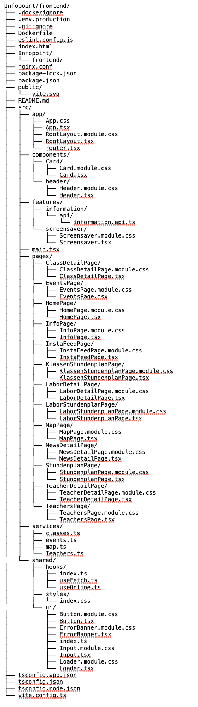

# Teilaufgabe Schüler Lukas Fellegger
\textauthor{Lukas Fellegger}

## Ausgangslage

### Teilaufgabenbereich

Dieser Aufgabenbereich innerhalb des Projekts umfasste die Frontend-Entwicklung der Anwendung. Die Aufgabe war es, eine übersichtliche, moderne und benutzerfreundliche Oberfläche zu erstellen, die auf unterschiedlichen Endgeräten zuverlässig funktioniert.

Für die Umsetzung des Frontends wurde das Framework React verwendet. Dieses ermöglicht die Entwicklung moderner Single Page Applications auf Basis von JavaScript bzw. TypeScript und zeichnet sich durch eine komponentenbasierte Architektur aus, die eine hohe Wiederverwendbarkeit und Wartbarkeit des Codes fördert. Dadurch konnte eine konsistente und erweiterbare Benutzeroberfläche realisiert werden.

Ein zentraler Fokus lag auf der strukturierten Umsetzung der Benutzeroberfläche. Einzelne Komponenten wurden modular aufgebaut, um die Wartbarkeit und Erweiterbarkeit des Codes zu verbessern. Durch die Wiederverwendung dieser Komponenten konnte eine einheitliche Gestaltung der Anwendung erreicht werden. Zusätzlich wurde darauf geachtet, dass die Oberfläche klar strukturiert und intuitiv bedienbar ist.

Im Zuge der Entwicklung wurden verschiedene UI- und Layout-Konzepte umgesetzt, um Inhalte übersichtlich darzustellen und eine angenehme Benutzererfahrung zu schaffen. Dabei spielte auch die Anpassung an unterschiedliche Bildschirmgrößen eine wichtige Rolle, um die Anwendung sowohl auf kleineren als auch auf größeren Displays optimal nutzen zu können.

## Theorie

### Client-Server-Modell

Das Client-Server-Modell bildet die Grundlage moderner Webanwendungen. Dabei übernimmt der Client, beispielsweise ein Webbrowser, die Darstellung der Benutzeroberfläche und ermöglicht die Interaktion mit den Benutzerinnen und Benutzern. Der Server stellt im Hintergrund die benötigten Daten und Funktionen bereit. Sobald der Client eine Anfrage sendet, verarbeitet der Server diese und liefert die entsprechenden Informationen zurück, welche anschließend im Client dargestellt werden. Der Server
hingegen stellt die benötigten Daten und Dienste zur Verfügung.

Aus Sicht eines Frontends besteht die Hauptaufgabe des Clients darin, gezielte
Anfragen an den Server zu senden und die empfangenen Daten in geeigneter Form
darzustellen. Die Kommunikation erfolgt dabei üblicherweise über das
HTTP-Protokoll. Der Client fordert beispielsweise Informationen zu
Neuigkeiten, Terminen oder Lageplänen an und erhält diese in strukturierter
Form zurück, als JSON-Dateiformat[@mdn_http].

Ein wesentliches Merkmal des Client-Server-Modells ist die klare Trennung
zwischen Darstellung und Datenhaltung. Während das Frontend ausschließlich
für die visuelle Aufbereitung der Inhalte sowie für die Benutzerinteraktion
verantwortlich ist, erfolgt die Verwaltung und Speicherung der Daten auf
Serverseite. Durch diese Trennung ist es möglich das Frontend unabhängig vom
Backend weiterzuentwickeln oder auszutauschen, ohne das gesamte System neu
konzipieren zu müssen.

Dieses Architekturmodell ermöglicht es, Inhalte dynamisch vom Server zu laden. Die benötigten 
Daten werden dabei zur Laufzeit vom Server angefordert.
Das Frontend verarbeitet diese Daten dynamisch und aktualisiert die Benutzeroberfläche
entsprechend, ohne dass ein vollständiger Seitenneuladevorgang erforderlich
ist. Jetzt können Informationen jederzeit aktuell gehalten werden, ohne
den laufenden Betrieb des Infopoints zu unterbrechen.

### REST-Architektur und API-Kommunikation

Für die Kommunikation zwischen Frontend und Backend
kommt eine REST-basierte Architektur zum Einsatz. REST
(Representational State Transfer) beschreibt einen Architekturstil für
verteilte Systeme, bei dem Ressourcen eindeutig über URLs adressiert und über
standardisierte HTTP-Methoden angesprochen werden. Aus Frontend-Sicht bietet
REST eine strukturierte und gut verständliche Möglichkeit, Daten vom Server
abzurufen und weiterzuverarbeiten [@rest_api].

Es werden überwiegend Lesezugriffe auf Daten durchgeführt.
Über HTTP-GET-Anfragen fordert das Frontend Inhalte wie Neuigkeiten, Termine
oder Informationen zu Lehrpersonen vom Server an. Die Antworten werden
typischerweise im JSON-Format bereitgestellt, da dieses Format leicht zu
verarbeiten ist und sich besonders gut für die Übertragung strukturierter
Daten eignet [@mdn_fetch].

Ein zentrales Merkmal der REST-Architektur besteht in ihrer
Zustandslosigkeit. Jede Anfrage enthält alle notwendigen Informationen, um vom
Server verarbeitet zu werden. Das Frontend muss daher keine serverseitigen
Sitzungszustände verwalten, sondern kann jede Anfrage unabhängig von vorherigen
Interaktionen stellen. Dies vereinfacht die Implementierung im Frontend und
trägt zur Skalierbarkeit und Stabilität des Gesamtsystems bei [@rest_api].

### Anbindung eines Backends an ein CMS im Frontend

Im modernen Softwareentwicklungsprozess spielt die klare Trennung von Inhalten
und Darstellungslogik eine wesentliche Rolle. Um diese Trennung umzusetzen, werden
häufig Content-Management-Systeme (CMS) eingesetzt. Diese übernehmen die
Verwaltung und Pflege der Inhalte, während das Frontend ausschließlich für die
Darstellung und Benutzerinteraktion verantwortlich ist.

Die Kommunikation zwischen Frontend, Backend und dem CMS erfolgt über definierte
Schnittstellen in Form von APIs verwendet. Über diese Schnittstellen können
strukturierte Inhalte wie Texte, Bilder, Termine oder Stundenpläne zentral
verwaltet und vom Frontend zur Laufzeit abgerufen werden. Änderungen an den
Inhalten lassen sich dadurch ohne Anpassungen am Frontend-Code vornehmen, was
den Pflegeaufwand erheblich reduziert und die Aktualität der angezeigten
Informationen sicherstellt.

Aus Frontend-Sicht bietet die Anbindung eines CMS die Möglichkeit, dass Inhalte
dynamisch geladen und flexibel verarbeitet werden können. Gerade in Verbindung
mit modernen Frontend-Frameworks wie React oder React Native können diese
Inhalte unabhängig von der Darstellung strukturiert eingebunden und auf
unterschiedlichen Endgeräten konsistent dargestellt werden. Dies ermöglicht
eine einheitliche Benutzeroberfläche, unabhängig davon, ob Inhalte textuell
oder visuell geprägt sind.

Darüber hinaus trägt die CMS-Anbindung wesentlich zur Wartbarkeit und
Erweiterbarkeit der Anwendung bei. Neue Inhalte oder zusätzliche Inhaltstypen können
ergänzt werden, ohne die bestehende Frontend-Architektur grundlegend zu ändern.
Dadurch entsteht eine saubere Lösung, die sich flexibel an neue
Anforderungen anpassen lässt und langfristig im Schulbetrieb eingesetzt werden
kann.

### Single Page Applications (SPA)

Single Page Applications (SPA) stellen ein verbreitetes Architekturkonzept moderner
Frontend-Entwicklung dar und bilden die technische Grundlage für das Frontend
des digitalen Infopoints. Im Gegensatz zu klassischen Webseiten, bei denen bei
jeder Benutzerinteraktion eine neue Seite vom Server geladen wird, besteht
eine SPA aus einer einzigen HTML-Seite. Inhalte werden dabei dynamisch
nachgeladen und innerhalb der bestehenden Seite aktualisiert
[@mdn_spa].

Aus Frontend-Sicht bietet sich dieses Architekturkonzept hervorragend an.
Nach dem initialen Laden der Anwendung erfolgen Seitenwechsel und
Inhaltsänderungen ohne einen vollständigen Neuladevorgang. Dadurch entsteht
ein flüssiges und reaktionsschnelles Benutzererlebnis, das insbesondere bei
einem öffentlich zugänglichen Infopoint von großer Bedeutung ist. Kurze
Reaktionszeiten erleichtern die Informationsaufnahme und tragen zur
Akzeptanz des Systems bei.

Ein weiteres Merkmal von Single Page Applications liegt in der klaren Trennung
zwischen Daten und Darstellung. Das Frontend lädt die benötigten Inhalte über
API-Schnittstellen nach und übernimmt deren visuelle Aufbereitung. Die
Navigation innerhalb der Anwendung wird vollständig clientseitig umgesetzt,
wodurch der Server von wiederholten Seitenanfragen entlastet wird. Diese
Architektur unterstützt zudem eine modulare und komponentenbasierte
Entwicklung des Frontends.

### Vorteile moderner Frontends

Der Einsatz moderner Frontend-Technologien bietet
zahlreiche Vorteile, insbesondere im Zusammenhang mit digitalen
Informationssystemen. Aus Frontend-Sicht
ermöglichen moderne Webanwendungen eine zeitgemäße, flexible und
benutzerfreundliche Darstellung von Informationen, die gezielt auf die
Anforderungen öffentlicher Anzeige- und Informationssysteme abgestimmt ist.

Ein zentraler Aspekt moderner Frontends liegt in der Möglichkeit, Inhalte
dynamisch darzustellen. Informationen können zur Laufzeit vom Server geladen
und aktualisiert werden, ohne dass ein Neustart der Anwendung oder ein
manueller Eingriff erforderlich ist. Dadurch stehen aktuelle Inhalte wie
Terminänderungen oder kurzfristige Ankündigungen sofort zur Verfügung, was
einen großen Mehrwert darstellt. [@contentful_headless].

Darüber hinaus biete moderne Frontends Möglichkeiten zur Verbesserung der
Benutzerfreundlichkeit bei. Klar strukturierte Layouts, angemessene lesbare
Typografie und eine konsistente visuelle Gestaltung können Informationen auch
in stark frequentierten Bereichen schnell erfasst werden. Eine intuitive
Benutzeroberfläche reduziert die kognitive Belastung der Nutzerinnen und
Nutzer und erhöht damit die Akzeptanz des Systems [@nng_usability].

Ein weiterer Aspekt moderner Frontend-Lösungen besteht in ihrer Wartbarkeit
und Erweiterbarkeit. Komponentenbasierte Architekturen ermöglichen eine klare
Trennung von Funktionalität und Darstellung sowie die Wiederverwendung
einzelner UI-Elemente. Neue Funktionen oder Seiten können dadurch mit
vergleichsweise geringem Aufwand integriert werden. Dies ist besonders im
schulischen Umfeld relevant, da sich organisatorische Anforderungen im Laufe
der Zeit ändern können [@react_docs].

### Komponentenbasierte Architektur in React

Ein zentrales Konzept von React ist die komponentenbasierte Architektur. Dabei
wird die Benutzeroberfläche nicht als monolithische Einheit entwickelt,
sondern in viele kleine, voneinander unabhängige Komponenten aufgeteilt. Jede
Komponente übernimmt eine klar definierte Aufgabe und ist für einen bestimmten
Teil der Benutzeroberfläche verantwortlich.

Dieser Ansatz bietet wesentliche Merkmale für die
Strukturierung und Wartbarkeit des Codes. Wiederkehrende UI-Elemente wie
Navigationsleisten, Karten, Listen oder Buttons können als eigenständige
Komponenten umgesetzt und an mehreren Stellen innerhalb der Anwendung
wiederverwendet werden. Änderungen an einer Komponente wirken sich dadurch
konsistent auf alle Verwendungsstellen aus, was den Pflegeaufwand deutlich
reduziert [@react_docs].

Darüber hinaus fördert die komponentenbasierte Architektur eine klare Trennung
von Verantwortlichkeiten. Jede Komponente kapselt ihre eigene Logik, ihren
internen Zustand sowie die Darstellung. Dies erleichtert nicht nur das
Verständnis des Quellcodes, sondern auch das Testen einzelner
Funktionseinheiten. Fehler können gezielt lokalisiert und behoben werden,
ohne unbeabsichtigte Auswirkungen auf andere Teile der Anwendung zu
verursachen.

Dieser Ansatz ist besonders geeignet, wenn viele Seiten eine ähnliche Struktur aufweisen. 
Durch wiederverwendbare Komponenten können Inhalte effizient dargestellt werden,
während der grundlegende Aufbau der Benutzeroberfläche gleich bleibt.
Durch parametrisierbare Komponenten können unterschiedliche
Inhalte mit derselben Struktur dargestellt werden. So lassen sich
beispielsweise Neuigkeiten, Termine oder Lehrpersonen auf Basis einer
einheitlichen Karten- oder Listenkomponente visualisieren.

Zusätzlich unterstützt die komponentenbasierte Architektur die kontinuierliche
Weiterentwicklung des Frontends. Neue Funktionen oder Seiten können durch das
Ergänzen weiterer Komponenten realisiert werden, ohne bestehende Strukturen
grundlegend verändern zu müssen. Dies fördert die Skalierbarkeit und
Zukunftssicherheit des Frontend-Systems bei [@component_architecture].

### State-Management im React-Frontend

Ein zentrales Element moderner Frontend-Anwendungen ist das
State-Management. Der sogenannte „State“ beschreibt den aktuellen Zustand
einer Anwendung, der sich im Laufe der Nutzung verändern kann. Dazu zählen
unter anderem geladene Daten, ausgewählte Inhalte oder der aktuelle
Navigationszustand. Im Frontend des digitalen Infopoints spielt das
State-Management eine zentrale Rolle, da Inhalte dynamisch geladen,
aktualisiert und angezeigt werden.

React stellt mit sogenannten Hooks grundlegende Mechanismen zur Verwaltung
von Zuständen bereit. Der lokale Komponentenstate wird dabei genutzt, um
UI-bezogene Zustände wie Ladeindikatoren, ausgewählte Elemente oder aktuell
angezeigte Inhalte zu verwalten. Dieser Ansatz ermöglicht eine klare und
übersichtliche Strukturierung des Frontend-Codes und stellt sicher, dass
Zustandsänderungen automatisch zu einer Aktualisierung der Benutzeroberfläche
führen [@react_hooks].

Neben lokalem State kann es erforderlich sein, Zustände über mehrere
Komponenten hinweg zu teilen. Für diesen Zweck bietet React die sogenannte
Context API, mit der globale Zustände zentral bereitgestellt werden können.
Dies ist insbesondere dann sinnvoll, wenn mehrere Komponenten auf dieselben
Daten zugreifen müssen, beispielsweise auf global geladene Inhalte oder
Konfigurationswerte des Infopoints [@react_context].

### Routing und Navigation im React-Frontend

Für die Strukturierung und Navigation innerhalb des Frontends ist ein clientseitiges Routing erforderlich. Da die Anwendung als
Single Page Application umgesetzt ist, erfolgt der Seitenwechsel nicht durch
das erneute Laden einzelner HTML-Seiten, sondern durch das dynamische Anzeigen
unterschiedlicher Komponenten innerhalb der bestehenden Anwendung.

Im React-Umfeld übernimmt eine spezialisierte Routing-Bibliothek diese Aufgabe
und ermöglicht es, URLs bestimmten Komponenten zuzuordnen. Aus
Frontend-Sicht erlaubt dies eine Trennung der einzelnen Seitenbereiche,
wie beispielsweise Startseite, Neuigkeiten, Termine oder Lagepläne. Jede Route
repräsentiert dabei einen abgegrenzten Anwendungszustand, der direkt über
die URL angesprochen werden kann [@react_router].

Ein zentrales Merkmal des clientseitigen Routings liegt in der 
Benutzererfahrung. Seitenwechsel erfolgen ohne vollständigen Neuladevorgang,
wodurch kurze Reaktionszeiten und flüssige Übergänge entstehen. Gerade bei
einem öffentlich zugänglichen Anwendungen ist dies relevant, da die
Anwendung dauerhaft verfügbar sein und unmittelbar auf Eingaben reagieren
muss.

Darüber hinaus ermöglicht das Routing eine strukturierte und nachvollziehbare
Navigation innerhalb der Anwendung. Navigationskomponenten wie eine feste
Menüleiste oder klickbare Karten können gezielt auf definierte Routen
verweisen. Dadurch wird eine intuitive Benutzerführung unterstützt und die
Orientierung innerhalb der Anwendung erleichtert [@spa_navigation].

### Datenbindung und Rendering in React

Ein zentrales Merkmal von React ist die enge Verknüpfung von Daten und
Benutzeroberfläche. Änderungen an den zugrunde liegenden Daten führen
automatisch zu einer Aktualisierung der dargestellten Inhalte. Dieses Prinzip
wird als deklaratives Rendering bezeichnet und stellt eine zentrale
Vereinfachung gegenüber klassischen, imperativen Ansätzen dar.

Aus Frontend-Sicht bedeutet deklaratives Rendering, dass der gewünschte Zustand
der Benutzeroberfläche beschrieben wird, ohne explizit festlegen zu müssen,
wie einzelne DOM-Elemente aktualisiert werden. React übernimmt diese Aufgabe
intern und sorgt dafür, dass Änderungen am Anwendungszustand effizient in der
Benutzeroberfläche umgesetzt werden. [@react_rendering].

Die Datenbindung erfolgt in React in der Regel über sogenannte Props und State.
Props dienen dazu, Daten von übergeordneten Komponenten an untergeordnete
Komponenten weiterzugeben. Der State beschreibt hingegen den aktuellen Zustand
einer Komponente oder der Anwendung insgesamt und kann sich im Laufe der
Nutzung verändern. Durch diese klare Trennung lassen sich Datenflüsse im
Frontend gut nachvollziehen und gezielt steuern [@react_props_state].

Für das Frontend ist dieses Konzept besonders relevant, da Inhalte
dynamisch über API-Schnittstellen geladen werden. Sobald neue Daten vom Server
empfangen werden, aktualisiert React automatisch die entsprechenden
UI-Komponenten. Auf diese Weise können Inhalte wie Neuigkeiten, Termine oder
Lagepläne ohne manuelle DOM-Manipulation dargestellt werden.

Ein weiterer znetraler Aspekt ist die effiziente Aktualisierung der
Benutzeroberfläche. React vergleicht den aktuellen Zustand der UI mit dem
vorherigen Zustand und nimmt nur jene Änderungen am DOM vor, die tatsächlich
erforderlich sind. Dieses Vorgehen trägt wesentlich zur Performance der
Anwendung bei und ist insbesondere für Systeme relevant, die dauerhaft im
Betrieb sind, wie etwa der digitale Infopoint [@react_vdom].

### Styling und UI-Gestaltung im React-Frontend

Die visuelle Gestaltung der Benutzeroberfläche spielt eine zentrale Rolle für
die Akzeptanz und Nutzbarkeit des digitalen Infopoints. Aus Frontend-Sicht
besteht die Aufgabe des Stylings nicht nur darin, eine ästhetisch ansprechende
Oberfläche zu schaffen, sondern vor allem darin, Inhalte klar, konsistent und
gut lesbar darzustellen.

Moderne React-Anwendungen bieten verschiedene Möglichkeiten zur Umsetzung von
Styling-Konzepten. Ziel ist es dabei, Styles möglichst modular und wartbar zu
gestalten. Durch die Kapselung von Styles auf Komponentenebene kann verhindert
werden, dass Designänderungen unbeabsichtigt andere Teile der Anwendung
beeinflussen. Dieser Ansatz unterstützt eine Trennung von Darstellung
und Logik und trägt wesentlich zur langfristigen Wartbarkeit des Frontends bei
[@css_modular].

Ein weiterer zentraler Aspekt der UI-Gestaltung ist die visuelle Konsistenz.
Farben, Schriftarten, Abstände und wiederkehrende UI-Elemente sollten
einheitlich eingesetzt werden, um eine klare visuelle Sprache zu schaffen. Ein
konsistentes Design erleichtert den Benutzerinnen und Benutzern die
Orientierung innerhalb der Anwendung und trägt dazu bei, Inhalte schneller und
effizienter zu erfassen [@material_design].

Für das Frontend ist zudem die Anpassung an große Displays wichtig. Bedienelemente müssen ausreichend groß dimensioniert
sein, und Inhalte sollten auch aus größerer Entfernung gut wahrnehmbar
bleiben. Eine reduzierte Gestaltung ohne überflüssige visuelle Effekte
unterstützt die schnelle Informationsaufnahme.

## Praxis

### Frontend-spezifische Ausgangssituation und Problemstellung

Im Projekt „Digitaler Infopoint“ nimmt das Frontend eine zentrale Rolle ein, da es den direkten Kontaktpunkt zwischen den dargestellten Informationen und den Benutzerinnen und Benutzern bildet. Unabhängig davon, wie gut die zugrunde liegenden Daten oder die eingesetzte Hardware sind, entscheidet letztlich die Benutzeroberfläche darüber, ob Informationen schnell erfasst, verstanden und sinnvoll genutzt werden können.

Im schulischen Umfeld zeigt sich aus Frontend-Sicht häufig, dass bestehende digitale Informationssysteme nicht optimal umgesetzt sind. Viele Oberflächen sind statisch aufgebaut, wirken unübersichtlich oder lassen sich nur mit großem Aufwand warten und anpassen. Inhalte sind dabei oft fest im Quellcode hinterlegt oder können nur mit technischem Know-how geändert werden, wodurch Aktualisierungen verzögert erfolgen oder ganz ausbleiben [@mdn_learn].

Ein weiterer zentraler Aspekt ist die Benutzerfreundlichkeit. Gerade Infopoints, die auf großen Displays im öffentlichen Raum eingesetzt werden, müssen klar strukturiert, gut lesbar und intuitiv bedienbar sein. Ungeeignete Schriftgrößen, schwache Kontraste oder überladene Layouts erschweren die schnelle Orientierung und führen dazu, dass Informationen nicht effektiv wahrgenommen werden [@nng_usability].

Zusätzlich stellt die Darstellung unterschiedlicher Inhaltstypen eine Herausforderung dar. Texte, Bilder, Lagepläne oder Stundenpläne müssen einheitlich und konsistent präsentiert werden, um ein stimmiges Gesamtbild zu erzeugen. Ohne ein durchdachtes Komponenten- und Designkonzept entstehen schnell inkonsistente Oberflächen und schwer wartbarer Code, was spätere Erweiterungen oder Anpassungen erheblich erschwert.

Diese frontend-spezifische Ausgangssituation macht deutlich, dass für den digitalen Infopoint ein modernes, komponentenbasiertes Frontend erforderlich ist. Dieses soll dynamische Inhalte aus einem Content-Management-System verarbeiten, eine klare und intuitive Benutzerführung bieten und gleichzeitig den Wartungsaufwand langfristig reduzieren.

### Zielsetzung des Frontend-Systems

Ziel des Frontend-Systems ist es, eine benutzerfreundliche, übersichtliche und
technisch gut wartbare Benutzeroberfläche für den digitalen Infopoint zu
realisieren. Das Frontend übernimmt dabei die Rolle der zentralen
Schnittstelle zwischen den im Hintergrund verwalteten Inhalten und den
Endnutzerinnen und Endnutzern und hat somit einen entscheidenden Einfluss auf
die Nutzbarkeit des gesamten Systems.

Ein wesentliches Ziel besteht in der klaren und intuitiven Darstellung der bereitgestellten
Informationen. Inhalte wie Neuigkeiten, Termine, Lagepläne oder Stundenpläne
sollen so aufbereitet werden, dass sie auf einen großen Displays schnell erfasst
werden können. Besonderer Wert wird dabei auf eine übersichtliche
Strukturierung, gut lesbare Typografie sowie eine konsistente visuelle
Gestaltung gelegt, um die Informationsaufnahme zu erleichtern
[@nng_usability].

Darüber hinaus soll das Frontend in der Lage sein, dynamische Inhalte zu
verarbeiten, die über ein Content-Management-System bereitgestellt werden.
Diese Inhalte dürfen nicht statisch im Quellcode hinterlegt sein, sondern
müssen zur Laufzeit geladen und dargestellt werden. Dadurch können
Aktualisierungen ohne Änderungen am Frontend-Code vorgenommen werden, was den
Wartungsaufwand reduziert und die Aktualität der angezeigten Informationen
sicherstellt [@contentful_headless].

Ein weiteres wesentliches Ziel ist die technische Wartbarkeit und
Erweiterbarkeit des Frontends. Durch eine komponentenbasierte Architektur
sollen wiederverwendbare UI-Bausteine geschaffen werden, die eine einheitliche
Gestaltung ermöglichen und zukünftige Erweiterungen erleichtern. Neue Seiten
oder Funktionen sollen mit möglichst geringem Entwicklungsaufwand integrierbar
sein [@react_docs].

Zusätzlich stellt die Performance des Frontends eine zentrale Rolle dar. Kurze
Ladezeiten, flüssige Übergänge und ein reaktionsschnelles Verhalten sollen eine
angenehme Benutzererfahrung gewährleisten. Gerade bei einem öffentlich
zugänglichen Infopoint ist eine stabile und zuverlässige Darstellung der
Inhalte von besonderer Bedeutung [@webdev_performance].

### Anforderungen an die Web-Oberfläche

Die Web-Oberfläche des digitalen Infopoints muss sowohl funktionale als auch
nicht-funktionale Anforderungen erfüllen, um einen zuverlässigen Einsatz im
schulischen Umfeld zu ermöglichen. Eine der zentralen Anforderungen ist dabei
die klare und übersichtliche Darstellung der bereitgestellten Informationen.
Da der Infopoint in öffentlich zugänglichen Bereichen genutzt wird, müssen
Inhalte schnell erfassbar sein, ohne dass eine aktive Interaktion oder längere
Beschäftigung mit der Oberfläche notwendig ist.

Ein wesentlicher Aspekt stellt die Lesbarkeit dar. Schriftgrößen, Kontraste und
Abstände müssen so gewählt werden, dass Informationen auch aus größerer
Entfernung gut erkennbar sind. Eine konsistente Typografie sowie ein
reduziertes und ruhiges Layout tragen dazu bei, die visuelle
Wahrnehmung zu unterstützen und eine Überforderung der Benutzerinnen und
Benutzer zu vermeiden [@nng_usability].

Darüber hinaus muss die Web-Oberfläche flexibel mit unterschiedlichen
Inhaltstypen umgehen können. Texte, Bilder, Lagepläne oder Stundenpläne werden
dynamisch aus einem Content-Management-System geladen und müssen einheitlich
dargestellt werden. Die Oberfläche darf dabei nicht von statisch im Quellcode
hinterlegten Inhalten abhängig sein, sondern muss auf Änderungen der Inhalte
zur Laufzeit reagieren können [@contentful_headless].

Die Performance stellt eine zentrale Anforderung an das Frontend dar. Die
Web-Oberfläche soll kurze Ladezeiten aufweisen und flüssig reagieren, um eine
durchgehend angenehme Benutzererfahrung zu gewährleisten. Insbesondere bei
bildlastigen Inhalten ist auf eine effiziente Darstellung zu achten, da lange
Ladezeiten die Akzeptanz des Systems deutlich beeinträchtigen können [@webdev_performance].

Zusätzlich spielt die Wartbarkeit des Frontends eine entscheidende Rolle. Die
Web-Oberfläche soll auf einer klar strukturierten, komponentenbasierten
Architektur aufbauen, sodass wiederverwendbare UI-Elemente entstehen. Diese
Struktur erleichtert nicht nur die Weiterentwicklung des Systems, sondern
stellt auch sicher, dass Design- und Funktionsanpassungen konsistent und
nachvollziehbar umgesetzt werden können [@react_docs].

### Auswahl des Frontend-Frameworks

Für die Implementierung des Frontends des digitalen Infopoints wurde ein
JavaScript-Framework benötigt, das eine komponentenbasierte Entwicklung,
dynamische Inhaltsdarstellung sowie eine langfristige Wartbarkeit ermöglicht.
Aus Frontend-Sicht fiel die Wahl auf React, da dieses Framework eine hohe
Flexibilität bietet und sich hervorragend für die Entwicklung von
Single Page Applications eignet.

Ein zentrales Auswahlkriterium war die
Komponentenorientierung. React ermöglicht es, die Benutzeroberfläche in
kleine, wiederverwendbare Komponenten zu unterteilen. Diese Komponenten
kapseln sowohl die Darstellungslogik als auch das Verhalten und können
weitgehend unabhängig voneinander entwickelt, getestet und erweitert werden.
Dadurch entsteht eine klare und übersichtliche Struktur, welche die
Wartbarkeit des Frontends deutlich verbessert [@react_docs].

Ein weiterer Aspekt ist die weite Verbreitung von React sowie die
große und aktive Community. Durch die hohe Akzeptanz des Frameworks stehen
zahlreiche Bibliotheken, Werkzeuge und umfangreiche Dokumentationen zur
Verfügung. Dies erleichtert die Entwicklung erheblich und reduziert das
Risiko, auf proprietäre oder schlecht unterstützte Lösungen angewiesen zu
sein [@react_community].

Technisch unterstützt React eine effiziente Aktualisierung der
Benutzeroberfläche durch das Konzept des virtuellen DOM. Änderungen am
Anwendungszustand führen nicht zu einem vollständigen Neurendern der gesamten
Seite, sondern lediglich zu gezielten Aktualisierungen der betroffenen
Komponenten. Dies trägt wesentlich zur Performance der Anwendung bei und ist
insbesondere für einen dauerhaft laufenden Infopoint von großer Bedeutung
[@react_vdom].

### Projektsetup und Entwicklungsumgebung

Zu Beginn der praktischen Umsetzung des Frontends wurde eine geeignete
Projektbasis geschaffen, die eine strukturierte Entwicklung sowie eine
langfristige Wartbarkeit der Anwendung ermöglicht. Das Frontend wurde
als eigenständiges Projekt umgesetzt und unabhängig vom Backend
entwickelt. Diese Trennung stellt sicher, dass frontend- und backendbezogene
Aufgaben voneinander abgegrenzt sind und unabhängig weiterentwickelt
werden können.

Für die Entwicklung kam eine JavaScript-basierte
Entwicklungsumgebung zum Einsatz, die kurze Build-Zeiten, ein zuverlässiges
Hot-Reloading sowie eine einfache Erweiterbarkeit bietet. Dadurch konnten
Änderungen an der Benutzeroberfläche unmittelbar überprüft werden, was den
iterativen Entwicklungsprozess deutlich beschleunigte und die schrittweise
Verbesserung des Frontends unterstützte.

Ein Schwerpunkt lag auf einer übersichtlichen und nachvollziehbaren
Projektstruktur. Wiederverwendbare UI-Komponenten, seitenbezogene Komponenten,
statische Assets sowie Service-Module für die Kommunikation mit dem Backend
wurden von Beginn an in getrennten Verzeichnissen organisiert. Diese übersichtliche
Struktur erleichtert nicht nur die Orientierung im Code, sondern stellt auch
sicher, dass einzelne Bestandteile des Frontends unabhängig voneinander
erweitert oder angepasst werden können.

Zusätzlich wurde ein Versionsverwaltungssystem eingesetzt, um alle Änderungen
am Quellcode zu dokumentieren. Durch eine strukturierte
Commit-Historie konnten Entwicklungsschritte nachverfolgt und bei Bedarf
auch rückgängig gemacht werden. Dies unterstützte nicht nur die eigene
Arbeitsweise, sondern erleichterte auch die Zusammenarbeit im Projektteam.

Insgesamt bildet das initiale Projektsetup die Grundlage für eine stabile und
übersichtliche Frontend-Entwicklung. Eine strukturierte Entwicklungsumgebung sowie
eine durchdachte Projektstruktur sind entscheidend, um die Anforderungen des
digitalen Infopoints effizient umzusetzen und das Frontend langfristig
wartbar zu halten.

### Projekt- und Ordnerstruktur des Frontends

Eine übersichtliche Projekt- und Ordnerstruktur stellt eine
wesentliche Grundlage für die Wartbarkeit und Erweiterbarkeit des Frontends
dar. Bereits zu Beginn der Implementierung wurde daher darauf geachtet, den
Quellcode logisch zu gliedern und Verantwortlichkeiten eindeutig zu trennen.
Diese Vorgehensweise erleichtert nicht nur die eigene Entwicklung, sondern
unterstützt auch die Zusammenarbeit im Projektteam und die spätere
Weiterentwicklung der Anwendung.

Das Frontend ist in mehrere zentrale Verzeichnisse unterteilt, die jeweils eine
definierte Aufgabe erfüllen. Wiederverwendbare UI-Komponenten sind in
einem eigenen Komponentenverzeichnis zusammengefasst. Diese Komponenten bilden
die grundlegenden Bausteine der Benutzeroberfläche, wie etwa
Navigationsleisten, Karten oder Layout-Container, und werden an verschiedenen
Stellen der Anwendung eingesetzt. Die Wiederverwendung föredert eine
einheitliche Gestaltung der Oberfläche sichergestellt werden.

Seitenbezogene Komponenten, die jeweils eine vollständige Ansicht des
Infopoints repräsentieren, sind in einem separaten Verzeichnis organisiert.
Jede Seite bündelt die Darstellung und die dazugehörige Logik für einen
bestimmten Funktionsbereich, beispielsweise die Startseite, die Anzeige von
Neuigkeiten oder die Darstellung von Lageplänen. Diese Trennung sorgt
dafür, dass der Aufbau der Anwendung übersichtlich bleibt und neue Seiten
ergänzt werden können.

Statische Ressourcen wie Bilder, Icons oder Schriftarten werden in einem
eigenen Asset-Verzeichnis verwaltet. Dadurch lassen sich grafische Inhalte
zentral pflegen und konsistent einsetzen, ohne dass statische Dateien
unstrukturiert im gesamten Projekt verteilt sind. Änderungen an visuellen
Elementen können so unabhängig vorgenommen werden, ohne den Anwendungscode zu
beeinflussen.

Die Kommunikation mit dem Backend sowie mit dem angebundenen
Content-Management-System ist in eigenen Service- bzw. Utility-Modulen
gekapselt. Diese Module übernehmen den Zugriff auf die jeweiligen
API-Schnittstellen und stellen die geladenen Daten dem restlichen Frontend in
strukturierter Form zur Verfügung. Durch diese Abstraktion bleibt die
Darstellungsebene von technischen Details der Datenbeschaffung getrennt, was
die Wartbarkeit des Codes verbessert und spätere Anpassungen
vereinfacht. Zugriff auf externe Datenquellen
getrennt.

{width=100%}

### Umsetzung der Navigation und des Routings

Die Navigation stellt ein zentrales Element des Frontends dar, da sie den
Benutzerinnen und Benutzern den Zugriff auf die verschiedenen Funktionen des
digitalen Infopoints ermöglicht. Bei der Umsetzung wurde besonderer Wert auf
Übersichtlichkeit und eine intuitive Bedienung gelegt, da der Infopoint im
öffentlichen Raum eingesetzt wird und Informationen schnell auffindbar sein
müssen.

Die Navigation wurde als eigenständige, wiederverwendbare Komponente
implementiert und ist auf allen relevanten Seiten des Frontends sichtbar. Sie
bietet einen direkten Zugriff auf die wichtigsten Bereiche der Anwendung, wie
beispielsweise die Startseite, Neuigkeiten, Termine, Lagepläne oder
Stundenpläne. Durch diese zentrale Platzierung wird eine konsistente
Benutzerführung gewährleistet und die Orientierung innerhalb der Anwendung
erleichtert.

Das Routing innerhalb der Anwendung erfolgt vollständig clientseitig. Jeder
Navigationspunkt ist dabei einer definierten Route zugeordnet, welche
wiederum eine konkrete Seitenkomponente rendert. Seitenwechsel erfolgen somit
ohne vollständigen Neuladevorgang, was zu kurzen Reaktionszeiten und einer
flüssigen Benutzererfahrung führt. Gleichzeitig ist die URL-Struktur logisch
aufgebaut, sodass einzelne Seiten auch direkt über ihre Adresse aufgerufen
werden können.

Bei der Gestaltung der Navigation wurde auf eine einfache Struktur
gesetzt. Da der Infopoint keine komplexen Benutzerinteraktionen erfordert,
wurde auf verschachtelte Menüs oder überladene Navigationskonzepte verzichtet.
Diese Reduktion auf das Wesentliche unterstützt eine schnelle Orientierung und
trägt dazu bei, dass Informationen ohne Umwege gefunden werden können.

Die Umsetzung von Navigation und Routing bildet somit eine zentrale Grundlage
für die Benutzerfreundlichkeit des Frontends. Durch die klare Struktur, die
reaktionsschnelle Umsetzung und die konsistente Darstellung erfüllt der
digitale Infopoint die Anforderungen an ein öffentlich zugängliches
Informationssystem im schulischen Umfeld.

#### Clientseitiges Routing (React Router)

Die zentrale Routing-Konfiguration ist in einer eigenen Datei abgelegt. Dort werden
die einzelnen Seiten der Anwendung als Routen definiert und einer jeweiligen
Seitenkomponente zugeordnet. Dadurch bleibt die URL-Struktur nachvollziehbar
und Seitenwechsel erfolgen innerhalb der SPA ohne vollständigen Neuladevorgang.

~~~~~~~~~~~~~~~~~~~~~~~~~~~~~~~~~~~~~~~~~~~~~~~{caption="Implementierung Router" .tsx}
export const router = createBrowserRouter([
  {
    path: "/",
    element: <RootLayout />,
    children: [
      { index: true, element: <HomePage /> },
      { path: "info", element: <InfoPage /> },
      { path: "map", element: <MapPage /> },
      { path: "news", element: <InfoPage /> },
      { path: "news/:id", element: <NewsDetailPage /> },
      { path: "insta", element: <InstaFeedPage /> },
      { path: "teachers", element: <TeachersPage /> },
      { path: "teachers/:shortCode", element: <TeacherDetailPage /> },
      { path: "events", element: <EventsPage /> },

      { path: "stundenplan", element: <StundenplanPage /> },
      { path: "stundenplan/klassen", element: <KlassenStundenplanPage /> },
      { path: "stundenplan/klassen/:shortCode", element: <ClassDetailPage /> },
      { path: "stundenplan/labore", element: <LaborStundenplanPage /> },
      { path: "laborstundenplan", element: <LaborStundenplanPage /> },
      { path: "laborstundenplan/:id", element: <LaborDetailPage /> },
    ],
  },
]);
~~~~~~~~~~~~~~~~~~~~~~~~~~~~~~~~~~~~~~~~~~~~~~~

#### Wiederverwendbare Navigation (Header-Komponente)

Die Navigation wurde als eigene Komponente umgesetzt, um sie konsistent auf allen
Seiten verwenden zu können. Zusätzlich wird über die aktuelle URL erkenntlich
gemacht, welcher Navigationspunkt aktiv ist. Dadurch ist die Orientierung für
Benutzerinnen und Benutzer gegeben.

~~~~~~~~~~~~~~~~~~~~~~~~~~~~~~~~~~~~~~~~~~~~~~~{caption="Beispielcode implementierung Header" .tsx}
import { Link, useLocation } from "react-router-dom";

export default function Header() {
    const location = useLocation();

    const isActive = (path: string) =>
        location.pathname === path;

    return (
        <nav>
            <Link to="/info" className={isActive("/info") ? "active" : ""}>
                Neuigkeiten
            </Link>

            <Link to="/map" className={isActive("/map") ? "active" : ""}>
                Lageplan
            </Link>
        </nav>
    );
}
~~~~~~~~~~~~~~~~~~~~~~~~~~~~~~~~~~~~~~~~~~~~~~~

### Umsetzung der Startseite und zentraler UI-Komponenten

Die Startseite des digitalen Infopoints bildet den ersten Berührungspunkt für
die Benutzerinnen und Benutzer und übernimmt damit eine zentrale Rolle im
Frontend. Ziel der Umsetzung war es, eine übersichtliche und strukturierte
Einstiegsseite zu schaffen, von der aus alle wichtigen Funktionen des
Infopoints schnell und intuitiv erreichbar sind. Die Startseite fungiert
somit als Übersicht über die angebotenen Inhalte und
Funktionsbereiche.

Die Gestaltung der Startseite basiert auf einem kartenbasierten Layout.
Zentrale Funktionen wie Neuigkeiten, Termine, Lagepläne oder Stundenpläne
werden in Form abgegrenzter UI-Elemente dargestellt. Diese Karten sind
visuell voneinander getrennt und ermöglichen einen direkten Zugriff auf die
jeweiligen Bereiche der Anwendung. Durch diese Darstellungsform wird eine
intuitive Bedienung unterstützt und die Orientierung innerhalb des Infopoints
erleichtert.

Zentrale UI-Elemente der Startseite wurden als wiederverwendbare Komponenten
umgesetzt. Dazu zählen unter anderem Karten, Buttons, Container-Elemente sowie
Layout-Komponenten. Diese Komponenten kapseln sowohl ihre Darstellung als auch
ihre Logik und können flexibel in unterschiedlichen Bereichen des Frontends
eingesetzt werden. Änderungen an Design oder Verhalten einer Komponente wirken
sich dadurch konsistent auf alle Verwendungsstellen aus.

Bei der Implementierung wurde darauf geachtet, die Komponenten möglichst
ansprechend zu gestalten. Inhalte wie Texte, Icons oder Zielseiten werden über
Parameter übergeben, sodass dieselbe Komponente für unterschiedliche Zwecke
verwendet werden kann. Dieser Ansatz reduziert Code-Duplikate und erhöht die
Wartbarkeit sowie Erweiterbarkeit des Frontends.

Die Startseite und die zentralen UI-Komponenten bilden gemeinsam die visuelle
Grundlage des digitalen Infopoints. Durch die Kombination aus klarer Struktur und
hoher Wiederverwendbarkeit entsteht eine
benutzerfreundliche Oberfläche, die den schnellen Zugriff auf Informationen
unterstützt und den Anforderungen des schulischen Einsatzes gerecht wird.

#### Umsetzung der Startseite (HomePage)

Die Startseite wurde als eigener Seiten-Container umgesetzt und enthält ein
kartenbasiertes Layout. Jede Karte repräsentiert einen zentralen
Funktionsbereich des Infopoints und führt per Klick direkt zur jeweiligen
Unterseite. Dadurch entsteht ein schneller Einstieg in die Anwendung, ohne
dass Benutzerinnen und Benutzer lange suchen müssen.

Der folgende Codeausschnitt zeigt den Aufbau der Startseite. Die Navigation zu
den einzelnen Bereichen erfolgt über Link-Elemente des clientseitigen
Routings.

~~~~~~~~~~~~~~~~~~~~~~~~~~~~~~~~~~~~~~~~~~~~~~~{caption="Beispielcode implementierung HomePage" .tsx}
import { Link } from "react-router-dom";

export default function HomePage() {
  return (
    <main>
      <h1>Informationsportal</h1>

      

        <Link to="/info" className="card">Neuigkeiten</Link>
        <Link to="/map" className="card">Lageplan</Link>
        <Link to="/events" className="card">Termine</Link>
      

    </main>
  );
}
~~~~~~~~~~~~~~~~~~~~~~~~~~~~~~~~~~~~~~~~~~~~~~~

#### Wiederverwendbare UI-Komponente (Card)

Neben seitenbezogenen Komponenten wurden wiederverwendbare UI-Bausteine
implementiert. Ein Beispiel dafür ist eine generische Card-Komponente,
welche sowohl als klickbares Element (Navigation) als auch als reiner Container
verwendet werden kann. Dadurch bleibt das UI konsistent und Erweiterungen
lassen sich umsetzen.

~~~~~~~~~~~~~~~~~~~~~~~~~~~~~~~~~~~~~~~~~~~~~~~{caption="Implementierung Card" .tsx}
import { Link } from 'react-router-dom'
import styles from './Card.module.css'

type Props = { title: string; to?: string; children?: React.ReactNode }

export default function Card({ title, to, children }: Props) {
  const Comp: any = to ? Link : 'div'
  return (
    <Comp to={to} className={styles.card}>
      
{title}

      
{children ?? 
}

    </Comp>
  )
}
~~~~~~~~~~~~~~~~~~~~~~~~~~~~~~~~~~~~~~~~~~~~~~~

### Anbindung an das Content-Management-System (CMS)

Ein zentraler Bestandteil der praktischen Umsetzung des Frontends ist die
Anbindung an ein Content-Management-System (CMS). Das CMS fungiert als zentrale
Datenquelle für sämtliche Inhalte, die im digitalen Infopoint dargestellt
werden. Dazu zählen unter anderem Neuigkeiten, Termine, Lagepläne,
Stundenpläne sowie weitere informationsrelevante Inhalte.

Die Kommunikation zwischen Frontend und CMS erfolgt über
API-Schnittstellen. Das Frontend ruft die benötigten Inhalte zur Laufzeit ab und
verarbeitet die empfangenen Daten, um sie in der Benutzeroberfläche
darzustellen. Durch diesen Ansatz sind die dargestellten Inhalte nicht fest im
Quellcode hinterlegt, sondern können unabhängig vom Frontend gepflegt und
aktualisiert werden. Dies erhöht die Flexibilität des Systems und erleichtert
den laufenden Betrieb des Infopoints.

Bei der Implementierung wurde besonderer Wert darauf gelegt, den Zugriff auf
das CMS in eigenen Service-Modulen zu kapseln. Diese Module übernehmen die
Verantwortung für die Kommunikation mit den API-Schnittstellen und stellen die
geladenen Daten den jeweiligen Seiten- oder UI-Komponenten in strukturierter
Form zur Verfügung. Dadurch bleibt die Darstellungsebene vom technischen
Zugriff auf das CMS getrennt, was die Wartbarkeit und Übersichtlichkeit des
Frontend-Codes verbessert.

Ein weiterer zentraler Aspekt ist der Umgang mit asynchronen Lade- und
Fehlerzuständen. Da Inhalte nicht sofort verfügbar sind, muss das Frontend
unterschiedliche Zustände berücksichtigen. Während des Ladevorgangs werden
entsprechende Hinweise angezeigt, und bei Fehlern in der Kommunikation mit dem
CMS wird eine entsprechend Fehlermeldung ausgegeben. Der Umgang mit
asynchronen Zuständen verbessert die Stabilität und Zuverlässigkeit des
Infopoints.

Durch die Anbindung an das Content-Management-System wird sichergestellt, dass
der digitale Infopoint jederzeit aktuelle Inhalte anzeigen kann. Gleichzeitig
wird der Pflegeaufwand reduziert, da inhaltliche Änderungen ohne Anpassungen am
Frontend-Code möglich sind. Die CMS-Anbindung bildet somit eine wesentliche
Grundlage für den flexiblen und langfristigen Betrieb des Frontends.

#### Beispiel: Lehrersuche als dynamische CMS-/Backend-Anbindung

Die Lehrersuche ist ein Beispiel für die dynamische Datenanbindung im
Frontend. Die Suchergebnisse werden nicht statisch im Frontend hinterlegt,
sondern zur Laufzeit über eine REST-Schnittstelle abgerufen. Dadurch können
aktuelle Informationen (z. B. Aufenthaltsort bzw. Unterrichtseinheit) direkt
aus dem Backend geladen und in der Oberfläche dargestellt werden.

Um die Darstellungsebene von der Datenbeschaffung zu trennen, wurde der Zugriff
auf die API in ein eigenes Service-Modul ausgelagert. Dieses kapselt die
URL-Erstellung, die Parameterübergabe sowie die Fehlerbehandlung und liefert
strukturierte Daten zurück.

##### Service-Modul für die API-Kommunikation

~~~~~~~~~~~~~~~~~~~~~~~~~~~~~~~~~~~~~~~~~~~~~~~{caption="Lehrersuche CMS-/Backend-Anbindung" .tsx}
export type TeacherInfoDTO = {
    fullHeader: string;
    lastName: string;
    firstName: string;
    shortCode: string;
    currentSubject: TeacherLessonDTO | null;
};

export async function searchTeachers(q: string, date: string): Promise<TeacherInfoDTO[]> {
    const params = new URLSearchParams({ q, date });

    const res = await fetch(`/api/v1/teacher-finder/search?${params}`);
    if (!res.ok) {
        throw new Error("Teacher search failed");
    }

    return res.json();
}

export type TeacherLessonDTO = {
    subject: string;
    room: string;
    classes: string;
    startTime: number;
    endTime: number;
    cancelled: boolean;
    irregular: boolean;
    event: boolean;
};

export type TeacherDayDTO = {
    fullHeader: string;
    lastName: string;
    firstName: string;
    shortCode: string;
    currentLesson: TeacherLessonDTO | null;
    lessons: TeacherLessonDTO[];
};

export async function getTeacherDay(shortCode: string, date: string): Promise<TeacherDayDTO> {
    const params = new URLSearchParams({ shortCode, date });
    const res = await fetch(`/api/v1/teacher-finder/day?${params}`);
    if (!res.ok) {
        throw new Error("Teacher day not found");
    }

    return res.json();
}
~~~~~~~~~~~~~~~~~~~~~~~~~~~~~~~~~~~~~~~~~~~~~~~
Der Rückgabewert des Service-Moduls wird anschließend in der Seitenkomponente
TeachersPage verarbeitet. Dort werden Eingaben (Suchbegriff und Datum) als
State verwaltet, API-Anfragen asynchron ausgelöst und die Ergebnisse mit
Lade- und Fehlerzustand in der Oberfläche dargestellt.

##### Verwendung des Service-Moduls in der TeachersPage

~~~~~~~~~~~~~~~~~~~~~~~~~~~~~~~~~~~~~~~~~~~~~~~{caption="Auszug aus TeachersPage" .tsx}
useEffect(() => {
        const controller = new AbortController();

        (async () => {
            try {
                setLoading(true);
                setError("");

                const params = new URLSearchParams({
                    q: "",
                    date: date
                });

                const res = await fetch(`/api/v1/teacher-finder/search?${params}`, {
                    headers: { Accept: "application/json" },
                    signal: controller.signal,
                });

                if (!res.ok) {
                    const text = await res.text();
                    throw new Error(`HTTP ${res.status}: ${text}`);
                }

                const data = (await res.json()) as TeacherInfoDTO[];
                setTeachers(data);
            } catch (e) {
                if (e instanceof DOMException && e.name === "AbortError") return;
                setError(e instanceof Error ? e.message : "Laden fehlgeschlagen");
            } finally {
                setLoading(false);
            }
        })();

        return () => controller.abort();
    }, [date]);
~~~~~~~~~~~~~~~~~~~~~~~~~~~~~~~~~~~~~~~~~~~~~~~

### Umsetzung der Inhaltsseiten (Neuigkeiten, Termine, Lagepläne)

Die Inhaltsseiten des digitalen Infopoints bilden den Kern der praktischen
Anwendung, da hier die für den Schulalltag relevanten Informationen dargestellt
werden. Dazu zählen insbesondere die Seiten für Neuigkeiten, Termine und
Lagepläne. Ziel der Umsetzung war es, unterschiedliche Inhaltstypen innerhalb
eines einheitlichen Frontend-Konzepts darzustellen, ohne dabei die
spezifischen Anforderungen der einzelnen Seiten zu vernachlässigen.

Die Seite für Neuigkeiten dient der Anzeige aktueller schulischer Informationen
und Ankündigungen. Diese Inhalte müssen übersichtlich und klar strukturiert
dargestellt werden, da sie häufig wechseln und für Schülerinnen und Schüler,
Lehrkräfte sowie Besucher gleichermaßen relevant sind. Titel, Veröffentlichungsdatum
und eine kurze Inhaltsvorschau ermöglichen es, neue Informationen zu
erfassen. Bei Bedarf kann der vollständige Inhalt angezeigt werden, ohne die
Übersichtlichkeit der Seite zu beeinträchtigen.

Die Terminseite ist auf die zeitliche Organisation von Veranstaltungen
ausgerichtet. Hier liegt der Fokus auf einer chronologischen Darstellung, bei
der bevorstehende Termine hervorgehoben werden. Neben dem Titel eines
Termins werden zusätzliche Informationen wie Datum, Uhrzeit und gegebenenfalls
der Veranstaltungsort angezeigt. Durch diese strukturierte Darstellung können
wichtige Ereignisse auf einen Blick erkannt werden.

Für die Darstellung von Lageplänen wurde eine eigene Inhaltsseite umgesetzt,
die speziell auf bildbasierte Inhalte ausgelegt ist. Der Lageplan wird
großflächig angezeigt, um eine entsprechende Lesbarkeit auch aus größerer Entfernung zu
gewährleisten. Falls mehrere Pläne vorhanden sind, beispielsweise für
unterschiedliche Stockwerke, kann zwischen diesen gewechselt werden. Dadurch
wird die Orientierung im Schulgebäude erleichtert und der Infopoint erfüllt
seine Rolle als Informationshilfe im öffentlichen Raum.

Alle Inhaltsseiten basieren auf denselben grundlegenden UI- und
Layout-Komponenten. Karten, Container und strukturierende Elemente werden
seitenübergreifend wiederverwendet, um ein konsistentes Erscheinungsbild zu
gewährleisten. Unterschiede zwischen den einzelnen Seiten ergeben sich
ausschließlich durch die Art der dargestellten Inhalte und deren Struktur.

Die Umsetzung dieser Inhaltsseiten zeigt, wie unterschiedliche Informationen
innerhalb eines gemeinsamen Frontend-Frameworks verarbeitet und dargestellt
werden können. Durch die Kombination aus klarer Struktur, wiederverwendbaren
Komponenten und der dynamischen Anbindung an das Backend entsteht eine
übersichtliche, wartbare und benutzerfreundliche Oberfläche, die den
Anforderungen des digitalen Infopoints im schulischen Umfeld gerecht wird.

#### Umsetzung der Terminseite (Events)

Die Terminseite hat die Aufgabe, schulische Veranstaltungen und wichtige
Ereignisse übersichtlich darzustellen. Dabei war besonders wichtig, dass
die Seite auch bei vielen Einträgen man sofort erkennt, was
als nächstes ansteht bzw. was neu hinzugekommen ist. Aus diesem Grund werden
die Termine nach Datum sortiert und das jeweils aktuellste
Ereignis wird oben angezeigt. Die Ereignisse die mehr als 24 Stunden in der Vergangenheit liegen,
werden automatisch nicht mehr angezeigt.

Damit die Inhalte nicht statisch im Frontend hinterlegt sind, werden die
Termine zur Laufzeit über eine REST-Schnittstelle vom Backend geladen. Die
Seite reagiert dabei auf typische Zustände der API-Kommunikation: Während des
Ladevorgangs wird ein Hinweis angezeigt und im Fehlerfall eine entsprechende
Meldung ausgegeben.

##### Laden der Termine aus dem Backend

Der folgende Codeausschnitt zeigt das asynchrone Laden der Daten über `fetch`.
Die Basis-URL wird über eine Umgebungsvariable (`VITE_API_BASE_URL`) gesetzt,
wodurch die Anwendung zwischen Entwicklungs- und Produktionsumgebung flexibel
konfigurierbar bleibt. Zusätzlich wird ein `AbortController` verwendet, um
Requests bei einem Seitenwechsel oder Unmount sauber abzubrechen.

~~~~~~~~~~~~~~~~~~~~~~~~~~~~~~~~~~~~~~~~~~~~~~~{caption="Auszug EventPage" .tsx}
useEffect(() => {
    const controller = new AbortController();

    (async () => {
        try {
            setLoading(true);
            setError("");

            const res = await fetch(
                `${import.meta.env.VITE_API_BASE_URL}/api/v1/events/20`,
                {
                    headers: { Accept: "application/json" },
                    signal: controller.signal,
                }
            );

            if (!res.ok) {
                throw new Error(`HTTP ${res.status}`);
            }

            const data = await res.json();
            setEvents(data);
        } catch (e) {
            if (e instanceof DOMException && e.name === "AbortError") return;
            setError("Load failed");
        } finally {
            setLoading(false);
        }
    })();

    return () => controller.abort();
}, []);
~~~~~~~~~~~~~~~~~~~~~~~~~~~~~~~~~~~~~~~~~~~~~~~

### Lehrersuche als interaktive Funktion

Neben den klassischen Inhaltsseiten wurden im Frontend des digitalen
Infopoints auch Funktionen umgesetzt, die den praktischen Nutzen des
Systems im Schulalltag deutlich erhöhen. Ziel dieser Erweiterungen war es,
typische Alltagssituationen an der Schule gezielt zu unterstützen und den
Infopoint nicht nur als reine Anzeige, sondern als aktives Hilfsmittel zu
nutzen.

Eine dieser Funktionen ist die Lehrersuche. Sie ermöglicht es
Benutzerinnen und Benutzern, gezielt nach Lehrpersonen zu suchen, ohne das
Schulgebäude durchsuchen oder andere Personen befragen zu müssen. Die
Suche erfolgt über ein zentrales Eingabefeld, in das Name oder Kürzel
eingegeben werden können.

Bereits während der Eingabe werden Suchanfragen an das Backend gesendet
und die Ergebnisse dynamisch aktualisiert. Dadurch werden relevante
Treffer sofort angezeigt, ohne dass ein zusätzlicher Suchvorgang gestartet
werden muss. Die Lehrersuche stellt damit ein praktisches Beispiel für den
Einsatz von asynchroner Datenabfrage, State-Management und dynamischem
Rendering im Frontend dar.

Die Suchergebnisse werden bewusst kompakt und übersichtlich dargestellt.
Angezeigt werden grundlegende Informationen wie Name, Kürzel sowie –
sofern verfügbar – weitere zugeordnete Daten. Dadurch kann schnell
erkannt werden, ob die gesuchte Lehrperson vorhanden ist und wo sie sich
aktuell befindet.

Die klare Darstellung ist besonders wichtig, da der Infopoint auch von
Personen genutzt wird, die nur wenig Zeit für die Informationssuche haben.

Die Umsetzung dieser Funktion zeigt, wie flexibel das Frontend des
digitalen Infopoints aufgebaut ist. Durch den gezielten Einsatz von
React-State, wiederverwendbaren Komponenten und dynamischer
Datenverarbeitung konnte eine Funktion realisiert werden, die über eine
reine Informationsanzeige hinausgeht und den Infopoint aktiv im
Schulalltag unterstützt.

### Screensaver-Modus für den Dauerbetrieb

Neben der Lehrersuche wurde zusätzlich ein Screensaver-Modus umgesetzt,
der den Infopoint bei längerer Inaktivität automatisch in einen
Präsentationsmodus versetzt. Da der Infopoint im öffentlichen Raum
dauerhaft eingeschaltet ist, soll der Bildschirm auch dann sinnvoll
genutzt werden, wenn gerade keine direkte Interaktion stattfindet.

Der Screensaver dient dazu, den Bildschirm visuell ansprechend zu
gestalten und gleichzeitig Aufmerksamkeit zu erzeugen. In diesem Modus
werden beispielsweise allgemeine Informationen oder eine Startansicht des
Infopoints angezeigt. Dadurch bleibt der Bildschirm aktiv, ohne dass eine
Benutzereingabe erforderlich ist.

Die Steuerung des Screensavers erfolgt zeitgesteuert. Nach einer
definierten Phase ohne Interaktion wird der Modus automatisch aktiviert.
Sobald eine Benutzereingabe erfolgt, kehrt das Frontend wieder in die
reguläre Ansicht zurück. Diese automatische Umschaltung macht den
Infopoint besonders geeignet für den dauerhaften Einsatz im
Schulgebäude.

~~~~~~~~~~~~~~~~~~~~~~~~~~~~~~~~~~~~~~~~~~~~~~~{caption="Screensaver" .tsx}
import styles from "./Screensaver.module.css";

type Props = {
  onStart: () => void;
};

export default function Screensaver({ onStart }: Props) {
  return (
    
 {
        if (e.key === "Enter" || e.key === " ") onStart();
      }}
    >
      

        
Infopoint

        
HTL Leoben

      

      
Zum Starten klicken

    

  );
}
~~~~~~~~~~~~~~~~~~~~~~~~~~~~~~~~~~~~~~~~~~~~~~~

### Fehlerbehandlung, Ladezustände und Benutzerfeedback

Bei der praktischen Umsetzung des Frontends wurde großer Wert auf einen
zuverlässigen Umgang mit Lade- und Fehlersituationen gelegt. Da der digitale
Infopoint seine Inhalte dynamisch über API-Schnittstellen aus dem Backend bzw.
dem Content-Management-System bezieht, können Verzögerungen, Ausfälle oder
temporäre Fehler nicht ausgeschlossen werden. Diese Situationen müssen im
Frontend abgefangen werden, um einen stabilen Betrieb zu gewährleisten.

Während Inhalte geladen werden, zeigt das Frontend einen erkennbaren
Ladezustand an. Dadurch wird der Benutzerin oder dem Benutzer signalisiert,
dass die Anwendung aktiv arbeitet und die angeforderten Informationen in
Kürze zur Verfügung stehen. Gerade bei öffentlich zugänglichen Infopoints ist
dies wichtig, um Unsicherheit oder den Eindruck eines nicht funktionierenden
Systems zu vermeiden.

Treten Fehler bei der Datenübertragung auf, etwa durch Netzwerkprobleme oder
nicht verfügbare Backend-Dienste, werden diese im Frontend kontrolliert
behandelt. Anstelle leerer Bereiche oder technischer Fehlermeldungen wird eine
verständliche und benutzerfreundliche Rückmeldung angezeigt. Diese informiert
darüber, dass die Inhalte aktuell nicht verfügbar sind, ohne die Benutzerinnen
und Benutzer mit technischen Details zu konfrontieren.

Ein weiterer zentraler Aspekt ist die Trennung der verschiedenen
Zustände. Ladezustand, Fehlerzustand und erfolgreicher Inhaltszustand werden
im Code explizit voneinander getrennt. Inhalte werden erst dann gerendert,
wenn die benötigten Daten vollständig und fehlerfrei geladen wurden. Dadurch
werden inkonsistente Darstellungen vermieden und die Stabilität der
Benutzeroberfläche gesteigert.

Die konsequente Umsetzung von Lade- und Fehlerbehandlung trägt zur
Zuverlässigkeit des digitalen Infopoints bei. Selbst bei temporären Problemen
in der Datenanbindung bleibt die Anwendung verständlich, kontrollierbar und
benutzerfreundlich. Dies ist besonders wichtig für den dauerhaften Einsatz im
schulischen Umfeld, in dem der Infopoint jederzeit einen professionellen
Eindruck vermitteln soll.

### Performanceoptimierung im Frontend

Die Performance des Frontends ist ein zentraler Faktor für den zuverlässigen
Betrieb des digitalen Infopoints. Da die Anwendung im Schulgebäude dauerhaft
läuft und von vielen Personen genutzt wird, müssen Ladezeiten möglichst kurz
gehalten und Inhalte flüssig dargestellt werden. Die Performance trägt
nicht nur zur Benutzerzufriedenheit bei, sondern verhindert auch den Eindruck
eines langsamen oder instabilen Systems.

Bereits beim Start der Anwendung wurde darauf geachtet, die initiale Ladezeit
so gering wie möglich zu halten. Das Frontend ist so aufgebaut, dass nur jene
Ressourcen geladen werden, die für den unmittelbaren Start notwendig sind.
Weitere Inhalte werden erst dann nachgeladen, wenn sie tatsächlich benötigt
werden. Dadurch ist der Infopoint schneller einsatzbereit und reagiert
zügiger auf Benutzereingaben.

Beim Umgang mit Daten wurde auf Effizienz geachtet. Inhalte aus dem
Backend bzw. dem Content-Management-System werden gezielt abgerufen und nicht
unnötig mehrfach geladen. Wiederholte Anfragen werden vermieden, indem bereits
geladene Daten im Frontend weiterverwendet werden. Dies reduziert die
Belastung der Schnittstellen und sorgt für kurze Reaktionszeiten, insbesondere
bei häufig aufgerufenen Seiten wie Terminen oder der Lehrersuche.

Ein weiterer zentraler Aspekt betrifft den Umgang mit medienintensiven
Inhalten. Bilder und andere große Ressourcen werden in angepasster Größe
eingebunden oder erst bei Bedarf geladen. Dadurch bleibt die Darstellung auch
auf weniger leistungsstarker Hardware stabil und Ladezeiten werden nicht
unnötig verlängert.

Zusätzlich wurde die Anzahl unnötiger Neurender-Vorgänge minimiert. Durch eine
klare Komponentenstruktur und einen bewussten Umgang mit Zustandsänderungen
werden nur jene Teile der Benutzeroberfläche aktualisiert, die tatsächlich von
einer Änderung betroffen sind. Dies sorgt für eine gleichmäßige Darstellung
und verhindert Leistungseinbußen während des laufenden Betriebs.

Insgesamt stellen diese Maßnahmen sicher, dass das Frontend des digitalen
Infopoints auch bei längerem Betrieb reaktionsschnell, stabil und zuverlässig
bleibt. Die Performanceoptimierungen tragen somit wesentlich dazu bei, dass
der Infopoint den Anforderungen des schulischen Alltags gerecht wird.

Durch die Verwendung von Memoisierung werden aufwendige Berechnungen nur
dann ausgeführt, wenn sich die zugrunde liegenden Daten tatsächlich ändern.

### Deployment und Betrieb des Frontends

Nach Abschluss der eigentlichen Entwicklungsarbeiten wurde das Frontend für
den produktiven Einsatz vorbereitet und deployt. Ziel dieses Schrittes war es,
die Anwendung stabil, zuverlässig und dauerhaft auf der vorgesehenen
Infopoint-Hardware betreiben zu können. Dabei wurde darauf geachtet, den
Bereitstellungsprozess möglichst einfach, nachvollziehbar und reproduzierbar
zu gestalten.

Für den Betrieb wird das Frontend in einer optimierten Produktionsversion
erstellt. In dieser Version sind ausschließlich jene Dateien enthalten, die
für den laufenden Betrieb notwendig sind. Entwicklungsabhängigkeiten,
Debug-Ausgaben und zusätzliche Werkzeuge werden entfernt, um eine schlanke
und performante Anwendung zu erhalten. Dadurch werden Ladezeiten reduziert
und die Stabilität im Dauerbetrieb erhöht.

Der digitale Infopoint ist für den Einsatz im Kiosk- bzw. Präsentationsmodus
ausgelegt. Die Anwendung wird automatisch gestartet und steht ohne
Benutzeranmeldung zur Verfügung. Nach einem Neustart der Hardware ist das
Frontend unmittelbar wieder einsatzbereit, ohne dass manuelle Eingriffe
erforderlich sind. Dieser Ansatz ist für den öffentlichen Raum
geeignet, da der Infopoint jederzeit betriebsbereit bleibt.

Ein weiterer zentraler Aspekt betrifft die Wartung im laufenden Betrieb. Da
alle Inhalte über ein Content-Management-System verwaltet werden, können
inhaltliche Änderungen vorgenommen werden, ohne das Frontend neu deployen zu
müssen. Aktualisierungen von Neuigkeiten, Terminen oder Lageplänen stehen
somit sofort zur Verfügung, was Ausfallzeiten minimiert und den Pflegeaufwand
reduziert.

Zusätzlich wurde beim Betrieb des Frontends darauf geachtet, dass die
Anwendung auch über längere Zeiträume hinweg stabil bleibt. Die zuvor
umgesetzten Maßnahmen zur Fehlerbehandlung und Performanceoptimierung tragen
dazu bei, dass der Infopoint zuverlässig funktioniert und auch bei
temporären Problemen kontrolliert reagiert.

Das Deployment und der anschließende Betrieb des Frontends bilden somit den
abschließenden Schritt der praktischen Umsetzung. Sie stellen sicher, dass
der digitale Infopoint nicht nur technisch funktioniert, sondern auch im
täglichen Schulbetrieb dauerhaft und zuverlässig eingesetzt werden kann.

~~~~~~~~~~~~~~~~~~~~~~~~~~~~~~~~~~~~~~~~~~~~~~~{caption="Deployment" .tsx}
VITE_API_BASE_URL=http://localhost:8888
~~~~~~~~~~~~~~~~~~~~~~~~~~~~~~~~~~~~~~~~~~~~~~~

### Herausforderungen und Lösungsansätze im Frontend

Während der Entwicklung des Frontends für den digitalen Infopoint traten
mehrere technische und konzeptionelle Herausforderungen auf, die im Laufe des
Projekts analysiert und schrittweise gelöst werden mussten. Diese
Herausforderungen ergaben sich sowohl aus den technischen Rahmenbedingungen
als auch aus den besonderen Anforderungen an eine Benutzeroberfläche im
öffentlichen Schulbetrieb.

Eine Herausforderung bestand in der einheitlichen Darstellung sehr
unterschiedlicher Inhaltstypen. Inhalte wie Texte, Bilder, Lagepläne oder
Stundenpläne unterscheiden sich stark in ihrer Struktur und stellen jeweils
andere Anforderungen an Layout und Darstellung. Um dennoch ein konsistentes
Erscheinungsbild zu gewährleisten, wurde ein komponentenbasierter Ansatz
gewählt. Wiederverwendbare UI-Komponenten konnten flexibel konfiguriert und
für verschiedene Inhalte eingesetzt werden. Dadurch ließ sich eine
einheitliche Benutzeroberfläche realisieren, ohne für jeden Inhaltstyp eigene
Speziallösungen entwickeln zu müssen.

Eine weitere Herausforderung ergab sich durch die asynchrone Datenanbindung.
Da sämtliche Inhalte über API-Schnittstellen geladen werden, mussten
Ladezeiten und mögliche Fehlerzustände zuverlässig behandelt werden. Ohne
eine klare Strukturierung dieser Zustände hätte dies schnell zu
inkonsistenten oder unübersichtlichen Darstellungen geführt. Dieses Problem
wurde durch ein State-Management gelöst, bei dem Lade-, Fehler- und
Erfolgszustände klar voneinander getrennt behandelt werden. Dadurch bleibt die
Anwendung auch bei temporären Problemen stabil und verständlich.

Auch die Performance stellte eine relevante Herausforderung dar, insbesondere
bei bildlastigen Inhalten wie Lageplänen oder beim Einsatz des
Screensaver-Modus. Große Bilddateien und häufige Zustandsänderungen können
schnell zu Leistungseinbußen führen. Durch gezieltes Nachladen von Inhalten,
angepasste Bildgrößen und die Reduktion unnötiger Neurender-Vorgänge konnte
eine flüssige Darstellung erreicht werden, die auch im Dauerbetrieb stabil
bleibt.

Darüber hinaus musste die Benutzeroberfläche speziell auf den Einsatz im
öffentlichen Raum angepasst werden. Große Displays, wechselnde
Lichtverhältnisse und kurze Nutzungsdauer erfordern eine andere Gestaltung
als klassische Desktop- oder Webanwendungen. Diese Herausforderung wurde
durch große und gut erkennbare
Bedienelemente sowie eine klare visuelle Hierarchie gelöst.

Die Auseinandersetzung mit diesen Herausforderungen trug zur
Qualität des Frontends bei. Durch diese konnte eine
stabile und benutzerfreundliche Oberfläche geschaffen werden,
die den Anforderungen des digitalen Infopoints im schulischen Alltag gerecht
wird.

### Fazit  des Frontend-Teils

Im Rahmen dieser Diplomarbeit wurde das Frontend eines digitalen Infopoints
konzipiert und umgesetzt, der den Informationsfluss im Schulalltag nachhaltig
verbessert. Ziel war es, eine moderne, übersichtliche und zugleich wartbare
Benutzeroberfläche zu entwickeln, die Schülerinnen und Schülern, Lehrkräften
sowie Besucherinnen und Besuchern einen schnellen und unkomplizierten Zugriff
auf relevante Informationen ermöglicht.

Durch den Einsatz moderner Webtechnologien und einer konsequent
komponentenbasierten Architektur konnte ein Frontend realisiert werden, das
sowohl flexibel erweiterbar als auch langfristig wartbar ist. Die klare
Trennung von Darstellung, Logik und Datenanbindung erwies sich dabei als
wesentliche Grundlage für eine saubere Codebasis und eine strukturierte
Weiterentwicklung der Anwendung.

Die praktische Umsetzung zeigte deutlich die Vorteile einer dynamischen
Anbindung an ein Content-Management-System. Inhalte können zentral gepflegt
und aktualisiert werden, ohne dass Änderungen am Frontend oder ein erneutes
Deployment erforderlich sind. Dadurch wird nicht nur der Wartungsaufwand
reduziert, sondern auch sichergestellt, dass der Infopoint stets aktuelle
Informationen anzeigt.

Zusätzliche Funktionen wie die Lehrersuche oder der automatische
Screensaver-Modus erhöhen die Alltagstauglichkeit des Systems deutlich. Sie
zeigen, dass das Frontend nicht nur als passive Anzeige dient, sondern aktiv
zur Orientierung und Information innerhalb des Schulgebäudes beiträgt. Gerade
im öffentlichen Raum erweist sich diese Funktionalität als sinnvoll und
praxisnah.

Abschließend lässt sich festhalten, dass das entwickelte Frontend eine stabile
und zukunftsfähige Grundlage für den digitalen Infopoint darstellt. Aufgrund
der gewählten Architektur bestehen zahlreiche Erweiterungsmöglichkeiten, etwa
die Integration weiterer Informationsbereiche, eine mehrsprachige Umsetzung
oder eine noch stärkere Anpassung an unterschiedliche Bildschirmgrößen. Diese
Erweiterungen können mit vergleichsweise geringem Aufwand umgesetzt werden und
unterstreichen die Nachhaltigkeit der gewählten Lösung.