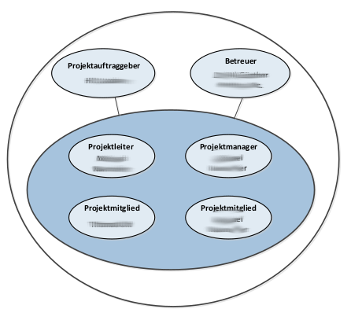
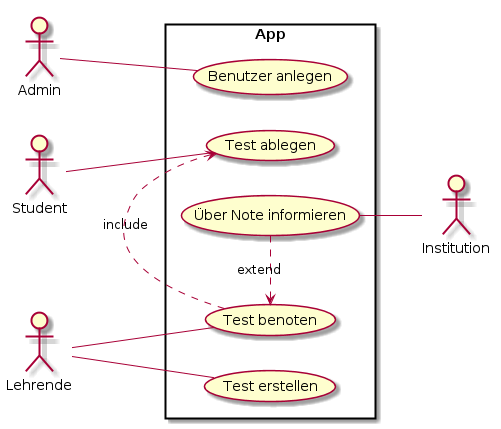

# Projekthandbuch
\textauthor{Michael Hänsler}

## Entwicklungsplan

### Projektauftrag

Unser Auftrag ist die Entwicklung eines digitalen Infopoints für die HTL Leoben. Dieser Infopoint soll zentrale schulrelevante Informationen wie z. B. Stundenplanänderungen, Vertretungen und schulinterne News anzeigen. Die Informationen werden über ein Touch-Display bereitgestellt, das an einem zentralen Ort im Schulgebäude montiert wird. Die Hardware wird nicht selbst gebaut. Stattdessen wird nach einer All-in-One-Lösung gesucht, die idealerweise keine eigene Software mitbringt, sodass unsere eigene Anwendung direkt darauf deployed werden kann. Als Verwaltungssystem für Inhalte ist die Integration eines Open-Source-CMS geplant.
Ein besonderer Fokus liegt auf der benutzerfreundlichen Gestaltung der Oberfläche sowie auf Mehrsprachigkeit, um eine möglichst zukunftsfähige Lösung zu schaffen.

#### Projektziele

* Auswahl eines geeigneten Hardware Systems für den Schulbetrieb im Innenbereich.

* Entwicklung eines funktionalen Infopoint-Systems für Touch-Displays

* Anzeige von aktuellen schulischen Informationen wie Veranstaltungen, Raumpläne, Stundenplan, Aufenthalt von Lehrpersonen, Social Media Feed

* Einfache Administrierbarkeit durch ein Content Managent System (CMS) 

* UI/UX-Design mit Fokus auf Barrierefreiheit und Mehrsprachigkeit (Deutsch & Englisch)

* Zukunftssichere Lösung, die einfach erweiterbar ist

#### Nicht-Ziele bzw. nicht Inhalte

* Zusammensetzung eines eigenen Hardware Systems 

* Anzeige der vollständigen Stundentafel der Lehrpersonen

* Anpassung unseres Systems auf alle Sprachen

* Erstellung eines eigenen CMS-Systems

#### Projektnutzen

Die derzeitige Informationsverteilung erfolgt oft über Aushänge oder verschiedene digitale Plattformen. Das führt zu Ineffizienz und Unübersichtlichkeit. Durch die zentrale Anzeige über den Infopoint soll dieser Zustand verbessert werden und bestenfalls auch Zeit einsparen. 

#### Projektauftraggeber

Der Auftraggeber dieses Projektes, ist die HTL Leoben. Die Geschäftsführung, Direktion und Lehrpersonen sind stehts bemüht den Schülerinnen und Schülern an der Schule einen mehrwert zu bieten und den Schulalltag zu erleichtern.

#### Projekttermine

| Termin     | Inhalt                          |
|-----------:|:--------------------------------|
| 24-06-2025 | Erstpräsentation                |
| 01-07-2025 | Projektstart                    |
| 05-09-2025 | Antrag Diplomarbeitsportal stellen|
| 01-11-2025 | 1. Zwischenpräsentation|
| 09-01-2026 | Abgabe der ersten Gesamtversion der Arbeit|
| 23-02-2026 | 2. Zwischenpräsentation |
| 06-03-2026 | Abgabe der finalen Korrekturversion in Papierform|
| 07-04-2026 | Abgabeschluss der Bibliotheksversion |
| 08-04-2026 | DA-Präsentation|
|||

: Projektterminübersicht

#### Projektkosten

##### Projektkosten (geplant)

| Kostenpunkt | Kostenart | Menge  | Preis   | Gesamtkosten | Deckung durch |
|:-------------|:---------:|:------:|--------:|-------------:|---------------|
| Hardware     | Hardware  |  1 |   0 | 0     | Auftraggeber       |
| Personal | Personalkosten | 3 | 8100.00 | 24300.00 | Auftraggeber|
| Chat-GPT Plus| Sonstiges  |  1    |  23.00 | 0      | Schüler |
| DA-Binden | Druck |  1     |   50.00 |  50.00      | Schüler |

 : Geplante Projektkosten
 
Das gesamte Projekt kostet in Summe  __X__  Euro. 

##### Projektkosten (tatsächlich)

--- ToDo ---

Am Ende der Diplomarbeit fügen Sie hier noch eine Liste der tatsächlich angefallenen Kosten ein.

#### Projektrisiken

| Risiko         | EW  | Auswirkungen     | Maßnahmen     |
|:--------------:|:---:| :----------------|:--------------|
| Grafische Oberfläche nicht einfach zu verstehen| 10% | Infopoint wird kaum genutzt | An best practice beispielen orientieren und gegebenenfalls Usabillity Test durchführen |
| Fehlende Kommunikation mit dem Betreuer | 10% | Entscheidungen verzögern sich und es entstehen Unsicherheiten | Regelmäßige Besprechungen einplannen| Lieferferzögerung der Hardware | 20% | Verzögerung des Zeitplans | Lieferanten mit angegeben Lieferzeitraum suchen |
| Probleme mit der Webuntis Schnittstelle  | 20% | Feature um Lehrer zu finden und Stundenpläne anzuzeigen kann nicht umgesetzt werden| Früh genug mit der Schnittstelle befassen und diese testen|
| Verzögerung im Zeitplan | 30% | Das Projekt kann nicht rechtzeitig abgeschlossen werden | Früh genug anfangen und genügend Puffer einplannen |
| Fehlende Motivation | 30%| Zeitplan kann nicht eingehalten werden| Genügend Meilensteine setzen und sich gegenseitig im Team kontrollieren |

: Projektrisiken

### Projektorganisation

#### Projektbeteiligte

| Vorname     | Nachname     | Organisation | Kontaktinfos      |
|:------------|:-------------|:-------------|:------------------|
| Michael | Hänsler | HTL Leoben | 211witb08@o365.htl-leoben.at |
| Simon | Moser | HTL Leoben     | 220131@o365.htl-leoben.at |
| Lukas | Fellegger | HTL Leoben | 211witb05@o365.htl-leoben.at |
| Zacharias | Markus | HTL Leoben | zama@o365.htl-leoben.at |
| Sebastian | Steiner | HTL Leoben | stse@o365.htl-leoben.at |
| Christian | Hofer | HTL Leoben | hch@o365.htl-leoben.at|

: Projektbeteiligte

#### Projektrollen

| Projektrolle           | Rollenbeschreibung     | Name              |
|------------------------|------------------------|-------------------|
| Projektleiter | Verantwortlicher für Einhaltung des Projektrahmens | Michael Hänsler |
| Auftraggeber | Auftraggeber der internen Diplomarbeit | Christian Hofer |
| Betreuer | Schulischer Betreuer | Markus Zacharias |
| Betreuer Stv. | Schulischer Betreuer | Sebastian Steiner |
| Projektmitglied | Backend Entwickler | Simon Moser |
| Projektmitglied | Frontend Entwickler | Lukas Fellegger|

: Projektrollen

{width=50%}

### Vorgehen bei Änderungen

Alle Änderungen am Projektumfang, den Meilensteinen oder Anwendungsfällen müssen mit dem Betreuer (und ggf. dem Auftraggeber) abgesprochen werden.

Informationsfluss:

Änderungen werden im Team-Chat und in Besprechungen dokumentiert.
Betreuer und Projektleiter müssen über alle Änderungen informiert werden.
Änderungen werden schriftlich im Änderungsprotokoll (Github Repository) vermerkt.

## Meilensteine

### 31.07.2025: Recherche Abgeschlossen

- Recherche zu verschiedenen Infopoint Systemen in unterschiedlichen Preiskategorien abgeschlossen
- Auswahl wird dem Auftraggeber vorgelegt

### 05-09-2025: Antrag Diplomarbeitsportal gestellt

- Antrag Diplomarbeitsportal gestellt

### 06.08.2025: Technologie Auswahl und Mockups

- Erstellung funktionaler Mockups abgeschlossen
- Software Auswahl für Front und Backend abgeschlossen

### 31.08.2025: Fertigstellung Rohversionen Front und Backend

- Fertigstellung der ersten Versionen von Front und Backend 

### 14.09.2025: Anbindung eines CMS Systems abgeschlossen

- Ein CMS System wurde über REST Schnittstellen angebunden
      
### 30.09.2025: Vereinigung von Front und Backend

- Vereinigung von Front und Backend Abgeschlossen

### 31.10.2025: Testphase auf Endgerät abgeschlossen

- Feedback eingeholt um möglich verbesserungen vorzunehmen.

### 20.11.2025: Verbesserungen umgesetzt

- Feedback eingeholt um möglich verbesserungen vorzunehmen.

### 30.11.2025: Diplomarbeit fertig verschriftlicht 

- Stilfehler sind behoben
- DA Dokumentationsblatt ist unterschrieben, eingescannt und im Hauptdokument enthalten 
- Praxisteil ist ebgeschlossen und verschriftlicht
- Informationen sind im DA Portal eingegeben
- Unterschriebene DA Betreuungsprotokolle sind in der DA enthalten
- DA liegt dem Betreuer in ausgedruckter Form vor
    

## Anwendungsfälle

Hier beschreiben Sie die Anwendungsfälle (=UseCases) Ihrer Anwendung / Diplomarbeit. Dabei sollte die Beschreibung auf hohem Niveau (also ohne implementierungsspezifische Details) erfolgen und typischerweise so benannt sein, wie die Ziele aus Sicht der Akteure heißen: Mitglied anmelden, Geld abheben, Auto zurückgeben.

Jeder Anwendungsfall wird im selben Muster beschrieben. In den folgenden Absätzen ist zuerst eine allgemeine Beschreibung eines solchen Anwendungsfalls zu finden und dann ein Beispiel dazu.

Damit man auch versteht wer mit welchem Anwendungsfall agiert bietet es sich an hier eine Übersichtsgrafik zu erstellen:

{width=60%}

\newpage
### Anwendungsfallname
Anwendungsfälle haben einen eindeutigen Namen aus dem man auf den Inhalt des Anwendungsfalls schließen kann. Wenn Sie agil arbeiten dann stellt ein Anwendungsfall eine UserStory dar welche im Backlog liegt und im Laufe des Projekts (in einem Sprint) abgearbeitet wird.

#### Kurzbeschreibung
Hier erfolgt eine kurze Beschreibung, was im Anwendungsfall passiert. Kurz bedeutet, dass es zwei oder drei Zeilen sind, selten mehr.
      
#### Trigger
Der fachliche Grund bzw. die Gründe dafür, dass dieser Anwendungsfall ausgeführt 

#### Vorbedingung
Alle Bedingungen, die erfüllt sein müssen, damit dieser Anwendungsfall ausgeführt werden kann. Gibt es keine Vorbedingungen, so steht hier "keine".
      
#### Nachbedingung
Der Zustand, der nach einem erfolgreichen Durchlauf des Anwendungsfalls erwartet wird.

#### Akteure
Akteure sind beteiligte Personen oder Systeme außerhalb (!) des beschriebenen Systems. Z. B. Anwender, angemeldeter Anwender, Kunde, System, Abrechnungsprozess.

#### Standardablauf
Hier wird das typische Szenario dargestellt, das leicht zu verstehen oder der am häufigsten vorkommende Fall ist. An seinem Ende steht die Zielerreichung des Primärakteurs. Die Ablaufschritte werden nummeriert und meist in strukturierter Sprache beschrieben. Ablaufpläne können jedoch ebenfalls benutzt werden, wenn es angebracht erscheint. Mittels der UML können diese Ablaufschritte in Aktivitätsdiagrammen oder Anwendungsfall-orientierten Sequenzdiagrammen dargestellt werden.

#### Fehlersituationen
Dies sind Szenarien, die sich außerhalb des Standardablaufs auch bei der (versuchten) Zielerreichung des Anwendungsfalls ereignen können. Sie werden meistens als konditionale Verzweigungen der normalen Ablaufschritte dargestellt. An ihrem Ende steht ein Misserfolg, die Zielerreichung des Primärakteurs oder eine Rückkehr zum Standardablauf.

#### Systemzustand im Fehlerfall
Der Zustand, der nach einem erfolglosen Durchlauf des Anwendungsfalls erwartet wird.

\newpage
### Benutzer Anlegen

#### Kurzbeschreibung
Der Benutzer "Admin" kann auf Anfrage einen neuen Benutzer als "Lehrende" und bzw. oder "Studierende" anlegen

#### Trigger
Admin legt auf Anfrage eines Benutzers einen neuen Account an

#### Vorbedingung
Benutzer als "Admin" angemeldet
      
#### Nachbedingung
Es existiert ein Eintrag in der DB Benutzer Tabelle für den neu erstellten Benutzer. (Dieser kann sich anschließend in der Anwendung anmelden)

#### Akteure
* Admin

#### Fehlersituationen
Admin bricht die Aktion ab

#### Systemzustand im Fehlerfall
Benutzer wird nicht angelegt und wird verworfen

#### Standardablauf:

1. Admin drückt Button, um einen neuen Benutzer anzulegen
2. Es öffnet sich ein Formular, indem die nötigen Benutzer-Informationen eingegeben werden (Name, Adresse, Telephonnummer, E-Mail, Geburtsdatum, Passwort-Hash, Rolle). Der neue Benutzer muss mindestens einer der Rollen "Lehrende" und "Studierende" angehören

#### Alternativabläufe:

* Admin drückt den Button, um die Aktion abzubrechen 
