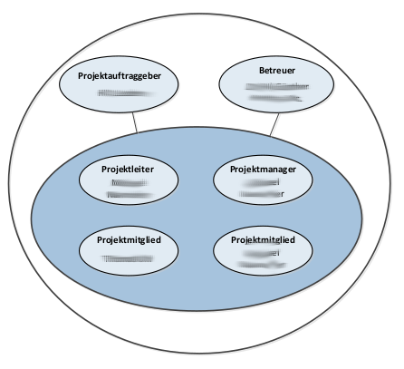

# Projekthandbuch
\textauthor{Michael Hänsler}

## Entwicklungsplan

### Projektauftrag

Der Projektauftrag umfasst die Entwicklung eines digitalen Infopoints für die HTL Leoben. Dieser Infopoint soll zentrale schulrelevante Informationen wie Stundenplanänderungen, Vertretungen und schulinterne Neuigkeiten anzeigen. Die Informationen werden über ein Touch-Display bereitgestellt, das an einem zentralen Ort im Schulgebäude montiert wird. Die Hardware wird nicht eigenständig entwickelt. Stattdessen wird eine All-in-One-Lösung evaluiert, die idealerweise keine proprietäre Software mitbringt, sodass die projektspezifische Anwendung direkt darauf bereitgestellt werden kann. Als Verwaltungssystem für Inhalte ist die Integration eines Open-Source-CMS vorgesehen.
Ein besonderer Fokus liegt auf der benutzerfreundlichen Gestaltung der Oberfläche, um eine zukunftsfähige Lösung zu gewährleisten.

#### Projektziele

Das Projekt verfolgt mehrere Kernziele. Zunächst erfolgt die Auswahl eines geeigneten Hardwaresystems für den Schulbetrieb im Innenbereich. Darauf aufbauend wird ein funktionales Infopoint-System für Touch-Displays entwickelt, das aktuelle schulische Informationen wie Veranstaltungen, Raumpläne, Stundenpläne, den Aufenthalt von Lehrpersonen sowie einen Social-Media-Feed darstellt. Die Administrierbarkeit wird durch die Integration eines Content-Management-Systems (CMS) gewährleistet. Das UI/UX-Design fokussiert auf Barrierefreiheit. Die Lösung wird zukunftssicher und erweiterbar konzipiert.

#### Nicht-Ziele bzw. nicht Inhalte

Explizit vom Projektumfang ausgeschlossen sind die Entwicklung eines eigenen Hardwaresystems, die Anzeige der vollständigen Stundentafel der Lehrpersonen, die Lokalisierung des Systems in sämtliche Sprachen sowie die Entwicklung eines eigenständigen CMS-Systems.

#### Projektnutzen

Die derzeitige Informationsverteilung erfolgt über Aushänge oder verschiedene digitale Plattformen, was zu Ineffizienz und mangelnder Übersichtlichkeit führt. Durch die zentrale Anzeige über den Infopoint wird dieser Zustand verbessert und eine Zeitersparnis für alle Beteiligten angestrebt. 

#### Projektauftraggeber

Der Auftraggeber dieses Projekts ist die HTL Leoben. Die Schulleitung und das Lehrpersonal sind bestrebt, den Schülerinnen und Schülern einen Mehrwert zu bieten und den Schulalltag zu erleichtern.

#### Projekttermine

| Termin     | Inhalt                          |
|-----------:|:--------------------------------|
| 24-06-2025 | Erstpräsentation                |
| 01-07-2025 | Projektstart                    |
| 05-09-2025 | Antrag Diplomarbeitsportal stellen |
| 01-11-2025 | 1. Zwischenpräsentation |
| 09-01-2026 | Abgabe der ersten Gesamtversion der Arbeit |
| 23-02-2026 | 2. Zwischenpräsentation |
| 06-03-2026 | Abgabe der finalen Korrekturversion in Papierform |
| 07-04-2026 | Abgabeschluss der Bibliotheksversion |
| 08-04-2026 | DA-Präsentation |
|||

: Projektterminübersicht

#### Projektkosten

##### Projektkosten (geplant)

| Kostenpunkt | Kostenart | Menge  | Preis   | Gesamtkosten | Deckung durch |
|:-------------|:---------:|:------:|--------:|-------------:|---------------|
| Hardware     | Hardware  |  1 |   0 | 0     | Auftraggeber       |
| Personal | Personalkosten | 3 | 8.100,00 | 24.300,00 | Auftraggeber|
| Chat-GPT Plus| Sonstiges  |  1    |  23,00 | 23,00      | Schüler |
| DA-Binden | Druck |  1     |   50,00 |  50,00      | Schüler |

 : Geplante Projektkosten
 
Das Gesamtprojekt beläuft sich auf Kosten von 24.373,00 Euro. 

##### Projektkosten (tatsächlich)

| Kostenpunkt | Geplant | Tatsächlich | Abweichung |
|:---|---:|---:|:---|
| Personal (3 Personen) | 24.300,00 € | 24.300,00 € | keine |
| ChatGPT Plus | 23,00 € | 23,00 € | keine |
| DA-Binden | 50,00 € | 50,00 € | keine |
| Hardware | 0,00 € (Auftraggeber) | 0,00 € | keine |
| **Gesamt** | **24.373,00 €** | **24.373,00 €** | **keine** |

: Tatsächliche Projektkosten

<!-- ToDo: Am Ende der Diplomarbeit ist hier eine Aufstellung der tatsächlich angefallenen Kosten einzufügen. -->

#### Projektrisiken

| Risiko         | EW  | Auswirkungen     | Maßnahmen     |
|:--------------:|:---:| :----------------|:--------------|
| Grafische Oberfläche nicht einfach zu verstehen| 10% | Infopoint wird kaum genutzt | An Best-Practice-Beispielen orientieren und gegebenenfalls Usability-Test durchführen |
| Fehlende Kommunikation mit dem Betreuer | 10% | Entscheidungen verzögern sich und es entstehen Unsicherheiten | Regelmäßige Besprechungen einplanen |
| Probleme mit der WebUntis-Schnittstelle  | 20% | Feature, um Lehrer zu finden und Stundenpläne anzuzeigen, kann nicht umgesetzt werden | Früh genug mit der Schnittstelle befassen und diese testen |
| Verzögerung im Zeitplan | 30% | Das Projekt kann nicht rechtzeitig abgeschlossen werden | Früh genug anfangen und genügend Puffer einplanen |
| Fehlende Motivation | 30%| Zeitplan kann nicht eingehalten werden| Genügend Meilensteine setzen und sich gegenseitig im Team kontrollieren |

: Projektrisiken

### Projektorganisation

#### Projektbeteiligte

| Vorname     | Nachname     | Organisation | Kontaktinfos      |
|:------------|:-------------|:-------------|:------------------|
| Michael | Hänsler | HTL Leoben | 211witb08@o365.htl-leoben.at |
| Simon | Moser | HTL Leoben     | 220131@o365.htl-leoben.at |
| Lukas | Fellegger | HTL Leoben | 211witb05@o365.htl-leoben.at |
| Zacharias | Markus | HTL Leoben | zama@o365.htl-leoben.at |
| Sebastian | Steiner | HTL Leoben | stse@o365.htl-leoben.at |
| Christian | Hofer | HTL Leoben | hch@o365.htl-leoben.at|

: Projektbeteiligte

#### Projektrollen

| Projektrolle           | Rollenbeschreibung     | Name              |
|------------------------|------------------------|-------------------|
| Projektleiter | Verantwortlicher für Einhaltung des Projektrahmens | Michael Hänsler |
| Auftraggeber | Auftraggeber der internen Diplomarbeit | Christian Hofer |
| Betreuer | Schulischer Betreuer | Markus Zacharias |
| Betreuer Stv. | Schulischer Betreuer | Sebastian Steiner |
| Projektmitglied | Backend Entwickler | Simon Moser |
| Projektmitglied | Frontend Entwickler | Lukas Fellegger|

: Projektrollen

{width=50%}

### Vorgehen bei Änderungen

Sämtliche Änderungen am Projektumfang, den Meilensteinen oder Anwendungsfällen erfordern eine Abstimmung mit dem Betreuer und gegebenenfalls dem Auftraggeber.

Der Informationsfluss ist wie folgt geregelt: Änderungen werden im Team-Chat und in Besprechungen dokumentiert. Der Betreuer und der Projektleiter werden über alle Änderungen informiert. Alle Änderungen werden schriftlich im Änderungsprotokoll des GitHub-Repositorys vermerkt.

## Meilensteine

### 05.09.2025: Antrag Diplomarbeitsportal gestellt

- Antrag Diplomarbeitsportal gestellt

### 19.09.2025: Recherche Abgeschlossen

- Recherche zu verschiedenen Infopoint Systemen in unterschiedlichen Preiskategorien abgeschlossen
- Auswahl wird dem Auftraggeber vorgelegt

### 25.09.2025: Technologie Auswahl und Mockups

- Erstellung funktionaler Mockups abgeschlossen
- Software-Auswahl für Front- und Backend abgeschlossen

### 13.10.2025: Fertigstellung Rohversionen Front- und Backend

- Fertigstellung der ersten Versionen von Front- und Backend 

### 20.10.2025: Anbindung eines CMS Systems abgeschlossen

- Ein CMS-System wurde über REST-Schnittstellen angebunden
      
### 27.10.2025: Vereinigung von Front- und Backend

- Vereinigung von Front- und Backend abgeschlossen

### 10.11.2025: 1. Zwischenpräsentation

- Präsentation des aktuellen Stands

### 17.11.2025: Testphase auf Endgerät abgeschlossen

- Feedback eingeholt, um mögliche Verbesserungen vorzunehmen.

### 24.11.2025: Verbesserungen umgesetzt

- Feedback eingeholt, um mögliche Verbesserungen vorzunehmen.

### 23.12.2025: Diplomarbeit fertig verschriftlicht 

- Stilfehler sind behoben
- DA-Dokumentationsblatt ist unterschrieben, eingescannt und im Hauptdokument enthalten 
- Praxisteil ist abgeschlossen und verschriftlicht
- Informationen sind im DA-Portal eingegeben
- Unterschriebene DA-Betreuungsprotokolle sind in der DA enthalten
- DA liegt dem Betreuer in ausgedruckter Form vor

### 01.01.2026: Projektabschluss

### 09.01.2026: Abgabe der ersten Gesamtversion der Arbeit

- Abgabe der ersten Gesamtversion

### 23.02.2026: 2. Zwischenpräsentation

- Präsentation des aktuellen Standes 

### 06.03.2026: Abgabe der finalen Korrekturversion in Papierform

### 07-04-2026: Abgabeschluss der Bibliotheksversion

### 08.04.2026: Diplomarbeits-Abschlusspräsentation
    
\newpage
## Anwendungsfälle

Dieser Abschnitt beschreibt die Anwendungsfälle (Use Cases) der Anwendung. Die Beschreibung erfolgt auf hohem Abstraktionsniveau ohne implementierungsspezifische Details.

### Informationen beschaffen

#### Kurzbeschreibung
Der Endverbraucher ruft über den Infopoint Informationen zu aktuellen Veranstaltungen, Neuigkeiten oder Stundenplänen ab. Das System lädt die entsprechenden Inhalte aus dem CMS und stellt diese auf der Benutzeroberfläche dar.

#### Trigger
Der Endverbraucher tippt auf den Standby-Bildschirm des Infopoints, um zur Benutzeroberfläche zu gelangen.

#### Vorbedingung
Der Infopoint ist eingeschaltet und betriebsbereit. Der Endverbraucher befindet sich vor dem Gerät.

#### Nachbedingung
Der Endverbraucher hat alle benötigten Informationen erhalten und der Infopoint kehrt nach einer definierten Zeit der Inaktivität in den Standby-Modus zurück.

#### Akteure
Endverbraucher (Schülerinnen und Schüler, Besucherinnen und Besucher)

#### Standardablauf

1. Der Endverbraucher nähert sich dem Infopoint und tippt auf den Standby-Bildschirm.
2. Das System wechselt vom Standby-Modus zum Homescreen.
3. Auf dem Homescreen wird eine Übersicht der verfügbaren Funktionen angezeigt.
4. Der Endverbraucher wählt eine gewünschte Funktion, etwa Veranstaltungen oder Neuigkeiten.
5. Das System lädt die aktuellen Daten über die REST-API aus dem CMS und zeigt sie an.
6. Der Endverbraucher liest die dargestellten Informationen.
7. Nach einer Phase der Inaktivität kehrt das System automatisch in den Standby-Modus zurück.

#### Fehlersituationen
Das System kann aufgrund einer fehlenden oder unterbrochenen Verbindung zum Backend nicht auf aktuelle Daten zugreifen.

#### Systemzustand im Fehlerfall
Dem Endverbraucher wird eine entsprechende Fehlermeldung angezeigt. Das System bleibt betriebsbereit und kehrt nach einer definierten Zeit in den Standby-Modus zurück.

\newpage
### Lehrperson suchen

#### Kurzbeschreibung
Der Endverbraucher sucht über die Lehrersuchfunktion des Infopoints nach einer bestimmten Lehrperson und ruft Informationen über deren aktuellen Aufenthaltsort ab.

#### Trigger
Der Endverbraucher wählt auf dem Homescreen die Funktion „Lehrperson suchen".

#### Vorbedingung
Der Infopoint ist betriebsbereit und der Endverbraucher befindet sich auf dem Homescreen. Der aktuelle Stundenplan ist über WebUntis abrufbar.

#### Nachbedingung
Der Endverbraucher hat den aktuellen Aufenthaltsort der gesuchten Lehrperson in Erfahrung gebracht.

#### Akteure
Endverbraucher (Schülerinnen und Schüler)

#### Standardablauf

1. Der Endverbraucher tippt auf dem Homescreen auf die Kachel „Lehrperson suchen".
2. Das System navigiert zur Lehrerübersichtsseite und lädt die verfügbaren Lehrerprofile aus dem Backend.
3. Die Lehrpersonen werden in einer übersichtlichen Liste dargestellt.
4. Der Endverbraucher tippt auf den Namen der gesuchten Lehrperson.
5. Das System zeigt die Detailansicht mit Informationen über den aktuellen Aufenthaltsort der Lehrperson an.
6. Der Endverbraucher erhält die benötigte Information und kehrt wahlweise zur Übersicht oder zum Homescreen zurück.

#### Fehlersituationen
Die gesuchte Lehrperson ist nicht im System erfasst oder die Verbindung zum Backend ist unterbrochen.

#### Systemzustand im Fehlerfall
Ist die Lehrperson nicht vorhanden, wird eine entsprechende Hinweismeldung angezeigt. Bei einer Verbindungsunterbrechung wird eine allgemeine Fehlermeldung eingeblendet.

\newpage
### Lageplan einsehen

#### Kurzbeschreibung
Der Endverbraucher ruft den interaktiven Lageplan des Schulgebäudes auf, um sich über die räumliche Anordnung des Schulgebäudes zu orientieren und bestimmte Räume oder Bereiche zu lokalisieren.

#### Trigger
Der Endverbraucher wählt auf dem Homescreen die Funktion „Lageplan".

#### Vorbedingung
Der Infopoint ist betriebsbereit und der Endverbraucher befindet sich auf dem Homescreen. Die Lageplanressourcen sind im CMS hinterlegt.

#### Nachbedingung
Der Endverbraucher hat sich erfolgreich über die räumliche Struktur des Schulgebäudes orientiert und den gesuchten Bereich lokalisiert.

#### Akteure
Endverbraucher (Schülerinnen und Schüler, Besucherinnen und Besucher)

#### Standardablauf

1. Der Endverbraucher tippt auf dem Homescreen auf die Kachel „Lageplan".
2. Das System navigiert zur Lageplananzeige und lädt die Plandaten über die REST-API.
3. Der Lageplan des Schulgebäudes wird auf dem Display dargestellt.
4. Der Endverbraucher navigiert durch den Plan, um den gesuchten Raum oder Bereich zu finden.
5. Der Endverbraucher hat sich erfolgreich orientiert und kehrt wahlweise zum Homescreen zurück.

#### Fehlersituationen
Die Lageplanressourcen können aufgrund einer Verbindungsunterbrechung nicht geladen werden.

#### Systemzustand im Fehlerfall
Dem Endverbraucher wird eine Fehlermeldung angezeigt. Das System bleibt betriebsbereit und kehrt nach einer definierten Zeit der Inaktivität in den Standby-Modus zurück.
