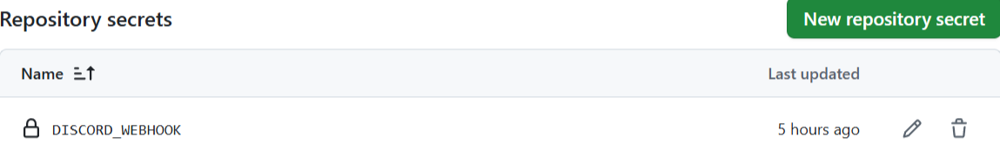

# Discord notification

The workflow `Discord notification` allows the user to send notifications triggered on different events to a Discord channel. Following events and their activity types are the default triggers for a notification:

- push
- completion of workflow [`Build and send diploma thesis`](../build/README.md)
- issue
  - (re-)opened
  - (un-)assigned
  - (un-)labeled
  - edited
  - closed
  - deleted
- pull request
  - (re-)opened
  - (un-)assigned
  - (un-)labeled
  - synchronize
  - closed
- release
  - created
  - edited
  - deleted

The [workflow triggers](https://docs.github.com/en/actions/writing-workflows/choosing-when-your-workflow-runs/events-that-trigger-workflows) can be adjusted at will as well as some of the [jobs](https://docs.github.com/en/actions/writing-workflows/choosing-what-your-workflow-does/using-jobs-in-a-workflow) deleted if they are not needed.

## GitHub repository

Create a folder `.github/workflows` in the root of your repository. Now paste `notification-discord.yml` into the newly created folder. It is recommended to rename the GitHub Action to `discord.yml`.

## Discord

1. [Create your own Discord server](https://support.discord.com/hc/en-us/articles/204849977-How-do-I-create-a-server) for the diploma thesis.
2. [Create a new channel](https://discord.com/community/basic-channel-setup) on your server preferably named `notifications`.
3. Get the channels [WebHook URL](https://support.discord.com/hc/en-us/articles/228383668-Intro-to-Webhooks).

## GitHub secrets

In your GitHub repository you need to [create the secret](https://docs.github.com/en/actions/security-for-github-actions/security-guides/using-secrets-in-github-actions#creating-secrets-for-a-repository) the Action needs with the information from your corresponding account.

| Name | Usage |
| - | - |
| DISCORD_WEBHOOK | Your Discord WebHook URL |

After creating the secret it should look like this:

**Author:** Marko Schrempf
